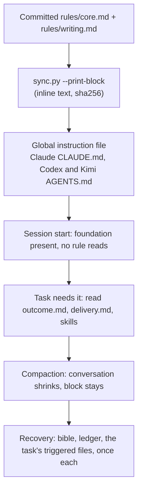

# Instruction-layer foundation and bounded compaction recovery

Status: proposed (design only, awaiting operator approval)

Issue: [#73](https://github.com/jak-pan/house-rules/issues/73)

## 1. Result

Every Claude Code, Codex and Kimi session gets a small House Rules foundation (core rules and
writing rules, about 4,200 tokens instead of 7,300) inside the tool's own instruction file, so
no session reads rule files at start and compaction cannot shrink the foundation to a summary.
The outcome and delivery rules load only when the task needs them. After a compaction an agent
re-reads only the files its current task uses, each at most once.

## 2. Terms

- **Instruction layer:** the text a tool injects into every session from its global instruction
  file: `CLAUDE.md` for Claude Code, `AGENTS.md` for Codex and Kimi. The agent does not read it
  with a tool. `ASSUMPTION` The tool keeps it outside the conversation that compaction
  summarizes; the canary in §7 tests this for each tool.
- **House Rules block:** the managed section of that file between `<!-- house-rules:begin -->`
  and `<!-- house-rules:end -->` ([INSTALL-AGENTS.md §3](../../INSTALL-AGENTS.md)).
- **Foundation:** the House Rules text every session needs: `rules/core.md` and
  `rules/writing.md` after this change.
- **Triggered file:** a rule file or skill that an agent reads with a tool when the task first
  needs it.
- **Block mode:** a session whose instructions hold the new House Rules block. **Fallback
  mode:** any other session, for example a cloud agent that reaches House Rules only through a
  repository's `AGENTS.md`.
- **Recovery:** what an agent reads again after a compaction or another context reset.
- **o200k:** the GPT tokenizer `o200k_base`; token counts below use it.

## 3. Current behavior

Evidence links are pinned to origin/main
[9e18159](https://github.com/jak-pan/house-rules/tree/9e1815917a4052e030b603350b27b855e6489e67).

- `FACT` The index requires all four rule files at session start and after every compaction:
  [AGENTS.md:10-17](https://github.com/jak-pan/house-rules/blob/9e1815917a4052e030b603350b27b855e6489e67/AGENTS.md#L10-L17).
- `FACT` The installed block holds only a pointer: "read `<HOUSE_RULES_ROOT>/AGENTS.md`"
  ([INSTALL-AGENTS.md:113-128](https://github.com/jak-pan/house-rules/blob/9e1815917a4052e030b603350b27b855e6489e67/INSTALL-AGENTS.md#L113-L128)).
  Every rule therefore reaches the agent through tool reads, which live in the conversation.
- `FACT` Core rules repeat the reload duty twice:
  [rules/core.md:45-46](https://github.com/jak-pan/house-rules/blob/9e1815917a4052e030b603350b27b855e6489e67/rules/core.md#L45-L46)
  and prime rule 15 at
  [rules/core.md:156](https://github.com/jak-pan/house-rules/blob/9e1815917a4052e030b603350b27b855e6489e67/rules/core.md#L156).
- `FACT` The always-load set is 36,247 bytes and 7,336 o200k tokens (measured with `tiktoken`
  0.13.0 on the five files at 9e18159): index 794, core 2,979, outcome 777, delivery 1,651,
  writing 1,135 tokens.
- `FACT` `scripts/sync.py` copies the block template from `INSTALL-AGENTS.md`
  ([sync.py:80-90](https://github.com/jak-pan/house-rules/blob/9e1815917a4052e030b603350b27b855e6489e67/scripts/sync.py#L80-L90)),
  reports a block that differs from it as stale
  ([sync.py:221-222](https://github.com/jak-pan/house-rules/blob/9e1815917a4052e030b603350b27b855e6489e67/scripts/sync.py#L221-L222)),
  and reads the always-load list from the index
  ([sync.py:248-258](https://github.com/jak-pan/house-rules/blob/9e1815917a4052e030b603350b27b855e6489e67/scripts/sync.py#L248-L258)).
  It never writes instruction files.
- `FACT` PR #53 ([bf4d846](https://github.com/jak-pan/house-rules/commit/bf4d846)) first made the
  outcome and delivery rules conditional, then restored them as always-loaded. Its commit message
  gives the reason: the rewrite "dropped qualifiers and moved safeguards into optional skills,
  so sessions could miss required protections and reading order". This design avoids that
  failure in three ways. Text moves verbatim, except the four sentences that §4.2 names.
  Safeguards stay in the foundation, including
  deferred-item tracking and external-write limits from `rules/delivery.md`. A one-time coverage
  check (§7) lists each sentence's new home.

The 2026-10-07 load test (a private report on the operator machine) adds these observations:

- `FACT` A manual Claude compaction went from 59,089 to 11,788 tokens (the run's
  `compact_metadata` record). `ASSUMPTION` (load-test report) After it, the agent held
  `rules/core.md` only as a summary and re-read the index and all four rule files.
- `FACT` In one Codex turn with an auto-compaction limit set low on purpose, the completed
  commands read the index six times and each rule file two or three times (counted in the
  run's event log).
- `FACT` In a separate Codex test, a project `AGENTS.md` holding rule text with a canary code
  was quoted in three turns of one thread with no command in any turn. No compaction happened
  in that thread, so survival is untested.
- `ASSUMPTION` (issue #73) A project `CLAUDE.md` importing a project file (`@core-copy.md`)
  delivered its canary before and after `/compact`. An absolute import of a file outside the
  project did not load in headless mode. Imports in the user-level `CLAUDE.md` are untested.
- `ASSUMPTION` (load-test re-test) Kimi's "hello" run read the index and the four rule files,
  so Kimi follows today's block like Claude and Codex.
- `FACT` A Claude Code subagent receives the user-level `CLAUDE.md` text in its instructions:
  the subagent that wrote this design received it.

## 4. Design

### 4.1 Overview

The foundation shrinks to `rules/core.md` plus `rules/writing.md`. `scripts/sync.py` generates
the House Rules block from those two committed files, so the foundation text sits inline in
each tool's global instruction file. The outcome and delivery rules become triggered files.
A new recovery rule bounds what an agent reads after a compaction.



### 4.2 Where every rule goes

No rule is removed. Three sentences (core 45, 46 and 156) are replaced by the new recovery
section, which covers them. One precedence sentence is split in two, and one tracker sentence
is reworded (§4.4).
Line numbers are at 9e18159.

| Source lines | Content | Destination |
|---|---|---|
| core 1-8 | one-home principles | foundation: core (unchanged) |
| AGENTS 6-8, core 179 | precedence | foundation: core §Precedence (AGENTS 8 split in two) |
| core 10-22 | Terms | foundation: core (unchanged) |
| core 26-32 | applicability, skills, native config | foundation: core §Loading |
| core 33-36 | tracker selection | delivery §Work tracking & continuity |
| core 40, 44, 47-48 | bible, context files, writing pointers | foundation: core §Loading |
| core 41-43, 49-50 | tracker board, subsystem reads, reading order | delivery §Session start (new) |
| core 45-46 | reload after reset | replaced by core §After a compaction |
| AGENTS 12-17 | always-load list | AGENTS §Always load (rewritten) |
| AGENTS 22-23 | STRUCTURE, PREFERENCES triggers | foundation: core §Loading |
| core 52-61 | Protected operator assets | foundation: core (unchanged) |
| core 63-85 | Operator correction, including stop | foundation: core (unchanged) |
| core 87-155 | Prime rules 1-15 | foundation: core (unchanged) |
| core 156 | re-read attachment rule | replaced by core §After a compaction |
| core 160-175, 180-195, 203-205 | collaboration mode, thresholds, lanes | outcome §Autonomy (new) |
| core 176-178, 196-202 | decisions required, unattended limits, stops | foundation: core §Authority (new) |
| delivery 68-69 | external repositories: read freely, no writes | foundation: core §Authority |
| delivery 104-117 | Track every deferred item | foundation: core §Deferred work (new) |
| core 207-251 | Security | foundation: core (unchanged) |
| core 253-264 | Stack & architecture, The bar | foundation: core (unchanged) |
| outcome 1-65 | all sections | outcome (triggered; one reference fixed) |
| delivery 1-67, 70-103, 118-136 | all other lines | delivery (triggered) |
| writing 1-87 | all sections | foundation: writing (unchanged) |

The foundation keeps every item the issue lists: precedence, authority, protected assets,
evidence honesty (prime rules 1, 3, 5, 6 and claim labels), sensitive data, durable-data and
shared-process protection (Security, prime rule 15), and stop instructions (Operator correction,
Authority). It also keeps the deferred-item rules and the external-write limit, because a
conversation can defer work or comment upstream without changing any file.

### 4.3 `rules/core.md`

New and changed sections, in their exact text. Unchanged sections keep their current text and
order: one-home principles, Terms, Protected operator assets, Operator correction, Prime rules,
Security, Stack & architecture, The bar. Prime rule 15 drops its last sentence ("Re-read the
attachment rule after any context compaction."); the block keeps rule 15 present after a
compaction.

Order: one-home principles, Precedence, Terms, Loading, After a compaction, Protected operator
assets, Operator correction, Prime rules, Authority, Deferred work, Security, Stack &
architecture, The bar. Deferred work holds delivery lines 104-117 verbatim, under the heading
`## Deferred work`.

```markdown
## Precedence

- Repository instructions and explicit operator choices override House Rules when they conflict.
- Both stay subject to the host instruction hierarchy, permissions, access, and approval controls.
- A repository override may tighten or loosen any House Rules rule, including a security rule.
- The override names the rule it changes.
- Give explicit task instructions and host controls precedence.

## Loading

- Apply the sections relevant to the actual task.
- Do not create implementation, benchmark, claim, commit, or handoff obligations for a simple question.
- The foundation is this file and rules/writing.md.
- The House Rules block in your instructions holds the foundation in full.
- Do not read the foundation files with tools while that block is present.
- Load these files when the task first needs them:
  - Substantive work beyond a question or a short exchange: rules/outcome.md.
  - Changing files, testing, committing, pushing, tracked or parallel work, or external or paid runs: rules/delivery.md.
  - Artifact paths, naming, or placement: STRUCTURE.md.
  - Project or stack defaults: PREFERENCES.md.
- Load procedural skills on demand.
- Choose skills by the descriptions in your skill list.
- Keep model selection, permissions, Model Context Protocol connections, and hooks in native tool configuration.
- Keep delegation application programming interfaces in native tool configuration.
- Treat skills as procedure descriptions.
- Do not treat skills as access grants or tools that make unavailable capabilities callable.
- At session start, read the bible and `CONTEXT.md` when present.
- Read context files fully.
- rules/writing.md governs all text.
- Follow skills/operator-writing/SKILL.md §Communication rules for operator-facing text.

## After a compaction

- After a compaction or other context reset, keep using the foundation from the House Rules block.
- Without that block, re-read rules/core.md and rules/writing.md.
- Re-read the bible and any active campaign ledger.
- Reload the triggered rule files and skills the current task uses.
- Read each file at most once per compaction.
- If re-reading causes another compaction, stop re-reading and report the loop to the operator.

## Authority

- Obtain a decision for changes to product scope, shipped product defaults, material risk, external-write authority, or resource envelopes.
- Apply this requirement in either collaboration mode.
- Keep the separate confirmation requirement for protected operator assets.
- Limit unattended work to approved work.
- Do not add scope, destructive steps, or protected-asset actions.
- Stop for the operator before credential steps.
- Stop for the operator before logins.
- Stop for the operator before destructive steps beyond a routine deploy.
- Report host safety controls that block launch.
- Do not work around those controls.
- Follow rules/outcome.md §Autonomy for collaboration modes, confidence thresholds, and unattended lanes.
- Read, clone, or fork externally owned repositories freely.
- For externally owned repositories, never push upstream, open pull requests/issues, or comment until the operator says ready.
```

The recovery rule is the "After a compaction" section. It replaces "re-read everything" with
three bounded reads: the bible, an active campaign ledger, and the triggered files the current
task uses. A Codex turn that read the index six times breaks the "at most once" sentence and
must stop and report instead.

### 4.4 `rules/outcome.md` and `rules/delivery.md`

- `rules/outcome.md` gains a final section `## Autonomy` holding core lines 160-175, 180-195 and
  203-205 verbatim. Line 65 changes its reference from "rules/core.md §Autonomy" to
  "rules/core.md §Authority".
- `rules/delivery.md` §Work tracking & continuity starts with core lines 33-36 verbatim and
  loses lines 104-117 to core §Deferred work. §Git loses lines 68-69 to core §Authority; line 70
  (the fork exception) stays.
- `rules/delivery.md` gains `## Session start` before `## Verification`:

```markdown
## Session start

- After the bible, read the tracker board, followed by your work item's state and latest handoff.
- Default to the project board.
- Read subsystem `CONTEXT.md` and `README.md` before touching that subsystem.
- Follow `work-tracking` §Session loop: fetch, update, reconcile for tracker procedure.
- Follow `design-flow` §5 for feature reading order.
```

The first sentence replaces "Then read the tracker board…" because the bible line now lives in
core.

### 4.5 `AGENTS.md`

The index keeps its skill lines. Skill wording belongs to [#76](https://github.com/jak-pan/house-rules/issues/76).
Its top and its "Always load" section become:

```markdown
# AGENTS.md — Universal

House Rules provides shared operating rules and task-specific skills.
This file is its index.
Precedence and loading rules are in [rules/core.md](rules/core.md).

## Always load

Your instructions may contain a line that starts with `House Rules foundation:`.
That block holds these files in full; do not read them with tools.
Without that line, read these files in full at session start:

- [core rules](rules/core.md)
- [writing rules](rules/writing.md)

## Load when the task needs it

Rule files and shared references load by the triggers in rules/core.md §Loading.
Skills load by their descriptions; this list repeats their triggers.
```

The STRUCTURE and PREFERENCES lines move to core §Loading. The fallback condition keys on the
line `House Rules foundation:`, which only the new block holds. An old pointer block also has
the heading `Shared operating foundation (House Rules)`; keying on that heading would make an
agent with an old block skip the rules.

### 4.6 Per-tool delivery

All three tools get the same generated block inline. No tool uses an import.

- **Claude Code:** the block goes into the user-level `$CLAUDE_CONFIG_DIR/CLAUDE.md` (default
  `~/.claude/CLAUDE.md`), as today. House Rules writes nothing into project `CLAUDE.md` files;
  they stay pointers to the repository `AGENTS.md` ([STRUCTURE.md](../../STRUCTURE.md)
  §Managed repository loader). The user-level `@import` question does not block this design.
  The canary in §7 probes it once, to decide later whether Claude could import instead of
  inlining.
- **Codex:** the block goes into `$CODEX_HOME/AGENTS.md`, or `AGENTS.override.md` when that file
  exists, in every Codex home (INSTALL-AGENTS.md §3 step 7, unchanged). `ASSUMPTION` Codex's
  32 KiB project-document limit does not apply to the global file; the block budget is under
  24 KB in either case.
- **Kimi Code:** the block goes into `$KIMI_CODE_HOME/AGENTS.md`. Kimi's compaction behavior is
  untested; the canary in §7 is its first evidence.
- **Other products:** `INSTALL-AGENTS.md` §1 lists only these three. Gemini, Cursor and Copilot
  appear only as project pointer files in `STRUCTURE.md`. Antigravity (`agy`) is tracked in
  [#78](https://github.com/jak-pan/house-rules/issues/78). Once #78 names its global instruction
  file, it receives the same `--print-block` output; this design needs no change for it.

A managed repository's loader ([STRUCTURE.md](../../STRUCTURE.md) §Managed repository loader)
still tells the agent to read the House Rules index. In block mode that costs one read of the
index, which then says not to read the rule files. This design does not change the loader.

### 4.7 The generated block and `scripts/sync.py`

`INSTALL-AGENTS.md` §3 step 3 replaces the pointer template with this template and tells the
installing agent to install the output of `sync.py --print-block` unchanged:

```markdown
<!-- house-rules:begin -->
# Shared operating foundation (House Rules)

House Rules root: `<HOUSE_RULES_ROOT>`. House Rules paths below are relative to it.
House Rules foundation: rules/core.md and rules/writing.md in full below, sha256 <FOUNDATION_HASH>.
scripts/sync.py generated this block from committed files; edit those files, not this block.

<FOUNDATION>
<!-- house-rules:end -->
```

Changes to `scripts/sync.py`:

- `committed(root, path) -> str` returns `git show HEAD:<path>` without stripping. Generation
  uses committed content only, so uncommitted edits in the checkout never reach a session.
- `always_load(root, findings)` keeps its parser and reads the committed `AGENTS.md`. It now
  returns `rules/core.md` and `rules/writing.md`.
- `foundation(root, findings) -> (text, hash)` joins the listed files with one blank line. The
  hash is the first 12 hex digits of SHA-256 over the joined text before link rewriting, so it is
  the same on every machine.
- `rewrite_links(text, path, root)` turns each relative Markdown link target into an absolute
  path under the root. Example: in `rules/writing.md`,
  `[rules/core.md prime rule 13](core.md#prime-rules)` becomes
  `[rules/core.md prime rule 13](<root>/rules/core.md#prime-rules)`. Web links and anchors stay
  unchanged.
- `template(root)` reads the committed `INSTALL-AGENTS.md` and fills `<HOUSE_RULES_ROOT>`,
  `<FOUNDATION_HASH>` and `<FOUNDATION>`.
- `FOUNDATION_MAX_BYTES = 24_000` is the budget in §6. A test enforces it.
- `--print-block` prints the generated block and exits. It writes nothing.
- `verify` keeps its exact comparison. A block built from an older foundation is reported as
  `stale block`, as today.
- `--write-blocks` exists only if question 1 is answered with option 1. It replaces a stale
  block only in a file with exactly one well-formed `house-rules` block. It first copies the file
  to `custom/backups/sync-<UTC time>/`, then writes through a temporary file in the same folder
  and renames it. It follows an instruction-file symlink to its regular target. It never adds a
  missing block and never touches `forge`, `groundwork`, malformed or multiple blocks. It prints
  `REPAIRED: stale block: <path> (backup: <path>)`.

`INSTALL-AGENTS.md` §5 runtime verification adds one check: `codex debug prompt-input` output
holds the `House Rules foundation:` line with the hash that `--print-block` prints. §6 states
that the generated block comes from committed files and, with option 1, documents
`--write-blocks`.

### 4.8 References and tests that follow the moves

- Skill references to "rules/core.md §Autonomy" change to "rules/outcome.md §Autonomy" in
  operator-protocol (lines 35, 36, 46), design-flow (40), bench-discipline (57-58) and
  project-bootstrap (25). failure-forensics line 71 ("for material risk and scope changes")
  changes to "rules/core.md §Authority".
- handoff-continuity line 39 changes to "rules/core.md §Loading and rules/delivery.md §Session
  start". work-tracking line 132 changes to "rules/delivery.md §Session start", and lines
  249-250 to "rules/delivery.md §Work tracking & continuity".
- `CHANGELOG-RULES.md` renames two headings ("Session start (reload skills after a reset)" to
  "After a compaction (reload skills)"; "Autonomy (unattended work)" to "Authority (unattended
  work)"). It adds an entry for this change, citing the operator direction of 2026-10-07.
- `skills/pr-ready/scripts/test_prompt.py` moves each pinned sentence to its new file: the
  session-start and reset tests, the council, L9, L10 and L11 autonomy tests, M1 precedence, and
  the tracking-rule and M9 tests (now core), and `RuleIndexTest` (Always load lists exactly core
  and writing; core §Loading names outcome, delivery, STRUCTURE and PREFERENCES).
- `scripts/test_sync.py` changes its fixture `RULES` to `("core", "writing")` and adds the tests
  in §7.

## 5. Alternatives considered

1. **Claude imports `@<root>/rules/core.md` from the user-level `CLAUDE.md`; Codex and Kimi
   inline.** Rejected: user-level imports are untested. An absolute import outside the project
   failed silently in headless mode, so a failure would look like success. It would also give
   Claude a second delivery mechanism.
2. **Keep tool reads and only shrink the files.** Rejected: read text stays in the
   conversation, so compaction can still reduce it to a summary and force a re-read.
3. **Inline all four rule files.** Rejected: every session would carry about 7,300 tokens, most
   of them irrelevant to questions and short exchanges.
4. **Put the foundation into each repository's `AGENTS.md` or `CLAUDE.md`.** Rejected:
   INSTALL-AGENTS.md §3 forbids copying the shared base into repositories, and each copy drifts.
5. **A new `rules/foundation.md` beside a smaller core.** Rejected: files outside the tests and changelog mention
   `rules/core.md` 47 times, including §Security, §Operator correction and prime rules. Keeping core as the
   foundation keeps them valid.
6. **A separate `rules/autonomy.md`.** Rejected: autonomy and outcome load for the same tasks.
   One file needs one trigger.
7. **Claude Code compaction hooks that re-inject the rules.** Rejected: Claude-only, and hooks
   are native configuration the operator owns (core §Loading).

## 6. Size

`DECISION` Foundation budget: the generated block stays at or under 24,000 bytes, about
4,900 o200k tokens (`ESTIMATE`, at 4.9 bytes per token measured at 9e18159). Tests enforce bytes
because the tests use only the Python standard library. The proposal uses about 20,600 bytes.
The headroom of about 3,400 bytes is half of `skills/operator-writing/SKILL.md` (7,062 bytes),
the most everyday writing text #76 could plausibly move into `rules/writing.md`.

| Set | Bytes | o200k tokens |
|---|---|---|
| Always-load before (5 files) | 36,247 | 7,336 (`FACT`) |
| Generated block after | about 20,600 | about 4,200 (`ESTIMATE`) |
| outcome.md after (triggered) | about 6,570 | about 1,220 (`ESTIMATE`) |
| delivery.md after (triggered) | about 7,400 | about 1,480 (`ESTIMATE`) |

The estimates come from a draft block assembled from the text in §4 with a placeholder root
path, measured with `tiktoken` 0.13.0. Rule-file reads at session start drop from five to zero
in block mode. Native skill descriptions load in both cases and are not counted.

Files and lines touched (`ESTIMATE`):

- `rules/core.md` about 45 lines out, 55 in; `rules/outcome.md` about 38 in;
  `rules/delivery.md` about 17 out, 12 in.
- `AGENTS.md` about 12; `INSTALL-AGENTS.md` about 30; `CHANGELOG-RULES.md`
  about 8.
- `scripts/sync.py` about 80, plus about 40 with `--write-blocks`; `scripts/test_sync.py` about
  150.
- `skills/pr-ready/scripts/test_prompt.py` about 40; seven skills, about 12 lines in total.

## 7. Verification

### Text tests (CI, no model calls)

- `test_sync.py`: the generated block equals the template filled with the committed core and
  writing text; the writing link example in §4.7 is rewritten; the hash is equal for two
  different roots; an uncommitted edit to `rules/core.md` does not appear in the block; a new
  commit to `rules/core.md` makes an installed block `stale block`.
- `test_sync.py`: the block generated from the real repository is at most
  `FOUNDATION_MAX_BYTES`; `--print-block` writes nothing.
- With option 1 of question 1, `test_sync.py` also checks `--write-blocks`: only the block bytes
  change, a backup exists, and missing, legacy, malformed and multiple blocks stay untouched.
- `test_prompt.py`: the moved pins in §4.8 pass, and the 20-word sentence test still passes on
  the changed rule files.
- One-time coverage check in the implementation PR: a script compares every bullet of the four
  rule files at 9e18159 with the new files and lists each bullet's new location. Only the three
  replaced sentences, the split precedence sentence and the reworded tracker-board sentence
  (§4.2) may be missing. Its output goes in the PR body. It is not a permanent test, because CI clones without history.

### Canary test (model runs; question 2 asks for approval)

Setup: a debug branch, never merged, appends a unique canary code to `rules/core.md` and
`rules/writing.md`. Test homes for Claude Code, Codex and Kimi each hold the block that
`--print-block` generates from that branch. The tool event logs are the evidence; the agent's
self-report is not.

1. **Start:** "Do not use any tool. Quote the canary codes in your instructions." Pass: both
   codes quoted and no tool call in the turn.
2. **Hello:** "hello". Pass: no read of any House Rules file.
3. **Compaction:** fill the context with a read-only task, then compact (`/compact` in Claude
   and Kimi; a low auto-compaction limit in Codex, as in the load test). Repeat prompt 1.
   Pass: both codes quoted, no read of `AGENTS.md`, `rules/core.md` or `rules/writing.md`, and
   no file read twice in the recovery turn.
4. **Coding task:** fix a typo in a fixture repository. Pass: `rules/outcome.md` and
   `rules/delivery.md` read at most once each.
5. **Probe, not a pass condition:** a Claude home whose user-level `CLAUDE.md` holds only
   `@<canary root>/rules/core.md`, run interactively and with `claude -p`. Record whether the
   code is quoted.

Pass for the issue: steps 1-4 pass in all three tools. `codex debug prompt-input` shows the
block once per Codex home, without a model call. If a tool fails step 3, the implementation PR
stays a draft and the evidence returns to the operator.

## 8. Rollout and pins

1. One implementation PR lands all changes in §4 together. The tests pin sentences to files, so
   the moves, references and tests must change in one commit range.
2. The operator checkout updates through `sync.py`. `sync.py` does not pull a dirty checkout, so
   the checkout must be clean first.
3. Installed blocks then report `stale block`. With option 1 of question 1, `sync.py
   --write-blocks` replaces them; with option 2, an agent installs the `--print-block` output per
   INSTALL-AGENTS.md §3. Until then, sessions keep the old pointer block and read the files as
   today, because the old block lacks the `House Rules foundation:` line.
4. **Lane pin:** no file under `prompts/` changes, so compiled role packs are unchanged and the
   lane pin can move at any time. `ASSUMPTION` (load-test re-test) Lane workers now run in their
   own Codex home without a House Rules block, so they do not receive the new block either.
5. **Warden pin:** Warden stages `prompts/` and `skills/pr-ready/`. Only
   `skills/pr-ready/scripts/test_prompt.py` changes there, and Warden's packs do not use it.
   Nothing waits for symbiotic-sh/warden#231.

## 9. Interfaces with the other designs

- **[#74](https://github.com/jak-pan/house-rules/issues/74) (worker packs):** `ASSUMPTION` #74's
  writing baseline under `prompts/` is a worker subset of `rules/writing.md` and does not copy
  it. This design moves nothing under `prompts/`. After warden#231, packs could include
  `rules/core.md` and `rules/writing.md` whole; #74 decides.
- **[#75](https://github.com/jak-pan/house-rules/issues/75) (subagent profiles):** Claude
  subagents already receive the user-level block, so a general worker gets the foundation
  without reads. `ASSUMPTION` Specialist homes are not listed in `custom/sync.env`. Otherwise
  `sync.py` reports their missing block, and with `--write-blocks` it would still not add one.
- **[#76](https://github.com/jak-pan/house-rules/issues/76) (review skill, operator-writing):**
  everyday writing lives in `rules/writing.md`, which is foundation and whole, with about 3,400
  bytes of headroom. `ASSUMPTION` #76 rewords the core §Loading sentence about operator-writing;
  this design keeps it verbatim. In block mode the index's skill lines are not loaded, so skill
  descriptions are the operative triggers.
- **[#77](https://github.com/jak-pan/house-rules/issues/77) (pack assembly):** the block follows
  the same principle: committed content only, with a recorded hash. `ASSUMPTION` If #77 builds a
  compiler that reads a pinned commit, `sync.py` may call it later instead of `git show`.
  `ASSUMPTION` (load-test re-test) #77 owns the managed repository loader that restarts the
  chain. This design needs only one property from it: an agent whose instructions hold the line
  `House Rules foundation:` is not told to read `rules/core.md` or `rules/writing.md`.
- **[#78](https://github.com/jak-pan/house-rules/issues/78) (agy):** its acceptance criterion
  names "the index and the always-load rule files". After this design, the matching check is the
  `House Rules foundation:` line in agy's instructions and no rule reads at start.

## 10. Questions for the operator

### 1\. Should `sync.py` rewrite stale House Rules blocks itself?
`FACT` Commit [651974a](https://github.com/jak-pan/house-rules/commit/651974a) ("limit sync to updates and drift reports") removed the write mode; `sync.py` never writes instruction files. `ASSESSMENT` With the foundation inline, every foundation change makes every installed block stale, so drift becomes routine instead of rare.\
Your answer decides whether §4.7 includes `--write-blocks` and whether the scheduled sync runs it.

1. **Add `--write-blocks`: it replaces only a well-formed stale block, with a backup, and the scheduled sync runs it after each update (recommended).** Side effect: the script writes instruction files again, in this one narrow case.
2. Keep `sync.py` report-only. Side effect: after each foundation change, sessions use the old foundation until you ask an agent to reinstall the block.

### 2\. Approve the canary runs in §7?
`FACT` The canary needs model sessions in Claude Code, Codex and Kimi: four steps per tool plus one Claude probe. `ASSESSMENT` #74, #75 and #76 also end in canary runs, so one combined round after all four designs land would cost fewer sessions but delay this issue's evidence.\
Without these runs the issue's acceptance criterion stays unmet.

1. **Approve up to 15 short sessions for this issue alone, on your existing subscriptions (recommended).** Side effect: the foundation is proven before the other designs change the same files.
2. Run one combined canary round after #73, #74, #75 and #76 land. Side effect: fewer sessions; a failure is harder to attribute to one change.

### 3\. Keep deferred-item tracking and the external-write limit in the foundation?
`FACT` Issue #73's foundation list does not name them; today they sit in `rules/delivery.md` (lines 68-69 and 104-117). `FACT` PR #53 once made delivery rules conditional and restored them because sessions could miss required protections. `ASSESSMENT` A conversation can defer work or comment upstream without changing any file, so a delivery trigger may never fire.\
Your answer decides whether §4.3 includes `## Deferred work` and the two external-repository lines.

1. **Keep both in the foundation (recommended).** Side effect: the block grows by about 1,400 bytes, about 300 tokens.
2. Leave both in `rules/delivery.md` and add "deferring work or writing to an external repository" to its trigger. Side effect: a smaller block, and the rules apply only when the agent recognizes the trigger.

**Answer like so:**
```text
 1. 1
 2. explain what a session costs
 3. ok
```
