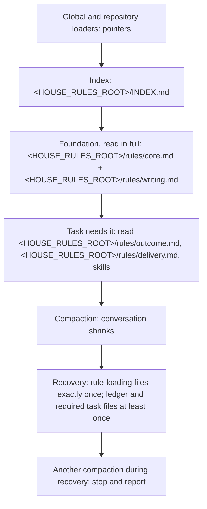

# Smaller House Rules foundation and bounded compaction recovery

Status: design only; operator choices recorded on 2026-10-07; implementation and verification pending

Issue: [#73](https://github.com/symbiotic-sh/house-rules/issues/73)

## 1. Result

The House Rules index becomes `<HOUSE_RULES_ROOT>/INDEX.md`.
The index replaces [&lt;HOUSE_RULES_ROOT&gt;/AGENTS.md](../../AGENTS.md) as the owner of shared loading instructions.
Global and managed-repository instruction files use the same pointer shape, with paths adjusted for each installation.
House Rules' own [&lt;HOUSE_RULES_ROOT&gt;/AGENTS.md](../../AGENTS.md) points to the index and `<HOUSE_RULES_ROOT>/.agents/rules.md`.

Each session reads a smaller foundation: [&lt;HOUSE_RULES_ROOT&gt;/rules/core.md](../../rules/core.md) and [&lt;HOUSE_RULES_ROOT&gt;/rules/writing.md](../../rules/writing.md).
The outcome and delivery rules load when the task needs them.
The index also loads the shared rules defined by [design #74](https://github.com/symbiotic-sh/house-rules/issues/74).
After a compaction, an agent re-reads each required rule-loading file exactly once.
The agent reads each required current task file completely at least once in the recovery turn.
Later reads of task files during the work are allowed.
An agent stops re-reading and reports the loop if recovery causes another compaction.

The operator approved this design's own canary runs on 2026-10-07.
The operator kept deferred-work tracking and the external-write limit in the foundation.
A separate Claude import change proceeds only after all three conditions in §4.7 pass.
House Rules stays tool-agnostic; the installer owns Claude-specific import lines.

## 2. Terms

`<HOUSE_RULES_ROOT>` means the permanent House Rules checkout.
`<REPOSITORY_ROOT>` means a managed repository's root.
`<SUBSYSTEM_ROOT>` means the subsystem being changed.
`<canary root>` means the debug House Rules checkout used for the canary.
`<fixture root>` means the temporary checkout used by the sync tests.
Paths below name complete locations within those roots.
Links to existing House Rules files resolve relative to this document.

- **House Rules block:** the managed pointer between `<!-- house-rules:begin -->` and `<!-- house-rules:end -->` in a tool's global instruction file.
  [&lt;HOUSE_RULES_ROOT&gt;/INSTALL-AGENTS.md §3](../../INSTALL-AGENTS.md) defines the block.
- **Index:** the proposed `<HOUSE_RULES_ROOT>/INDEX.md`, which owns shared loading instructions.
- **Foundation:** the House Rules text every session reads in full: [&lt;HOUSE_RULES_ROOT&gt;/rules/core.md](../../rules/core.md) and [&lt;HOUSE_RULES_ROOT&gt;/rules/writing.md](../../rules/writing.md).
- **Triggered file:** a rule file or skill an agent reads when the task first needs the file.
- **Rule-loading file:** the index, foundation, every triggered rule file and skill, the repository bible and repository context file when present.
- **Recovery:** the files an agent re-reads after a compaction or another context reset.
- **Instruction import:** a tool feature that links current file text into instructions, such as Claude's `@<HOUSE_RULES_ROOT>/rules/core.md`.
- **o200k:** the GPT tokenizer `o200k_base`, used for the token counts below.

## 3. Current behavior

Historical repository evidence below is pinned to commit
[9e18159](https://github.com/symbiotic-sh/house-rules/tree/9e1815917a4052e030b603350b27b855e6489e67).

- `FACT` The index requires all four rule files at session start and after every compaction:
  [&lt;HOUSE_RULES_ROOT&gt;/AGENTS.md:10-17](https://github.com/symbiotic-sh/house-rules/blob/9e1815917a4052e030b603350b27b855e6489e67/AGENTS.md#L10-L17).
- `FACT` The installed block is a pointer: "read [&lt;HOUSE_RULES_ROOT&gt;/AGENTS.md](../../AGENTS.md)" at session start
  and after every compaction or reset
  ([&lt;HOUSE_RULES_ROOT&gt;/INSTALL-AGENTS.md:113-128](https://github.com/symbiotic-sh/house-rules/blob/9e1815917a4052e030b603350b27b855e6489e67/INSTALL-AGENTS.md#L113-L128)).
  `ASSESSMENT` The pointer requires tool reads to bring shared rules into the conversation.
- `FACT` Core rules repeat the reload duty twice:
  [&lt;HOUSE_RULES_ROOT&gt;/rules/core.md:45-46](https://github.com/symbiotic-sh/house-rules/blob/9e1815917a4052e030b603350b27b855e6489e67/rules/core.md#L45-L46)
  and prime rule 15 at
  [&lt;HOUSE_RULES_ROOT&gt;/rules/core.md:156](https://github.com/symbiotic-sh/house-rules/blob/9e1815917a4052e030b603350b27b855e6489e67/rules/core.md#L156).
  `FACT` The reload instructions in [&lt;HOUSE_RULES_ROOT&gt;/rules/core.md at 9e18159](https://github.com/symbiotic-sh/house-rules/blob/9e1815917a4052e030b603350b27b855e6489e67/rules/core.md#L45-L46) and [prime rule 15](https://github.com/symbiotic-sh/house-rules/blob/9e1815917a4052e030b603350b27b855e6489e67/rules/core.md#L156) set no read limit.
- `FACT` The always-load set is 36,247 bytes and 7,336 o200k tokens (measured with `tiktoken`
  on the five Git objects at 9e18159 in this run): the index has 794 tokens, core has 2,979, outcome has 777, delivery has 1,651 and writing has 1,135.
  The measurement sums byte lengths and `o200k_base` encodings of `git show 9e18159:<file>` output.
- `FACT` [&lt;HOUSE_RULES_ROOT&gt;/scripts/sync.py](../../scripts/sync.py) reads the always-load list from the index
  ([&lt;HOUSE_RULES_ROOT&gt;/scripts/sync.py:248-258](https://github.com/symbiotic-sh/house-rules/blob/9e1815917a4052e030b603350b27b855e6489e67/scripts/sync.py#L248-L258))
  and reports a block that differs from the template as stale
  ([&lt;HOUSE_RULES_ROOT&gt;/scripts/sync.py:221-222](https://github.com/symbiotic-sh/house-rules/blob/9e1815917a4052e030b603350b27b855e6489e67/scripts/sync.py#L221-L222)).
  `ASSUMPTION` (the existing design's script review) The sync script only reports installation drift.
- `FACT` PR #53 ([bf4d846](https://github.com/symbiotic-sh/house-rules/commit/bf4d846)) first made the
  outcome and delivery rules conditional, then restored them as always-loaded. Its commit message
  gives the reason: the rewrite "dropped qualifiers and moved safeguards into optional skills,
  so sessions could miss required protections and reading order". This design avoids that
  failure in three ways. Rule moves preserve text except for the edits named in §4.2, complete file references and the index rename.
  Safeguards stay in the foundation, including deferred-item tracking and external-write limits
  from [&lt;HOUSE_RULES_ROOT&gt;/rules/delivery.md](../../rules/delivery.md). A one-time coverage check (§7) lists each sentence's new home.

The earlier design reports the following load-test observations from 2026-10-07.
The source logs for these observations were not checked in this revision.

- `ASSUMPTION` (the earlier design's load-test report) A manual Claude compaction went from 59,089 to 11,788 tokens (the run's
  `compact_metadata` record). `ASSUMPTION` (load-test report) After it, the agent held
  [&lt;HOUSE_RULES_ROOT&gt;/rules/core.md](../../rules/core.md) only as a summary and re-read the index and all four rule files.
- `ASSUMPTION` (the earlier design's event-log count) In one Codex turn with an auto-compaction limit set low on purpose, the completed
  commands read the index six times and each rule file two or three times (counted in the
  run's event log).
- `ASSUMPTION` (the earlier design's account of issue #73 and its pull-request comment) A project `<REPOSITORY_ROOT>/CLAUDE.md` importing a project
  file delivered its canary before and after `/compact`. An absolute import of a file outside the
  project did not load in headless mode. An import from the user-level `$CLAUDE_CONFIG_DIR/CLAUDE.md` is untested.
- `ASSUMPTION` (load-test re-test) Kimi's "hello" run read the index and the four rule files,
  so Kimi follows today's block like Claude and Codex.
- `ASSUMPTION` (the earlier design author) A Claude Code subagent received the user-level `$CLAUDE_CONFIG_DIR/CLAUDE.md` text in its instructions.

## 4. Design

### 4.1 Overview

`DECISION` (operator direction, 2026-10-07) The House Rules block stays a permanent pointer to the
index. The installer does not copy rule text into tool instructions.
The design changes the pointer destination and recovery reads:

1. The index becomes `<HOUSE_RULES_ROOT>/INDEX.md`; every loader becomes a pointer.
2. The foundation shrinks to [&lt;HOUSE_RULES_ROOT&gt;/rules/core.md](../../rules/core.md) plus [&lt;HOUSE_RULES_ROOT&gt;/rules/writing.md](../../rules/writing.md).
3. The outcome and delivery rules become triggered files.
4. A recovery rule bounds the re-read after a compaction.
5. Shared-rule loading follows [design #74](https://github.com/symbiotic-sh/house-rules/issues/74).



### 4.2 Where every rule goes

The implementation must retain every requirement through the rule moves.
The recovery section replaces three reload sentences at core lines 45, 46 and 156.
The precedence rule splits one sentence into two.
The session-start rule rewords one tracker-board sentence (§4.4).
The index and loader references follow the rename in §4.5.
Shared-rule extraction follows [design #74](https://github.com/symbiotic-sh/house-rules/issues/74).
Line numbers in the coverage map refer to commit 9e18159.

| Source lines | Content | Destination |
|---|---|---|
| [&lt;HOUSE_RULES_ROOT&gt;/rules/core.md](../../rules/core.md) 1-8 | one-home principles | foundation: [&lt;HOUSE_RULES_ROOT&gt;/rules/core.md](../../rules/core.md) (unchanged) |
| [&lt;HOUSE_RULES_ROOT&gt;/AGENTS.md](../../AGENTS.md) 6-8, [&lt;HOUSE_RULES_ROOT&gt;/rules/core.md](../../rules/core.md) 179 | precedence | foundation: [&lt;HOUSE_RULES_ROOT&gt;/rules/core.md](../../rules/core.md) §Precedence ([&lt;HOUSE_RULES_ROOT&gt;/AGENTS.md](../../AGENTS.md) 8 split in two) |
| [&lt;HOUSE_RULES_ROOT&gt;/rules/core.md](../../rules/core.md) 10-22 | Terms | foundation: [&lt;HOUSE_RULES_ROOT&gt;/rules/core.md](../../rules/core.md) (unchanged) |
| [&lt;HOUSE_RULES_ROOT&gt;/rules/core.md](../../rules/core.md) 26-32 | applicability, skills, native config | foundation: [&lt;HOUSE_RULES_ROOT&gt;/rules/core.md](../../rules/core.md) §Loading |
| [&lt;HOUSE_RULES_ROOT&gt;/rules/core.md](../../rules/core.md) 33-36 | tracker selection | [&lt;HOUSE_RULES_ROOT&gt;/rules/delivery.md](../../rules/delivery.md) §Work tracking & continuity |
| [&lt;HOUSE_RULES_ROOT&gt;/rules/core.md](../../rules/core.md) 40, 44, 47-48 | bible, context, writing pointers | foundation: [&lt;HOUSE_RULES_ROOT&gt;/rules/core.md](../../rules/core.md) §Loading |
| [&lt;HOUSE_RULES_ROOT&gt;/rules/core.md](../../rules/core.md) 41-43, 49-50 | tracker board, subsystem reads, reading order | [&lt;HOUSE_RULES_ROOT&gt;/rules/delivery.md](../../rules/delivery.md) §Session start (new) |
| [&lt;HOUSE_RULES_ROOT&gt;/rules/core.md](../../rules/core.md) 45-46 | reload after reset | replaced by [&lt;HOUSE_RULES_ROOT&gt;/rules/core.md](../../rules/core.md) §After a compaction |
| [&lt;HOUSE_RULES_ROOT&gt;/AGENTS.md](../../AGENTS.md) 12-17 | always-load list | `<HOUSE_RULES_ROOT>/INDEX.md` §Always load; shared rules per #74 |
| [&lt;HOUSE_RULES_ROOT&gt;/AGENTS.md](../../AGENTS.md) 22-23 | [&lt;HOUSE_RULES_ROOT&gt;/STRUCTURE.md](../../STRUCTURE.md), [&lt;HOUSE_RULES_ROOT&gt;/PREFERENCES.md](../../PREFERENCES.md) triggers | foundation: [&lt;HOUSE_RULES_ROOT&gt;/rules/core.md](../../rules/core.md) §Loading |
| [&lt;HOUSE_RULES_ROOT&gt;/rules/core.md](../../rules/core.md) 52-61 | Protected operator assets | foundation: [&lt;HOUSE_RULES_ROOT&gt;/rules/core.md](../../rules/core.md) (unchanged) |
| [&lt;HOUSE_RULES_ROOT&gt;/rules/core.md](../../rules/core.md) 63-85 | Operator correction, including stop | foundation: [&lt;HOUSE_RULES_ROOT&gt;/rules/core.md](../../rules/core.md) (unchanged) |
| [&lt;HOUSE_RULES_ROOT&gt;/rules/core.md](../../rules/core.md) 87-155 | Prime rules 1-15 | foundation: [&lt;HOUSE_RULES_ROOT&gt;/rules/core.md](../../rules/core.md) (unchanged) |
| [&lt;HOUSE_RULES_ROOT&gt;/rules/core.md](../../rules/core.md) 156 | re-read attachment rule | replaced by [&lt;HOUSE_RULES_ROOT&gt;/rules/core.md](../../rules/core.md) §After a compaction |
| [&lt;HOUSE_RULES_ROOT&gt;/rules/core.md](../../rules/core.md) 160-175, 180-195, 203-205 | collaboration mode, thresholds, lanes | [&lt;HOUSE_RULES_ROOT&gt;/rules/outcome.md](../../rules/outcome.md) §Autonomy (new) |
| [&lt;HOUSE_RULES_ROOT&gt;/rules/core.md](../../rules/core.md) 176-178, 196-202 | decisions required, unattended limits, stops | foundation: [&lt;HOUSE_RULES_ROOT&gt;/rules/core.md](../../rules/core.md) §Authority (new) |
| [&lt;HOUSE_RULES_ROOT&gt;/rules/delivery.md](../../rules/delivery.md) 68-69 | external repositories: read freely, no writes | foundation: [&lt;HOUSE_RULES_ROOT&gt;/rules/core.md](../../rules/core.md) §Authority |
| [&lt;HOUSE_RULES_ROOT&gt;/rules/delivery.md](../../rules/delivery.md) 104-117 | Track every deferred item | foundation: [&lt;HOUSE_RULES_ROOT&gt;/rules/core.md](../../rules/core.md) §Deferred work (new) |
| [&lt;HOUSE_RULES_ROOT&gt;/rules/core.md](../../rules/core.md) 207-251 | Security | foundation: [&lt;HOUSE_RULES_ROOT&gt;/rules/core.md](../../rules/core.md) (unchanged) |
| [&lt;HOUSE_RULES_ROOT&gt;/rules/core.md](../../rules/core.md) 253-264 | Stack & architecture, The bar | foundation: [&lt;HOUSE_RULES_ROOT&gt;/rules/core.md](../../rules/core.md) (unchanged) |
| [&lt;HOUSE_RULES_ROOT&gt;/rules/outcome.md](../../rules/outcome.md) 1-65 | all sections | [&lt;HOUSE_RULES_ROOT&gt;/rules/outcome.md](../../rules/outcome.md) (triggered; one reference fixed) |
| [&lt;HOUSE_RULES_ROOT&gt;/rules/delivery.md](../../rules/delivery.md) 1-67, 70-103, 118-136 | all other lines | [&lt;HOUSE_RULES_ROOT&gt;/rules/delivery.md](../../rules/delivery.md) (triggered) |
| [&lt;HOUSE_RULES_ROOT&gt;/rules/writing.md](../../rules/writing.md) 1-87 | all sections | foundation: [&lt;HOUSE_RULES_ROOT&gt;/rules/writing.md](../../rules/writing.md) (unchanged) |

The foundation retains precedence, authority and protected-asset rules.
The foundation retains evidence honesty through prime rules 1, 3, 5 and 6 and claim labels.
The foundation retains sensitive-data, durable-data and shared-process protection through Security and prime rule 15.
The foundation retains stop instructions through Operator correction and Authority.
`DECISION` (operator, 2026-10-07) The foundation also retains deferred-work tracking and the external-write limit.
A conversation can defer work or comment upstream without changing a file.

### 4.3 [&lt;HOUSE_RULES_ROOT&gt;/rules/core.md](../../rules/core.md)

The block below proposes the new and changed sections. Unchanged sections keep their current text:
one-home principles, Terms, Protected operator assets, Operator correction, Prime rules,
Security, Stack & architecture, The bar. Prime rule 15 drops its last sentence ("Re-read the
attachment rule after any context compaction."); the recovery rule re-reads all of core.

Order: one-home principles, Precedence, Terms, Loading, After a compaction, Protected operator
assets, Operator correction, Prime rules, Authority, Deferred work, Security, Stack &
architecture, The bar. Deferred work holds the delivery rule lines 104-117, under the heading
`## Deferred work`.

```markdown
## Precedence

- Repository instructions and explicit operator choices override House Rules when they conflict.
- Both stay subject to the host instruction hierarchy, permissions, access, and approval controls.
- A repository override may tighten or loosen any House Rules rule, including a security rule.
- The override names the rule it changes.
- Give explicit task instructions and host controls precedence.

## Loading

- Apply the sections relevant to the actual task.
- Do not create implementation, benchmark, claim, commit, or handoff obligations for a simple question.
- The foundation is <HOUSE_RULES_ROOT>/rules/core.md and <HOUSE_RULES_ROOT>/rules/writing.md.
- Load these files when the task first needs them:
  - Substantive work beyond a question or a short exchange: <HOUSE_RULES_ROOT>/rules/outcome.md.
  - Changing files, testing, committing, pushing, tracked or parallel work, or external or paid runs: <HOUSE_RULES_ROOT>/rules/delivery.md.
  - Artifact paths, naming, or placement: <HOUSE_RULES_ROOT>/STRUCTURE.md.
  - Project or stack defaults: <HOUSE_RULES_ROOT>/PREFERENCES.md.
- Load procedural skills on demand.
- Choose skills by the descriptions in your skill list.
- To identify which skills apply, read skill descriptions, not skill bodies.
- Keep model selection, permissions, Model Context Protocol connections, and hooks in native tool configuration.
- Keep delegation application programming interfaces in native tool configuration.
- Treat skills as procedure descriptions.
- Do not treat skills as access grants or tools that make unavailable capabilities callable.
- At session start, read the bible and `<REPOSITORY_ROOT>/CONTEXT.md` when present.
- Read context files fully.
- <HOUSE_RULES_ROOT>/rules/writing.md governs all text.
- Follow <HOUSE_RULES_ROOT>/skills/operator-writing/SKILL.md §Communication rules for operator-facing text.
- Lane workers load House Rules as normal sessions.
- A specialist prompt may state that it is the specialist's only House Rules source.
- That specialist prompt replaces House Rules loading and re-read instructions for that specialist run.

## After a compaction

- After a compaction or other context reset, re-read <HOUSE_RULES_ROOT>/INDEX.md, <HOUSE_RULES_ROOT>/rules/core.md and <HOUSE_RULES_ROOT>/rules/writing.md.
- Re-read the bible and `<REPOSITORY_ROOT>/CONTEXT.md` when present, and any active campaign ledger.
- Reload the triggered rule files and skills the current task uses.
- Read each required rule-loading file exactly once per compaction.
- Read each required current task file completely at least once in the recovery turn.
- Later reads of task files during the work are allowed.
- If re-reading causes another compaction, stop re-reading and report the loop to the operator.

## Authority

- Obtain a decision for changes to product scope, shipped product defaults, material risk, external-write authority, or resource envelopes.
- Apply this requirement in either collaboration mode.
- Keep the separate confirmation requirement for protected operator assets.
- Limit unattended work to approved work.
- Do not add scope, destructive steps, or protected-asset actions.
- Stop for the operator before credential steps.
- Stop for the operator before logins.
- Stop for the operator before destructive steps beyond a routine deploy.
- Report host safety controls that block launch.
- Do not work around those controls.
- Follow <HOUSE_RULES_ROOT>/rules/outcome.md §Autonomy for collaboration modes, confidence thresholds, and unattended lanes.
- Read, clone, or fork externally owned repositories freely.
- For externally owned repositories, never push upstream, open pull requests/issues, or comment until the operator says ready.
```

The skill-description loading rule comes from [design #75](https://github.com/symbiotic-sh/house-rules/issues/75).
The specialist-only prompt exception follows that design's separate safe-mode processes.
Lane workers retain normal session loading under [design #74](https://github.com/symbiotic-sh/house-rules/issues/74).
The role-prompt build follows [design #77](https://github.com/symbiotic-sh/house-rules/issues/77).
The operator-writing reference remains until [design #76](https://github.com/symbiotic-sh/house-rules/issues/76) moves everyday writing to its shared owner.

The recovery rule is the "After a compaction" section. An agent cannot reliably tell whether a
file it read survived compaction in full or only as a summary, so the rule always re-reads the
foundation. In exchange it bounds the re-read: each file once, and a stop with a report when the
re-read itself causes a compaction. `ASSESSMENT` A second index read during one recovery would violate the proposed "at most once" rule.

### 4.4 [&lt;HOUSE_RULES_ROOT&gt;/rules/outcome.md](../../rules/outcome.md) and [&lt;HOUSE_RULES_ROOT&gt;/rules/delivery.md](../../rules/delivery.md)

- [&lt;HOUSE_RULES_ROOT&gt;/rules/outcome.md](../../rules/outcome.md) gains a final section `## Autonomy` holding core lines 160-175, 180-195 and
  203-205 with only complete file references changed. Line 65 changes its reference from "[&lt;HOUSE_RULES_ROOT&gt;/rules/core.md](../../rules/core.md) §Autonomy" to
  "[&lt;HOUSE_RULES_ROOT&gt;/rules/core.md](../../rules/core.md) §Authority".
- [&lt;HOUSE_RULES_ROOT&gt;/rules/delivery.md](../../rules/delivery.md) §Work tracking & continuity starts with core lines 33-36 and
  loses lines 104-117 to core §Deferred work. §Git loses lines 68-69 to core §Authority; line 70
  (the fork exception) stays.
- [&lt;HOUSE_RULES_ROOT&gt;/rules/delivery.md](../../rules/delivery.md) gains `## Session start` before `## Verification`:

```markdown
## Session start

- After the bible, read the tracker board, followed by your work item's state and latest handoff.
- Default to the project board.
- Read subsystem `<SUBSYSTEM_ROOT>/CONTEXT.md` and `<SUBSYSTEM_ROOT>/README.md` before touching that subsystem.
- Follow `work-tracking` §Session loop: fetch, update, reconcile for tracker procedure.
- Follow `design-flow` §5 for feature reading order.
```

The session-start section replaces "Then read the tracker board…" with "After the bible, read the tracker board…".
The replacement names the reading order after the bible instruction moves to core.

### 4.5 Index rename and pointer files

Move the shared index from [&lt;HOUSE_RULES_ROOT&gt;/AGENTS.md](../../AGENTS.md) to `<HOUSE_RULES_ROOT>/INDEX.md`.
The index keeps the skill list.
Skill wording follows [design #76](https://github.com/symbiotic-sh/house-rules/issues/76).
The index starts with:

```markdown
# House Rules index

House Rules provides shared operating rules and task-specific skills.
This file is the shared index.
Precedence and loading rules are in [&lt;HOUSE_RULES_ROOT&gt;/rules/core.md](rules/core.md).

## Always load

At session start, read these files in full:

- [&lt;HOUSE_RULES_ROOT&gt;/rules/core.md](rules/core.md)
- [&lt;HOUSE_RULES_ROOT&gt;/rules/writing.md](rules/writing.md)

After a compaction or reset, follow <HOUSE_RULES_ROOT>/rules/core.md §After a compaction.

## Load when the task needs it

Rule files and shared references load by <HOUSE_RULES_ROOT>/rules/core.md §Loading.
Skills load by their descriptions; this list repeats their triggers.
```

The shared-rule additions to the index follow [design #74](https://github.com/symbiotic-sh/house-rules/issues/74).
The foundation budget in §6 counts those additions.
The structure and preference triggers move to core §Loading.

Replace [&lt;HOUSE_RULES_ROOT&gt;/AGENTS.md](../../AGENTS.md) with a pointer to `<HOUSE_RULES_ROOT>/INDEX.md` and `<HOUSE_RULES_ROOT>/.agents/rules.md`.
Every global and managed-repository pointer uses the same shape:

```markdown
# Shared operating foundation (House Rules)

At session start and after every context compaction or reset, read <HOUSE_RULES_ROOT>/INDEX.md.
Follow the rule files and skills that the index selects.
Read <LOCAL_RULES_FILE> when present for repository rules and settled local decisions.
Repository rules and explicit operator choices override shared preferences.
All work remains subject to the host instruction hierarchy and access controls.
```

The installer resolves `<HOUSE_RULES_ROOT>` for each installation.
For House Rules' own pointer, `<LOCAL_RULES_FILE>` resolves to `<HOUSE_RULES_ROOT>/.agents/rules.md`.
For a managed repository, `<LOCAL_RULES_FILE>` resolves to `<REPOSITORY_ROOT>/.agents/rules.md`.
In a global pointer, `<LOCAL_RULES_FILE>` means the current repository's `<REPOSITORY_ROOT>/.agents/rules.md` when present.
The installer preserves the managed block markers around global pointers.

[&lt;HOUSE_RULES_ROOT&gt;/INSTALL-AGENTS.md](../../INSTALL-AGENTS.md) §3 and [&lt;HOUSE_RULES_ROOT&gt;/STRUCTURE.md](../../STRUCTURE.md) §Managed repository loader adopt this shape.
[&lt;HOUSE_RULES_ROOT&gt;/scripts/sync.py](../../scripts/sync.py) changes its index path to `<HOUSE_RULES_ROOT>/INDEX.md`.
The sync parser continues to read the index's "Always load" list.
References that mean the shared index change to `<HOUSE_RULES_ROOT>/INDEX.md`.
References that mean a repository or global loader keep that loader's complete path.

### 4.6 Per-tool delivery

The installer updates global blocks and managed-repository pointers to the index in §4.5.
The installer preserves content outside each managed block.
The sync script reports old global blocks as stale.
One installation update changes the pointers; later rule edits need no reinstall.

- **Claude Code:** the global block is in `$CLAUDE_CONFIG_DIR/CLAUDE.md`, defaulting to `~/.claude/CLAUDE.md`.
  The separate import change follows §4.7.
- **Codex:** the global block is in `$CODEX_HOME/AGENTS.md` or `$CODEX_HOME/AGENTS.override.md` when the override exists.
  Every configured Codex home gets the same pointer shape.
  Codex uses the bounded re-read.
- **Kimi Code:** the global block is in `$KIMI_CODE_HOME/AGENTS.md`.
  Kimi uses the bounded re-read.
  The §7 canary supplies the missing evidence for Kimi's recovery behavior.
- **Other products:** adapters point to the same index.
  Antigravity installation belongs to [issue #78](https://github.com/symbiotic-sh/house-rules/issues/78).

A managed repository's `<REPOSITORY_ROOT>/AGENTS.md` points to the same shared index as the global block.
The agent reads the index once at session start, even if both loaders request that read.
The same once-per-file rule governs rule loading during recovery.
Lane workers use normal sessions under [design #74](https://github.com/symbiotic-sh/house-rules/issues/74).

### 4.7 Conditional Claude import in a separate pull request

`DECISION` (operator, 2026-10-07) Adopt the Claude import in a separate pull request only if all three conditions below pass.
The installer writes the import lines as a Claude-specific delivery detail.
House Rules keeps tool-agnostic loading rules.
Other tools continue re-reading after compaction.
The §7 canary tests whether the import retains the foundation across `/compact`.
A passing import lets Claude skip re-reading foundation text held in full in its instructions.

1. The import links rule text instead of copying rule text.
   The imported text changes when the House Rules checkout changes, with no regeneration.
2. The probe passes: the canary codes of [&lt;HOUSE_RULES_ROOT&gt;/rules/core.md](../../rules/core.md) and [&lt;HOUSE_RULES_ROOT&gt;/rules/writing.md](../../rules/writing.md) are quoted without
   tools, before and after `/compact`, in an interactive session and with `claude -p`.
3. Updating the import never requires hand regeneration of rule text.
   The import lines name the two foundation files.
   The import lines change only when the foundation list changes.

After all three conditions pass, the separate pull request makes these changes:

- The Claude block template in [&lt;HOUSE_RULES_ROOT&gt;/INSTALL-AGENTS.md](../../INSTALL-AGENTS.md) §3 gains two lines after the pointer text:
  `@<HOUSE_RULES_ROOT>/rules/core.md` and `@<HOUSE_RULES_ROOT>/rules/writing.md`. [&lt;HOUSE_RULES_ROOT&gt;/scripts/sync.py](../../scripts/sync.py)'s
  The sync `template()` function takes the product key and returns this variant for `CLAUDE_CONFIG_DIR` homes.
- Core §After a compaction and the index's "Always load" each gain one sentence: "Skip a
  foundation file that your instructions hold in full through an import."
- Installed Claude blocks report `stale block` once and are reinstalled once.

A failed condition leaves Claude using the bounded re-read.
The implementation team records the failed condition and its evidence.

### 4.8 References and tests that follow the moves

- Skill references to "[&lt;HOUSE_RULES_ROOT&gt;/rules/core.md](../../rules/core.md) §Autonomy" change to "[&lt;HOUSE_RULES_ROOT&gt;/rules/outcome.md](../../rules/outcome.md) §Autonomy" in
  [&lt;HOUSE_RULES_ROOT&gt;/skills/operator-protocol/SKILL.md](../../skills/operator-protocol/SKILL.md) (lines 35, 36, 46), [&lt;HOUSE_RULES_ROOT&gt;/skills/design-flow/SKILL.md](../../skills/design-flow/SKILL.md) (40), [&lt;HOUSE_RULES_ROOT&gt;/skills/bench-discipline/SKILL.md](../../skills/bench-discipline/SKILL.md) (57-58) and
  [&lt;HOUSE_RULES_ROOT&gt;/skills/project-bootstrap/SKILL.md](../../skills/project-bootstrap/SKILL.md) (25). [&lt;HOUSE_RULES_ROOT&gt;/skills/failure-forensics/SKILL.md](../../skills/failure-forensics/SKILL.md) line 71 ("for material risk and scope changes")
  changes to "[&lt;HOUSE_RULES_ROOT&gt;/rules/core.md](../../rules/core.md) §Authority".
- [&lt;HOUSE_RULES_ROOT&gt;/skills/handoff-continuity/SKILL.md](../../skills/handoff-continuity/SKILL.md) line 39 changes to "[&lt;HOUSE_RULES_ROOT&gt;/rules/core.md](../../rules/core.md) §Loading and [&lt;HOUSE_RULES_ROOT&gt;/rules/delivery.md](../../rules/delivery.md) §Session start". [&lt;HOUSE_RULES_ROOT&gt;/skills/work-tracking/SKILL.md](../../skills/work-tracking/SKILL.md) line 132 changes to "[&lt;HOUSE_RULES_ROOT&gt;/rules/delivery.md](../../rules/delivery.md) §Session start", and lines
  249-250 to "[&lt;HOUSE_RULES_ROOT&gt;/rules/delivery.md](../../rules/delivery.md) §Work tracking & continuity".
- [&lt;HOUSE_RULES_ROOT&gt;/CHANGELOG-RULES.md](../../CHANGELOG-RULES.md) renames two headings ("Session start (reload skills after a reset)" to
  "After a compaction (reload skills)"; "Autonomy (unattended work)" to "Authority (unattended
  work)"). It adds an entry for this change, citing the operator direction of 2026-10-07.
- [&lt;HOUSE_RULES_ROOT&gt;/skills/pr-ready/scripts/test_prompt.py](../../skills/pr-ready/scripts/test_prompt.py) moves each pinned sentence to its new file: the
  session-start test (`test_procedure_moves_preserve_reading_and_landing_order`), the council-escalation and unattended-autonomy tests, the precedence test, and the deferred-work tests (now core).
- `test_reset_reloads_skills_and_references_the_writing_rule_owner` keeps its name and now reads
  core §Loading and §After a compaction. Renaming it belongs to #76, which deletes the
  operator-writing sentence.
- `RuleIndexTest` reads the renamed index: `test_index_loads_every_skill_and_rule_file_with_resolving_relative_links`
  expects the foundation and design #74's shared rules in the index.
  The link assertion checks the outcome, delivery, structure and preference files named in core §Loading. `test_agents_contains_only_purpose_precedence_and_load_lines` checks the pointer shape of [&lt;HOUSE_RULES_ROOT&gt;/AGENTS.md](../../AGENTS.md).
  A separate index assertion checks the purpose and "Always load" lines in `<HOUSE_RULES_ROOT>/INDEX.md`. It keeps its format check for
  every skill line (`- <trigger>: load [name](path).`), which #76 relies on.
  `test_repository_overrides_may_tighten_or_loosen_and_name_the_rule` reads core §Precedence
  and checks the two sentences of the split precedence rule.
- A new test in [&lt;HOUSE_RULES_ROOT&gt;/skills/pr-ready/scripts/test_prompt.py](../../skills/pr-ready/scripts/test_prompt.py), `test_foundation_read_fits_budget`, sums the bytes of the index
  and the files under its "Always load" heading and asserts the budget in §6.
- [&lt;HOUSE_RULES_ROOT&gt;/scripts/test_sync.py](../../scripts/test_sync.py) renames its fixture index to `<fixture root>/INDEX.md`.
  Its `RULES` fixture follows the foundation and the shared-rule list from [design #74](https://github.com/symbiotic-sh/house-rules/issues/74).
  Regression checks cover the renamed index, stale old global blocks and the new pointer template.

## 5. Rejected alternatives

- **Inline copies of the foundation:** rejected because copied rule text drifts after source changes.
- **Automatic inline regeneration on every pull:** rejected because the pointer and bounded recovery need no repeated instruction-file writes.
- **Always load outcome and delivery:** rejected because short exchanges would still load task-specific rules.
- **Copy shared rules into repository loaders:** rejected because each copy becomes another rule owner.
- **Add a separate foundation file:** rejected because the existing core already owns the foundation rules.
- **Add a separate autonomy file:** rejected because autonomy and outcome use the same task trigger.
- **Use Claude compaction hooks:** rejected because hooks are tool-specific native configuration.
- **Combine canary rounds across designs:** rejected by the 2026-10-07 choice to verify this design alone.
- **Make deferred-work tracking and external-write limits conditional:** rejected by the 2026-10-07 choice to keep both in core.
- **Keep the shared index in [&lt;HOUSE_RULES_ROOT&gt;/AGENTS.md](../../AGENTS.md):** rejected by the 2026-10-07 choice to make every loader a pointer.
- **Keep bounded re-reading as Claude's only delivery method:** rejected if the separate import probe meets all three §4.7 conditions.

## 6. Size

`ASSESSMENT` Proposed foundation budget: the start-of-session read (the index plus the files under its
"Always load" heading) stays at or under 26,000 bytes, about 5,300 o200k tokens (`ESTIMATE`, at
4.9 bytes per token from the baseline byte and token counts verified in §3). A test enforces bytes because the tests use only the
Python standard library. `ESTIMATE` The earlier design estimated about 23,300 bytes before the settled index rename and shared-rule extraction.
The implementation team must remeasure the assembled index and always-loaded files after those changes.
The 26,000-byte budget includes every rule file that the index always loads.
[Design #76](https://github.com/symbiotic-sh/house-rules/issues/76) owns the everyday-writing additions.

| Set | Bytes | o200k tokens |
|---|---|---|
| Baseline: index + four rules | 36,247 | 7,336 |
| Earlier proposal: index + core + writing | about 23,300 | about 4,900 (`ESTIMATE`) |
| [&lt;HOUSE_RULES_ROOT&gt;/rules/outcome.md](../../rules/outcome.md), triggered | about 6,570 | about 1,220 (`ESTIMATE`) |
| [&lt;HOUSE_RULES_ROOT&gt;/rules/delivery.md](../../rules/delivery.md), triggered | about 7,400 | about 1,480 (`ESTIMATE`) |

`ASSUMPTION` (the earlier design's size report) The estimates used assembled proposal text and `tiktoken` 0.13.0.
These historical estimates do not measure this revision's proposed implementation.
Native skill descriptions are outside the file-read count.
The implementation team reports the final start-of-session and recovery counts.

Files and lines touched (`ESTIMATE`):

- [&lt;HOUSE_RULES_ROOT&gt;/rules/core.md](../../rules/core.md) about 45 lines out, 50 in; [&lt;HOUSE_RULES_ROOT&gt;/rules/outcome.md](../../rules/outcome.md) about 38 in;
  [&lt;HOUSE_RULES_ROOT&gt;/rules/delivery.md](../../rules/delivery.md) about 17 out, 12 in.
- The index rename adds `<HOUSE_RULES_ROOT>/INDEX.md` and replaces [&lt;HOUSE_RULES_ROOT&gt;/AGENTS.md](../../AGENTS.md) with a pointer.
- [&lt;HOUSE_RULES_ROOT&gt;/CHANGELOG-RULES.md](../../CHANGELOG-RULES.md) about 8 lines.
- [&lt;HOUSE_RULES_ROOT&gt;/skills/pr-ready/scripts/test_prompt.py](../../skills/pr-ready/scripts/test_prompt.py) about 50; [&lt;HOUSE_RULES_ROOT&gt;/scripts/test_sync.py](../../scripts/test_sync.py) for index and template regressions; the skill references listed in §4.8.
- [&lt;HOUSE_RULES_ROOT&gt;/INSTALL-AGENTS.md](../../INSTALL-AGENTS.md), [&lt;HOUSE_RULES_ROOT&gt;/STRUCTURE.md](../../STRUCTURE.md) and [&lt;HOUSE_RULES_ROOT&gt;/scripts/sync.py](../../scripts/sync.py) change for the renamed index and pointer shape.
  Their final line counts depend on the reference sweep.
  The separate Claude import change touches the installer and sync template again.

## 7. Verification

### Text tests (continuous integration, no model calls)

- [&lt;HOUSE_RULES_ROOT&gt;/skills/pr-ready/scripts/test_prompt.py](../../skills/pr-ready/scripts/test_prompt.py): the moved pins in §4.8 pass, the 20-word sentence test still passes on the
  changed rule files, and `test_foundation_read_fits_budget` passes.
- [&lt;HOUSE_RULES_ROOT&gt;/scripts/test_sync.py](../../scripts/test_sync.py): with the fixture index listing the foundation and design #74's shared rules, the existing missing-rule-file tests pass.
- One-time coverage check in the implementation PR: a script compares every bullet of the four
  rule files at 9e18159 with the new files and lists each bullet's new location.
  The check accounts for complete file references and the shared-rule moves from design #74.
  Only the three
  replaced sentences, the split precedence sentence and the reworded tracker-board sentence
  (§4.2) may be replaced instead of preserved. Its output goes in the PR body. It is not a permanent test, because the existing design assumes continuous-integration clones omit history.

### Canary test (model runs approved for this design alone)

`DECISION` (operator, 2026-10-07) Run this design's canary round alone, rather than combining the five designs.
`DECISION` (operator, 2026-10-07) Use up to 15 short sessions on existing subscriptions for the canary round.

Setup: a debug branch, never merged, appends a unique canary code to the index, [&lt;HOUSE_RULES_ROOT&gt;/rules/core.md](../../rules/core.md),
[&lt;HOUSE_RULES_ROOT&gt;/rules/writing.md](../../rules/writing.md), [&lt;HOUSE_RULES_ROOT&gt;/rules/outcome.md](../../rules/outcome.md) and [&lt;HOUSE_RULES_ROOT&gt;/rules/delivery.md](../../rules/delivery.md). Test homes for Claude Code, Codex
and Kimi hold the new pointer block, pointing at that branch's `<HOUSE_RULES_ROOT>/INDEX.md`. The tool event logs are the
evidence; the agent's self-report is not.
The fixture repository contains both `<REPOSITORY_ROOT>/.agents/rules.md` (the bible) and `<REPOSITORY_ROOT>/CONTEXT.md`.

For steps 1-3, use a required-file inventory for startup, task-triggered loading and recovery.
Before each phase, record the complete paths in the event log from the pointer, index, repository rules and applicable task rules and skills.
Deduplicate paths requested by multiple loaders.
Distinguish rule-loading files (§2) from task files in each inventory, following the lead decision in §10, Decision 5.
The exactly-once check governs required rule loading at startup, when a task first triggers a file, and after compaction.
A missing, partial or duplicate rule-loading read fails the phase.
Every required task file must receive at least one complete read before the work requiring it.
Later reads of task files are allowed and do not fail the canary.
Task-triggered loading inventories only newly required rule-loading files plus the required task files.
Rule-loading files read at startup are not read again before compaction.

1. **Hello:** "hello". The startup inventory includes the index, foundation, `<REPOSITORY_ROOT>/.agents/rules.md` and `<REPOSITORY_ROOT>/CONTEXT.md` when present.
   Include every shared rule required at startup by [design #74](https://github.com/symbiotic-sh/house-rules/issues/74).
   Pass: every file in the startup inventory receives exactly one complete read before answering.
   Apply this startup check to the coding session too.
   The hello session does not read outcome or delivery.
2. **Coding task:** fix a fixture function with incorrect behavior, add and run a regression test, and commit the fix.
   This substantive task triggers outcome; changing files, testing and committing trigger delivery (§4.3).
   The task-triggered inventory includes outcome, delivery, every other triggered rule file and skill,
   the work item, latest handoff when present, source and regression test files,
   and `<SUBSYSTEM_ROOT>/CONTEXT.md` and `<SUBSYSTEM_ROOT>/README.md` when present.
   Pass before compaction: every newly required rule-loading file receives exactly one complete read before the work requiring it.
   Also, every required task file receives at least one complete read before the work requiring it.
   Verify the tracker board, work item and latest handoff reads in the order required by §4.4.
   To check ordinary verification reads, read the changed source and regression test files again after editing.
   These later reads must not fail the canary.
3. **Compaction:** before finishing step 2, fill the context by inspecting the fixture read-only, then compact
   (`/compact` in Claude and Kimi; a low auto-compaction limit in Codex, as in the load test).
   Before compaction, list the complete paths of the required recovery files in the event log:
   `<canary root>/INDEX.md`, [&lt;canary root&gt;/rules/core.md](../../rules/core.md),
   [&lt;canary root&gt;/rules/writing.md](../../rules/writing.md), [&lt;canary root&gt;/rules/outcome.md](../../rules/outcome.md),
   [&lt;canary root&gt;/rules/delivery.md](../../rules/delivery.md), the fixture's bible and repository context file when present,
   any active campaign ledger when present,
   every other triggered rule file and skill still used, and all still-required task files from step 2.
   Include the shared rules required by [design #74](https://github.com/symbiotic-sh/house-rules/issues/74).
   Pass: the recovery turn performs exactly one complete read of every required rule-loading file before resuming the coding task.
   It performs at least one complete read of every still-required task file before resuming, including the work item, source and regression test files.
   After resuming work, read the changed source and regression test files again to verify further edits.
   These later reads must not fail the canary.
4. **Compaction loop:** repeat step 3 in Codex with a limit low enough that the re-read itself
   compacts again. Pass: the agent stops re-reading and reports the loop; no rule-loading file is read a
   third time.
5. **Claude import probe (§4.7, not a pass condition for this issue):** a Claude home whose
   user-level `$CLAUDE_CONFIG_DIR/CLAUDE.md` block holds the pointer plus `@<canary root>/rules/core.md` and
   `@<canary root>/rules/writing.md`. Ask "Do not use any tool. Quote the canary codes in your
   instructions." before and after `/compact`, interactively and with `claude -p`. Then commit a
   new canary code to the branch and ask again in a fresh session. Record whether both codes are
   quoted each time and whether the new code appears without reinstalling.

Pass for the issue: steps 1-3 pass in all three tools and step 4 passes in Codex. If a tool fails,
the implementation PR stays a draft and the evidence returns to the operator.

## 8. Rollout and pins

The proposed merge order across the five designs is #74, #77, #73, #76, #75.
The shared-rule design is [#74](https://github.com/symbiotic-sh/house-rules/issues/74).
The prompt-building design is [#77](https://github.com/symbiotic-sh/house-rules/issues/77).
The review and specialist designs are [#76](https://github.com/symbiotic-sh/house-rules/issues/76) and [#75](https://github.com/symbiotic-sh/house-rules/issues/75).

1. One implementation pull request changes the index, rule moves, references, installer templates and tests together.
   The implementation includes a reference sweep that distinguishes the shared index from pointer files.
2. The operator's clean checkout updates through [&lt;HOUSE_RULES_ROOT&gt;/scripts/sync.py](../../scripts/sync.py).
   The installer updates old global blocks and managed-repository loaders to the new pointer shape.
3. New sessions read `<HOUSE_RULES_ROOT>/INDEX.md` through the installed pointer.
   Later rule changes need no pointer reinstall.
4. Lane workers load live session rules through the House Rules block, like normal sessions.
   Only role prompts are built from named Git commits under [design #77](https://github.com/symbiotic-sh/house-rules/issues/77).
   The index rename does not pin lane session rules.
5. Warden shared-rule staging and role includes follow [design #74](https://github.com/symbiotic-sh/house-rules/issues/74).
   The matching Warden prompt-building change follows [design #77](https://github.com/symbiotic-sh/house-rules/issues/77).
6. The separate Claude import pull request follows only after the §4.7 probe passes all three conditions.

## 9. Interfaces with the other designs

- **[Design #74](https://github.com/symbiotic-sh/house-rules/issues/74), shared rules and role prompts:** shared rules live in `<HOUSE_RULES_ROOT>/rules/` and load through `<HOUSE_RULES_ROOT>/INDEX.md` for sessions and subagents.
  Design #74 owns Warden shared-rule includes, omission of those includes for normal lane sessions, and removal of copies from `<HOUSE_RULES_ROOT>/prompts/util/`.
  Lane workers retain House Rules, skills and guardian escalation; Warden reviewers stay read-only and run no builds or tests.
- **[Design #75](https://github.com/symbiotic-sh/house-rules/issues/75), specialists:** separate `claude -p --safe-mode` processes receive needed skill text in prompts.
  Design #75 owns the Model Context Protocol test and fallback.
- **[Design #76](https://github.com/symbiotic-sh/house-rules/issues/76), reviews and writing:** everyday writing remains in [&lt;HOUSE_RULES_ROOT&gt;/rules/writing.md](../../rules/writing.md).
  Design #76 owns the `change-review` skill, review format and default of one reviewer for plain chat reviews.
- **[Design #77](https://github.com/symbiotic-sh/house-rules/issues/77), prompt building:** role prompts come from Git objects at a named commit in any clone.
  Lane session rules come from the live House Rules checkout through the block.
- **[Issue #54](https://github.com/symbiotic-sh/house-rules/issues/54), tracker exception:** the separate tracking change allows a workspace tracker file only when no repository exists.
  This design retains deferred-work tracking in core without duplicating that change.
- **[Issue #78](https://github.com/symbiotic-sh/house-rules/issues/78), Antigravity:** the adapter points to `<HOUSE_RULES_ROOT>/INDEX.md` and loads the foundation.

## 10. Decisions

The operator's decisions dated 2026-10-07 settle the choices below.
The other designs' choices remain with their owners in §9.

1. `DECISION` (2026-10-07) Run the canary test for this design alone.
   Use up to 15 short sessions on the existing subscriptions.
2. `DECISION` (2026-10-07) Keep deferred-work tracking and the external-write limit in the always-loaded core.
   The earlier design estimates the added read at about 300 tokens per session.
3. `DECISION` (2026-10-07) Adopt Claude's import in a separate pull request only after all three §4.7 conditions pass.
   House Rules remains tool-agnostic.
   The installer writes Claude-specific import lines; other tools keep re-reading after compaction.
4. `DECISION` (2026-10-07) Rename the shared index to `<HOUSE_RULES_ROOT>/INDEX.md`.
   Global and managed-repository instruction files use the same pointer shape with installation-specific paths.
   House Rules' own [&lt;HOUSE_RULES_ROOT&gt;/AGENTS.md](../../AGENTS.md) points to the index and `<HOUSE_RULES_ROOT>/.agents/rules.md`.
   File references use complete paths, including diagram labels.
5. `DECISION` (lead, 2026-10-07) The exactly-once check governs required rule loading at startup and after compaction.
   It covers the index, foundation, every triggered rule file and skill, the repository bible and repository context file when present.
   Newly triggered rule files and skills receive exactly one complete read before the work requiring them.
   The coding task's work item, source and regression test files must each be read completely at least once in the recovery turn.
   Later reads of task files during the work are allowed and do not fail the canary.
   This preserves [issue #73](https://github.com/symbiotic-sh/house-rules/issues/73)'s exactly-once requirement for rule loading.

## 11. Open points

No operator choice remains open for this design.
The implementation team must close these evidence gaps:

- **Canary evidence:** run §7 within the approved envelope and attach tool event logs to the implementation pull request.
  A failing required step keeps that pull request in draft and returns the evidence to the operator.
- **Claude import evidence:** record whether all three §4.7 conditions pass before starting the separate import pull request.
  A failed condition keeps Claude on the bounded re-read.
- **Final size and coverage:** measure the renamed index and all always-loaded files after the shared-rule changes from design #74.
  Pass the §6 byte-budget test and publish the §7 rule-coverage output.
