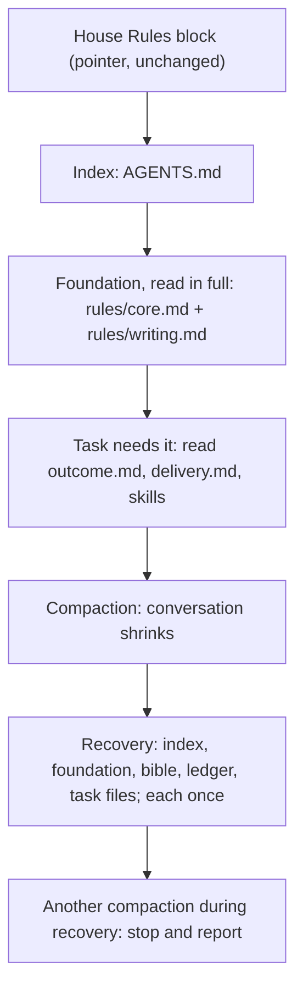

# Smaller House Rules foundation and bounded compaction recovery

Status: proposed (design only, awaiting operator approval)

Issue: [#73](https://github.com/jak-pan/house-rules/issues/73)

## 1. Result

Each session reads a smaller House Rules foundation at start: the index, `rules/core.md` and
`rules/writing.md`, about 4,900 tokens instead of 7,300. The outcome and delivery rules load only
when the task needs them. After a compaction, an agent re-reads the foundation and the files its
current task uses once each, and stops and reports if re-reading causes another compaction. The
House Rules block in each tool's instructions stays a permanent pointer to the index, so a pull
of House Rules updates every tool without reinstalling.

## 2. Terms

- **House Rules block:** the managed section of a tool's global instruction file between
  `<!-- house-rules:begin -->` and `<!-- house-rules:end -->`
  ([INSTALL-AGENTS.md §3](../../INSTALL-AGENTS.md)): `CLAUDE.md` for Claude Code, `AGENTS.md` for
  Codex and Kimi. It is a pointer: it tells the agent to read the House Rules index.
- **Index:** House Rules `AGENTS.md`.
- **Foundation:** the House Rules text every session reads in full at start: `rules/core.md` and
  `rules/writing.md` after this change. It replaces the "always-load set" (the index plus four
  rule files). The sibling designs #74-#77 use the same term.
- **Triggered file:** a rule file or skill that an agent reads when the task first needs it.
- **Recovery:** what an agent reads again after a compaction or another context reset.
- **Instruction import:** a tool feature that puts a linked file's current text into the
  instructions, for example `@path` in a Claude Code `CLAUDE.md`. The file is linked, not copied.
- **o200k:** the GPT tokenizer `o200k_base`; token counts below use it.

## 3. Current behavior

Evidence links are pinned to origin/main
[9e18159](https://github.com/jak-pan/house-rules/tree/9e1815917a4052e030b603350b27b855e6489e67).

- `FACT` The index requires all four rule files at session start and after every compaction:
  [AGENTS.md:10-17](https://github.com/jak-pan/house-rules/blob/9e1815917a4052e030b603350b27b855e6489e67/AGENTS.md#L10-L17).
- `FACT` The installed block is a pointer: "read `<HOUSE_RULES_ROOT>/AGENTS.md`" at session start
  and after every compaction or reset
  ([INSTALL-AGENTS.md:113-128](https://github.com/jak-pan/house-rules/blob/9e1815917a4052e030b603350b27b855e6489e67/INSTALL-AGENTS.md#L113-L128)).
  Every rule reaches the agent through tool reads, which live in the conversation.
- `FACT` Core rules repeat the reload duty twice:
  [rules/core.md:45-46](https://github.com/jak-pan/house-rules/blob/9e1815917a4052e030b603350b27b855e6489e67/rules/core.md#L45-L46)
  and prime rule 15 at
  [rules/core.md:156](https://github.com/jak-pan/house-rules/blob/9e1815917a4052e030b603350b27b855e6489e67/rules/core.md#L156).
  No rule limits how often a file is re-read.
- `FACT` The always-load set is 36,247 bytes and 7,336 o200k tokens (measured with `tiktoken`
  0.13.0 on the five files at 9e18159): index 794, core 2,979, outcome 777, delivery 1,651,
  writing 1,135 tokens.
- `FACT` `scripts/sync.py` reads the always-load list from the index
  ([sync.py:248-258](https://github.com/jak-pan/house-rules/blob/9e1815917a4052e030b603350b27b855e6489e67/scripts/sync.py#L248-L258))
  and reports a block that differs from the template as stale
  ([sync.py:221-222](https://github.com/jak-pan/house-rules/blob/9e1815917a4052e030b603350b27b855e6489e67/scripts/sync.py#L221-L222)).
  It never writes instruction files.
- `FACT` PR #53 ([bf4d846](https://github.com/jak-pan/house-rules/commit/bf4d846)) first made the
  outcome and delivery rules conditional, then restored them as always-loaded. Its commit message
  gives the reason: the rewrite "dropped qualifiers and moved safeguards into optional skills,
  so sessions could miss required protections and reading order". This design avoids that
  failure in three ways. Text moves verbatim, except the four sentences that §4.2 names.
  Safeguards stay in the foundation, including deferred-item tracking and external-write limits
  from `rules/delivery.md`. A one-time coverage check (§7) lists each sentence's new home.

The 2026-10-07 load test (a private report on the operator machine) adds these observations:

- `FACT` A manual Claude compaction went from 59,089 to 11,788 tokens (the run's
  `compact_metadata` record). `ASSUMPTION` (load-test report) After it, the agent held
  `rules/core.md` only as a summary and re-read the index and all four rule files.
- `FACT` In one Codex turn with an auto-compaction limit set low on purpose, the completed
  commands read the index six times and each rule file two or three times (counted in the
  run's event log).
- `ASSUMPTION` (issue #73 and the operator's PR comment) A project `CLAUDE.md` importing a project
  file delivered its canary before and after `/compact`. An absolute import of a file outside the
  project did not load in headless mode. An import from the user-level `CLAUDE.md` is untested.
- `ASSUMPTION` (load-test re-test) Kimi's "hello" run read the index and the four rule files,
  so Kimi follows today's block like Claude and Codex.
- `FACT` A Claude Code subagent receives the user-level `CLAUDE.md` text in its instructions:
  the subagent that wrote this design received it.

## 4. Design

### 4.1 Overview

`DECISION` (operator direction, 2026-10-07) The House Rules block stays a permanent pointer to the
index. No tool gets an inline copy of rule text that could go stale. The design changes what the
pointer leads to and how much an agent re-reads:

1. The foundation shrinks to `rules/core.md` plus `rules/writing.md`.
2. The outcome and delivery rules become triggered files.
3. A recovery rule bounds the re-read after a compaction.



### 4.2 Where every rule goes

No rule is removed. Three sentences (core 45, 46 and 156) are replaced by the new recovery
section, which covers them. One precedence sentence is split in two, and one tracker sentence
is reworded (§4.4). Line numbers are at 9e18159.

| Source lines | Content | Destination |
|---|---|---|
| core 1-8 | one-home principles | foundation: core (unchanged) |
| AGENTS 6-8, core 179 | precedence | foundation: core §Precedence (AGENTS 8 split in two) |
| core 10-22 | Terms | foundation: core (unchanged) |
| core 26-32 | applicability, skills, native config | foundation: core §Loading |
| core 33-36 | tracker selection | delivery §Work tracking & continuity |
| core 40, 44, 47-48 | bible, context files, writing pointers | foundation: core §Loading |
| core 41-43, 49-50 | tracker board, subsystem reads, reading order | delivery §Session start (new) |
| core 45-46 | reload after reset | replaced by core §After a compaction |
| AGENTS 12-17 | always-load list | AGENTS §Always load (two files) |
| AGENTS 22-23 | STRUCTURE, PREFERENCES triggers | foundation: core §Loading |
| core 52-61 | Protected operator assets | foundation: core (unchanged) |
| core 63-85 | Operator correction, including stop | foundation: core (unchanged) |
| core 87-155 | Prime rules 1-15 | foundation: core (unchanged) |
| core 156 | re-read attachment rule | replaced by core §After a compaction |
| core 160-175, 180-195, 203-205 | collaboration mode, thresholds, lanes | outcome §Autonomy (new) |
| core 176-178, 196-202 | decisions required, unattended limits, stops | foundation: core §Authority (new) |
| delivery 68-69 | external repositories: read freely, no writes | foundation: core §Authority |
| delivery 104-117 | Track every deferred item | foundation: core §Deferred work (new) |
| core 207-251 | Security | foundation: core (unchanged) |
| core 253-264 | Stack & architecture, The bar | foundation: core (unchanged) |
| outcome 1-65 | all sections | outcome (triggered; one reference fixed) |
| delivery 1-67, 70-103, 118-136 | all other lines | delivery (triggered) |
| writing 1-87 | all sections | foundation: writing (unchanged) |

The foundation keeps every item the issue lists: precedence, authority, protected assets,
evidence honesty (prime rules 1, 3, 5, 6 and claim labels), sensitive data, durable-data and
shared-process protection (Security, prime rule 15), and stop instructions (Operator correction,
Authority). It also keeps the deferred-item rules and the external-write limit, because a
conversation can defer work or comment upstream without changing any file.

### 4.3 `rules/core.md`

New and changed sections, in their exact text. Unchanged sections keep their current text:
one-home principles, Terms, Protected operator assets, Operator correction, Prime rules,
Security, Stack & architecture, The bar. Prime rule 15 drops its last sentence ("Re-read the
attachment rule after any context compaction."); the recovery rule re-reads all of core.

Order: one-home principles, Precedence, Terms, Loading, After a compaction, Protected operator
assets, Operator correction, Prime rules, Authority, Deferred work, Security, Stack &
architecture, The bar. Deferred work holds delivery lines 104-117 verbatim, under the heading
`## Deferred work`.

```markdown
## Precedence

- Repository instructions and explicit operator choices override House Rules when they conflict.
- Both stay subject to the host instruction hierarchy, permissions, access, and approval controls.
- A repository override may tighten or loosen any House Rules rule, including a security rule.
- The override names the rule it changes.
- Give explicit task instructions and host controls precedence.

## Loading

- Apply the sections relevant to the actual task.
- Do not create implementation, benchmark, claim, commit, or handoff obligations for a simple question.
- The foundation is this file and rules/writing.md.
- Load these files when the task first needs them:
  - Substantive work beyond a question or a short exchange: rules/outcome.md.
  - Changing files, testing, committing, pushing, tracked or parallel work, or external or paid runs: rules/delivery.md.
  - Artifact paths, naming, or placement: STRUCTURE.md.
  - Project or stack defaults: PREFERENCES.md.
- Load procedural skills on demand.
- Choose skills by the descriptions in your skill list.
- To identify which skills apply, read skill descriptions, not skill bodies.
- Keep model selection, permissions, Model Context Protocol connections, and hooks in native tool configuration.
- Keep delegation application programming interfaces in native tool configuration.
- Treat skills as procedure descriptions.
- Do not treat skills as access grants or tools that make unavailable capabilities callable.
- At session start, read the bible and `CONTEXT.md` when present.
- Read context files fully.
- rules/writing.md governs all text.
- Follow skills/operator-writing/SKILL.md §Communication rules for operator-facing text.
- A compiled prompt may state that it is your only rule source.
- For that run, it overrides the loading and re-read rules in this file.

## After a compaction

- After a compaction or other context reset, re-read the index, this file and rules/writing.md.
- Re-read the bible and any active campaign ledger.
- Reload the triggered rule files and skills the current task uses.
- Read each file at most once per compaction.
- If re-reading causes another compaction, stop re-reading and report the loop to the operator.

## Authority

- Obtain a decision for changes to product scope, shipped product defaults, material risk, external-write authority, or resource envelopes.
- Apply this requirement in either collaboration mode.
- Keep the separate confirmation requirement for protected operator assets.
- Limit unattended work to approved work.
- Do not add scope, destructive steps, or protected-asset actions.
- Stop for the operator before credential steps.
- Stop for the operator before logins.
- Stop for the operator before destructive steps beyond a routine deploy.
- Report host safety controls that block launch.
- Do not work around those controls.
- Follow rules/outcome.md §Autonomy for collaboration modes, confidence thresholds, and unattended lanes.
- Read, clone, or fork externally owned repositories freely.
- For externally owned repositories, never push upstream, open pull requests/issues, or comment until the operator says ready.
```

Three §Loading sentences come from the sibling designs. "To identify which skills apply…" is
[#75](https://github.com/jak-pan/house-rules/issues/75)'s sentence. The two sentences about a
compiled prompt let a worker pack built under #74 and #77 stay its worker's only rule source,
even when that worker's tool also delivers the House Rules block. The sentence "Follow
skills/operator-writing/SKILL.md §Communication rules for operator-facing text." stays here only
until [#76](https://github.com/jak-pan/house-rules/issues/76) merges after this design; #76
deletes it together with the section it names.

The recovery rule is the "After a compaction" section. An agent cannot reliably tell whether a
file it read survived compaction in full or only as a summary, so the rule always re-reads the
foundation. In exchange it bounds the re-read: each file once, and a stop with a report when the
re-read itself causes a compaction. The Codex turn that read the index six times breaks the
"at most once" sentence at its second read.

### 4.4 `rules/outcome.md` and `rules/delivery.md`

- `rules/outcome.md` gains a final section `## Autonomy` holding core lines 160-175, 180-195 and
  203-205 verbatim. Line 65 changes its reference from "rules/core.md §Autonomy" to
  "rules/core.md §Authority".
- `rules/delivery.md` §Work tracking & continuity starts with core lines 33-36 verbatim and
  loses lines 104-117 to core §Deferred work. §Git loses lines 68-69 to core §Authority; line 70
  (the fork exception) stays.
- `rules/delivery.md` gains `## Session start` before `## Verification`:

```markdown
## Session start

- After the bible, read the tracker board, followed by your work item's state and latest handoff.
- Default to the project board.
- Read subsystem `CONTEXT.md` and `README.md` before touching that subsystem.
- Follow `work-tracking` §Session loop: fetch, update, reconcile for tracker procedure.
- Follow `design-flow` §5 for feature reading order.
```

The first sentence replaces "Then read the tracker board…" because the bible line now lives in
core.

### 4.5 `AGENTS.md`

The index keeps its skill lines. Skill wording belongs to [#76](https://github.com/jak-pan/house-rules/issues/76).
Its top and its "Always load" section become:

```markdown
# AGENTS.md — Universal

House Rules provides shared operating rules and task-specific skills.
This file is its index.
Precedence and loading rules are in [rules/core.md](rules/core.md).

## Always load

At session start, read these files in full:

- [core rules](rules/core.md)
- [writing rules](rules/writing.md)

After a compaction or reset, follow rules/core.md §After a compaction.

## Load when the task needs it

Rule files and shared references load by the triggers in rules/core.md §Loading.
Skills load by their descriptions; this list repeats their triggers.
```

The STRUCTURE and PREFERENCES lines move to core §Loading. `scripts/sync.py` already reads the
"Always load" list from the index, so its rule-file check follows the change without code
changes.

### 4.6 Per-tool delivery

The House Rules block template in [INSTALL-AGENTS.md](../../INSTALL-AGENTS.md) §3 does not change.
It already says to read the index at session start and after every compaction or reset, and to
load what the index selects. Installed blocks therefore stay current: a pull of House Rules
changes what the pointer leads to, and no tool needs a reinstall.

- **Claude Code:** the block in the user-level `$CLAUDE_CONFIG_DIR/CLAUDE.md` (default
  `~/.claude/CLAUDE.md`). Claude subagents receive it too. An optional instruction import is in
  §4.7.
- **Codex:** the block in `$CODEX_HOME/AGENTS.md`, or `AGENTS.override.md` when that file exists,
  in every Codex home (INSTALL-AGENTS.md §3 step 7). Codex has no import; it uses the bounded
  re-read.
- **Kimi Code:** the block in `$KIMI_CODE_HOME/AGENTS.md`. It uses the bounded re-read. Kimi's
  compaction behavior is untested; the canary in §7 is its first evidence.
- **Other products:** `INSTALL-AGENTS.md` §1 lists only these three. Gemini, Cursor and Copilot
  appear only as project pointer files in `STRUCTURE.md`. Antigravity (`agy`) is tracked in
  [#78](https://github.com/jak-pan/house-rules/issues/78); it gets the same pointer block.
- **Inline text:** no tool needs it in this design. `DECISION` If a tool ever needs inline House
  Rules text, `scripts/sync.py` regenerates that text automatically on every pull; no person or
  agent updates it by hand.

A managed repository's loader ([STRUCTURE.md](../../STRUCTURE.md) §Managed repository loader)
tells the agent to read the House Rules index, which the block already did. In a managed
repository this can cost one extra read of the index, about 730 tokens. The STRUCTURE.md "Managed
repository loader" template is unchanged by all five designs; #77 owns detecting it.

### 4.7 Optional: a Claude Code import from the user-level `CLAUDE.md`

An instruction import could keep the foundation in Claude's instructions across `/compact`, so
recovery would skip re-reading it. The canary in §7 tests this once (step 5). The change below
may be adopted only if all three conditions hold:

1. The import is a link, not a copy: the imported text changes when the House Rules checkout
   changes, with no regeneration.
2. The probe passes: the canary codes of `rules/core.md` and `rules/writing.md` are quoted without
   tools, before and after `/compact`, in an interactive session and with `claude -p`.
3. `scripts/sync.py` never has to regenerate text by hand. The import lines name the two
   foundation files, which change only when this design's foundation list changes.

If adopted, the change is small and lands in its own PR:

- The Claude block template in `INSTALL-AGENTS.md` §3 gains two lines after the pointer text:
  `@<HOUSE_RULES_ROOT>/rules/core.md` and `@<HOUSE_RULES_ROOT>/rules/writing.md`. `sync.py`'s
  `template()` takes the product key and returns this variant for `CLAUDE_CONFIG_DIR` homes.
- Core §After a compaction and the index's "Always load" each gain one sentence: "Skip a
  foundation file that your instructions hold in full through an import."
- Installed Claude blocks report `stale block` once and are reinstalled once.

Question 3 asks whether to plan for this.

### 4.8 References and tests that follow the moves

- Skill references to "rules/core.md §Autonomy" change to "rules/outcome.md §Autonomy" in
  operator-protocol (lines 35, 36, 46), design-flow (40), bench-discipline (57-58) and
  project-bootstrap (25). failure-forensics line 71 ("for material risk and scope changes")
  changes to "rules/core.md §Authority".
- handoff-continuity line 39 changes to "rules/core.md §Loading and rules/delivery.md §Session
  start". work-tracking line 132 changes to "rules/delivery.md §Session start", and lines
  249-250 to "rules/delivery.md §Work tracking & continuity".
- `CHANGELOG-RULES.md` renames two headings ("Session start (reload skills after a reset)" to
  "After a compaction (reload skills)"; "Autonomy (unattended work)" to "Authority (unattended
  work)"). It adds an entry for this change, citing the operator direction of 2026-10-07.
- `skills/pr-ready/scripts/test_prompt.py` moves each pinned sentence to its new file: the
  session-start test (`test_procedure_moves_preserve_reading_and_landing_order`), the council,
  L9, L10 and L11 autonomy tests, M1 precedence, and the tracking-rule and M9 tests (now core).
- `test_reset_reloads_skills_and_references_the_writing_rule_owner` keeps its name and now reads
  core §Loading and §After a compaction. Renaming it belongs to #76, which deletes the
  operator-writing sentence.
- `RuleIndexTest`: `test_index_loads_every_skill_and_rule_file_with_resolving_relative_links`
  expects core and writing in the index and outcome, delivery, STRUCTURE and PREFERENCES linked
  from core §Loading. `test_agents_contains_only_purpose_precedence_and_load_lines` adds the new
  purpose and "Always load" lines from §4.5 to its accepted set. It keeps its format check for
  every skill line (`- <trigger>: load [name](path).`), which #76 relies on.
  `test_repository_overrides_may_tighten_or_loosen_and_name_the_rule` reads core §Precedence
  and checks the two sentences of the split precedence rule.
- A new test in `test_prompt.py`, `test_foundation_read_fits_budget`, sums the bytes of the index
  and the files under its "Always load" heading and asserts the budget in §6.
- `scripts/test_sync.py` changes its fixture `RULES` to `("core", "writing")`. `scripts/sync.py`
  does not change.

## 5. Alternatives considered

1. **Inline the foundation into each tool's instruction file** (this design's first version).
   Rejected by operator direction on 2026-10-07: inline text goes out of date after every rule
   change and needs regenerating or reinstalling.
2. **Inline text that `sync.py` regenerates on every pull.** Rejected: the bounded re-read works
   without it, the script would write instruction files after every pull, and commit
   [651974a](https://github.com/jak-pan/house-rules/commit/651974a) deliberately made the script
   report-only. A session started before the pull would still run the old text.
3. **Keep all four rule files always loaded and only bound the re-read.** Rejected: every session
   would still read about 7,300 tokens, most of them irrelevant to questions and short exchanges.
4. **Put the foundation into each repository's `AGENTS.md` or `CLAUDE.md`.** Rejected:
   INSTALL-AGENTS.md §3 forbids copying the shared base into repositories, and each copy drifts.
5. **A new `rules/foundation.md` beside a smaller core.** Rejected: files outside the tests and
   changelog mention `rules/core.md` 47 times, including §Security, §Operator correction and
   prime rules. Keeping core as the foundation keeps them valid.
6. **A separate `rules/autonomy.md`.** Rejected: autonomy and outcome load for the same tasks.
   One file needs one trigger.
7. **Claude Code compaction hooks that re-read the rules.** Rejected: Claude-only, and hooks are
   native configuration the operator owns (core §Loading).

## 6. Size

`DECISION` Foundation budget: the start-of-session read (the index plus the files under its
"Always load" heading) stays at or under 26,000 bytes, about 5,300 o200k tokens (`ESTIMATE`, at
4.9 bytes per token measured at 9e18159). A test enforces bytes because the tests use only the
Python standard library. The proposal uses about 23,300 bytes. The headroom of about 2,600 bytes
is for everyday writing rules that #76 adds to `rules/writing.md`. `ASSUMPTION` (cross-check of
the five designs) #76 adds about 920 bytes to the index, core and writing together.

| Set | Bytes | o200k tokens |
|---|---|---|
| Start-of-session read before (index + 4 files) | 36,247 | 7,336 (`FACT`) |
| Start-of-session read after (index + core + writing) | about 23,300 | about 4,900 (`ESTIMATE`) |
| outcome.md after (triggered) | about 6,570 | about 1,220 (`ESTIMATE`) |
| delivery.md after (triggered) | about 7,400 | about 1,480 (`ESTIMATE`) |

The estimates come from the text in §4 assembled with the unchanged sections, measured with
`tiktoken` 0.13.0. A recovery re-reads the same foundation plus the task's files, so it also
drops by about 2,500 tokens. Native skill descriptions load in both cases and are not counted.

Files and lines touched (`ESTIMATE`):

- `rules/core.md` about 45 lines out, 50 in; `rules/outcome.md` about 38 in;
  `rules/delivery.md` about 17 out, 12 in.
- `AGENTS.md` about 12; `CHANGELOG-RULES.md` about 8.
- `skills/pr-ready/scripts/test_prompt.py` about 50; `scripts/test_sync.py` about 3; seven
  skills, about 12 lines in total.
- `INSTALL-AGENTS.md` and `scripts/sync.py`: none (§4.7 would add about 10 and 15).

## 7. Verification

### Text tests (CI, no model calls)

- `test_prompt.py`: the moved pins in §4.8 pass, the 20-word sentence test still passes on the
  changed rule files, and `test_foundation_read_fits_budget` passes.
- `test_sync.py`: with the fixture index listing core and writing, the existing missing-rule-file
  tests pass unchanged.
- One-time coverage check in the implementation PR: a script compares every bullet of the four
  rule files at 9e18159 with the new files and lists each bullet's new location. Only the three
  replaced sentences, the split precedence sentence and the reworded tracker-board sentence
  (§4.2) may be missing. Its output goes in the PR body. It is not a permanent test, because CI
  clones without history.

### Canary test (model runs; question 1 asks for approval)

Setup: a debug branch, never merged, appends a unique canary code to the index, `rules/core.md`,
`rules/writing.md`, `rules/outcome.md` and `rules/delivery.md`. Test homes for Claude Code, Codex
and Kimi hold the unchanged pointer block, pointing at that branch. The tool event logs are the
evidence; the agent's self-report is not.

1. **Hello:** "hello". Pass: the index, core and writing are each read once; outcome and delivery
   are not read.
2. **Coding task:** fix a typo in a fixture repository. Pass: outcome and delivery are read at
   most once each.
3. **Compaction:** fill the context with a read-only task, then compact (`/compact` in Claude and
   Kimi; a low auto-compaction limit in Codex, as in the load test). Pass: the recovery turn
   reads the index, core, writing and the task's files at most once each.
4. **Compaction loop:** repeat step 3 in Codex with a limit low enough that the re-read itself
   compacts again. Pass: the agent stops re-reading and reports the loop; no file is read a
   third time.
5. **Claude import probe (§4.7, not a pass condition for this issue):** a Claude home whose
   user-level `CLAUDE.md` block holds the pointer plus `@<canary root>/rules/core.md` and
   `@<canary root>/rules/writing.md`. Ask "Do not use any tool. Quote the canary codes in your
   instructions." before and after `/compact`, interactively and with `claude -p`. Then commit a
   new canary code to the branch and ask again in a fresh session. Record whether both codes are
   quoted each time and whether the new code appears without reinstalling.

Pass for the issue: steps 1-3 pass in all three tools and step 4 passes in Codex. If a tool fails,
the implementation PR stays a draft and the evidence returns to the operator.

## 8. Rollout and pins

Merge order across the five designs: #74, #77, #73, #76, #75.

1. One implementation PR lands all changes in §4 together. The tests pin sentences to files, so
   the moves, references and tests must change in one commit range.
2. The operator checkout updates through `sync.py`. `sync.py` does not pull a dirty checkout, so
   the checkout must be clean first.
3. No reinstall: installed blocks are unchanged and lead to the new index from the next session.
4. **Lane pin:** this merge does not move it. The lane pin moves once, after #77 merges,
   together with the lane runner's switch to `--target`. No file under `prompts/` changes, so
   compiled role packs are unchanged. `ASSUMPTION` (load-test re-test) Lane workers run in their
   own Codex home without a House Rules block.
5. **Warden pin:** Warden stages only `prompts/` and `skills/pr-ready/`; staging `rules/` is a
   separate Warden change. Only the test file `skills/pr-ready/scripts/test_prompt.py` changes
   there. Nothing here waits for a Warden change.
6. If question 3 is answered with option 1 and the probe passes, the §4.7 PR follows.

## 9. Interfaces with the other designs

- **[#74](https://github.com/jak-pan/house-rules/issues/74) (worker packs):** what House Rules
  text a worker or specialist pack carries is #74's decision; packs do not include the
  foundation files. #74's writing baseline under `prompts/` is a verbatim subset copy of
  `rules/writing.md`, kept by #74's parity test. An edit to `rules/writing.md` must keep those
  lines or update the copy in the same PR. This design moves nothing under `prompts/`.
- **[#75](https://github.com/jak-pan/house-rules/issues/75) (subagent profiles):** a Claude
  subagent receives the pointer block, so a general worker reads the index and the foundation
  once, like a session. A specialist follows its compiled prompt under the two §Loading
  sentences about compiled prompts. Specialist homes appear only under #75's `SPECIALIST_*` keys
  in `custom/sync.env`; this design adds no `sync.py` behavior for them.
- **[#76](https://github.com/jak-pan/house-rules/issues/76) (review skill, operator-writing):**
  everyday writing lives in `rules/writing.md`, which is foundation and whole, within the budget
  in §6. #76 merges after this design and deletes the core §Loading sentence about
  operator-writing (§4.3). The House Rules root stays findable as the folder of the `AGENTS.md`
  that the block names.
- **[#77](https://github.com/jak-pan/house-rules/issues/77) (pack assembly):** no interface
  beyond the loader line in §4.6. This design generates no text, so it needs nothing from #77's
  assembler.
- **[#78](https://github.com/jak-pan/house-rules/issues/78) (agy):** agy gets the same pointer
  block; its acceptance check becomes "reads the index and the foundation files".

## 10. Questions for the operator

### 1\. Approve the canary runs in §7?
`FACT` The canary needs model sessions in Claude Code, Codex and Kimi: three steps per tool, one Codex loop step and one Claude import probe. `ASSESSMENT` #74, #75 and #76 also end in canary runs, so one combined round after all four designs land would cost fewer sessions but delay this issue's evidence.\
Without these runs the issue's acceptance criterion stays unmet.

1. **Approve up to 15 short sessions for this issue alone, on your existing subscriptions (recommended).** Side effect: the foundation is proven before the other designs change the same files.
2. Run one combined canary round after #73, #74, #75 and #76 land. Side effect: fewer sessions; a failure is harder to attribute to one change.

### 2\. Keep deferred-item tracking and the external-write limit in the foundation?
`FACT` Issue #73's foundation list does not name them; today they sit in `rules/delivery.md` (lines 68-69 and 104-117). `FACT` PR #53 once made delivery rules conditional and restored them because sessions could miss required protections. `ASSESSMENT` A conversation can defer work or comment upstream without changing any file, so a delivery trigger may never fire.\
Your answer decides whether §4.3 includes `## Deferred work` and the two external-repository lines.

1. **Keep both in the foundation (recommended).** Side effect: the start-of-session read grows by about 1,400 bytes, about 300 tokens.
2. Leave both in `rules/delivery.md` and add "deferring work or writing to an external repository" to its trigger. Side effect: a smaller read, and the rules apply only when the agent recognizes the trigger.

### 3\. Plan the Claude import in §4.7 if the probe passes?
`FACT` The import would add two `@` lines to the Claude block, linking `rules/core.md` and `rules/writing.md` without copying them. `ASSESSMENT` It would save Claude about 4,100 tokens per compaction and remove the summary risk, at the cost of a second delivery mechanism for one tool.\
Your answer decides whether a passing probe leads to the §4.7 PR or only to a recorded result.

1. **Adopt it in a separate PR when the probe meets all three conditions in §4.7 (recommended).** Side effect: Claude blocks report stale once and are reinstalled once.
2. Keep one mechanism, the bounded re-read, for every tool. Side effect: Claude keeps re-reading about 4,900 tokens after each compaction.

**Answer like so:**
```text
 1. 1
 2. explain how the trigger would be worded
 3. ok
```
