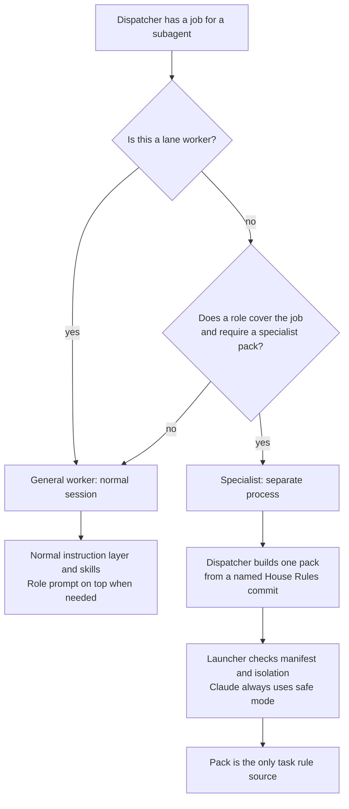

# Subagent profiles: general worker and specialist

Status: revised design proposal; operator choices recorded on 2026-10-07; implementation not qualified.

Issue: [#75](https://github.com/symbiotic-sh/house-rules/issues/75).

## 1. Result

Every subagent gets one of two profiles.
The dispatcher names the profile in the dispatch.
A **general worker** receives House Rules through the normal session instruction layer.
Lane workers are general workers even when a role prompt covers their job.
A **specialist** receives one compiled pack as its only task rule source.
The specialist environment loads no House Rules instruction block, project instruction files or discovered House Rules skills.
Host permission controls still apply to both profiles.
Every Claude specialist runs as a separate `claude -p --safe-mode` process.
A Claude specialist that needs a skill receives the skill text in its pack.

The shared-rule organization belongs to the [role-pack design (#74)](https://github.com/symbiotic-sh/house-rules/issues/74).
The compiler contract belongs to the [prompt-building design (#77)](https://github.com/symbiotic-sh/house-rules/issues/77).
This design adds dispatch guidance, a specialist launcher and specialist-home verification.

## 2. Terms

- **Dispatcher:** the session or script that starts a subagent and writes its task.
- **Subagent:** an agent started through the Claude Agent tool, Codex `spawn_agent`, or a separate command-line process.
- **In-process subagent:** a child inside the dispatcher's tool session.
- **General worker:** a subagent that loads House Rules as a normal session does.
- **Lane worker:** an implementer, fixer or lane reviewer running as a normal session with a role prompt on top.
- **Specialist:** a separate process whose only task rule source is a compiled pack.
- **Specialist pack:** a role prompt, required shared rules, optional lens and skill text, repository rules and task, built from a named House Rules commit.
- **Manifest:** the compiler's JSON record of the House Rules revision, included files and blob identifiers, and the pack's SHA-256 hash.
- **Specialist home:** a Codex or Kimi configuration home that loads no House Rules block, project instructions or House Rules skills.
- **Launcher:** the proposed specialist launcher in the agent-lanes scripts directory.
- **Foundation:** the normal session instructions defined by the [smaller-core design (#73)](https://github.com/symbiotic-sh/house-rules/issues/73).

File paths beginning with `<HOUSE_RULES_ROOT>` name the House Rules checkout.
File paths beginning with `<checkout>` name the target repository.
File paths beginning with `<specialist-home>` name the registered tool home.
Repository-relative links below name files from the House Rules root.

## 3. Current behavior and evidence limits

`FACT` [INSTALL-AGENTS.md](../../INSTALL-AGENTS.md) at commit `3b043816284e223ba83d2cb4e60238a646500f84`, lines 105–129, tells sessions to read `<HOUSE_RULES_ROOT>/AGENTS.md` at start and after compaction.
The index becomes `<HOUSE_RULES_ROOT>/INDEX.md` under the [smaller-core design (#73)](https://github.com/symbiotic-sh/house-rules/issues/73).
The House Rules repository pointer becomes `<HOUSE_RULES_ROOT>/AGENTS.md` pointing to that index and `<HOUSE_RULES_ROOT>/.agents/rules.md`.

`FACT` [skills/pr-ready/scripts/review-panel.sh](../../skills/pr-ready/scripts/review-panel.sh) at commit `3b043816284e223ba83d2cb4e60238a646500f84`, lines 91–107 and 142, prepares reviewer prompts and starts Codex and Kimi without a specialist home.
`FACT` [skills/pr-ready/scripts/prompt.py](../../skills/pr-ready/scripts/prompt.py) at commit `3b043816284e223ba83d2cb4e60238a646500f84` expands whole-file `@rule house-rules:<path>` includes from the checkout in its `expand()` function.
Neither source inspection qualifies the proposed specialist launcher.

`ASSUMPTION` The earlier version of this design reports that Claude Agent-tool children inherit user instructions and skill descriptions.
The earlier design also reports Codex isolation probes and Kimi command-line behavior.
Those runtime reports were not repeated during this revision.
Section 7 requires tool logs before the implementation claims isolation.

`ASSUMPTION` The operator's 2026-10-07 decision record reports that the safe-mode probe's `lanes/main/canary/safemode-test/with.txt` showed no skill loading, including through `--plugin-dir`.
This revision did not inspect that probe log.
The safe-mode skill decision is settled even though this revision does not independently qualify the runtime.
Explicit Model Context Protocol (MCP) server loading through `--mcp-config` remains untested.
Section 7 includes the MCP test and its fallback.

## 4. Design

The launcher and text changes in this section are implementation proposals.
Section 10 records the operator choices that bind those proposals.

### 4.1 How the dispatcher chooses



A role prompt alone does not make an agent a specialist.
Lane workers use the operator's normal Codex home, House Rules block, skills and guardian escalation path.
A lane worker's session rules come from the live House Rules checkout through the block.
Only the lane worker's role prompt is built from a named commit.
The dispatcher must not describe the entire lane worker session as pinned to that commit.

In-process subagents remain general workers.
A dispatcher sends a job requiring isolated task rules to the specialist launcher.
Every Claude specialist uses a separate safe-mode process, including a specialist review dispatched through the [change-review design (#76)](https://github.com/symbiotic-sh/house-rules/issues/76).

### 4.2 Dispatch guidance in the agent-lanes skill

[skills/agent-lanes/SKILL.md](../../skills/agent-lanes/SKILL.md) gains a “Subagent profiles” section between “Resource budgets” and “Lane cleanup”.
The proposed section tells dispatchers to choose the profile using section 4.1.
The proposed section tells dispatchers to identify applicable skills from their descriptions before opening skill bodies.
A dispatcher that already holds skill descriptions answers a skill-identification question itself.

General-worker dispatch text:

```text
Profile: general worker. Follow normal session loading of House Rules.
Skills this task needs: <names, or "none">. Load others only if the task requires them.
Role prompt: <compiled role prompt, or "none">.
Task: <objective and acceptance>.
Scope: <repositories, file set, worktree>.
Authority: <read-only | commit on branch | explicitly authorized push>; never push or merge main.
Output: <required final-message contents>.
```

Lane workers receive a role prompt compiled with shared-rule includes omitted.
The proposed compiler option is `--session-rules-loaded`.
The option tells the compiler that the receiving agent loads the shared rules through its normal House Rules instructions.
Specialist packs and Warden reviewer prompts retain shared-rule includes.
The [role-pack design (#74)](https://github.com/symbiotic-sh/house-rules/issues/74) owns the shared-rule includes and role text.
The [prompt-building design (#77)](https://github.com/symbiotic-sh/house-rules/issues/77) owns the compiler option.

The dispatcher writes a specialist task file before compiling.
The task file contains objective, acceptance, scope, authority, output, and the work item's Decisions and Pre-flight sections.
The dispatcher passes a named commit, the target checkout and the task file to [skills/pr-ready/scripts/prompt.py](../../skills/pr-ready/scripts/prompt.py).
The dispatcher then passes the resulting pack and manifest to the proposed specialist launcher.
The launcher runs as an attached background job under [rules/core.md](../../rules/core.md) prime rule 15.
The proposed agent-lanes description adds “subagent profiles” to its existing orchestration scope.

### 4.3 Pack contents and revision selection

The dispatcher compiles the pack.
The specialist never compiles its own pack or follows House Rules source links to load more rules.
The [prompt-building design (#77)](https://github.com/symbiotic-sh/house-rules/issues/77) owns part order and manifest fields.
The specialist launcher requires the header `House Rules revision: <40-hex commit id>` and the manifest fields `house_rules_revision`, `files` and `pack.sha256`.

The role prompt includes the shared writing, Git and priority-label rules from `rules/`.
The [role-pack design (#74)](https://github.com/symbiotic-sh/house-rules/issues/74) owns those files and their `@rule house-rules:rules/<file>.md` includes.
No verbatim shared-rule copies remain under `prompts/util/`.
Session-only rules about operator conversation, question presentation and running lanes are not included through role prompts.
A specialist that needs a skill receives its text through the compiled pack.
Skill text comes from the same named House Rules commit as the role prompt.
The compiler must report a skill-text dependency that cannot be included; the compiler must not silently omit required text.

The compiler reads repository rules from `<checkout>/.agents/rules.md` or a non-loader `<checkout>/AGENTS.md`.
The compiler excludes the managed pointer in `<checkout>/AGENTS.md` defined by the [smaller-core design (#73)](https://github.com/symbiotic-sh/house-rules/issues/73).
The dispatcher copies no repository rules by hand.
The task file supplies the work item's Decisions and Pre-flight sections.
A dispatcher without a target repository uses `--no-target`.

A lane uses its named lane pin for the role prompt.
An interactive dispatcher names a House Rules commit explicitly, using the checkout's current commit unless the task specifies another commit.
The compiler reads House Rules text from Git objects in any clone.
Uncommitted edits and another branch's working-tree text cannot enter the pack.
No separate pinned checkout is required.
Normal session rules still follow the live checkout; the prompt revision does not pin those rules.

### 4.4 Specialist launcher

The proposed launcher is `skills/agent-lanes/scripts/specialist.py`.
The proposed launcher uses Python 3.9 or later and only the standard library, like [scripts/sync.py](../../scripts/sync.py).
The proposed command contract is:

```text
<specialist-launcher> --tool {codex,claude,kimi} --pack FILE --manifest FILE --workdir DIR
                      --mode {ro,rw} --out FILE [--model NAME] [--effort LEVEL]
                      [--mcp-config FILE]
exit 0: the child succeeded and wrote --out
exit 1: the child failed; stderr names its exit status and log path
exit 2: isolation or required capability refused; stderr names the failed check
```

The proposed launcher checks the following before any model call:

1. The pack header names the manifest's `house_rules_revision`.
2. The pack's SHA-256 matches `pack.sha256`; the launcher sends the verified pack unchanged.
3. Codex and Kimi have registered specialist homes with login state; Claude needs no specialist home.
4. The configured home instruction files, including `<specialist-home>/AGENTS.md` and `<specialist-home>/AGENTS.override.md` where applicable, contain no House Rules, Forge or Groundwork block.
5. Codex's `debug prompt-input -c project_doc_max_bytes=0` output contains no House Rules block, project instruction text or discovered House Rules skill.

A failed check prevents launch.
The launcher reports a required capability that the selected tool cannot provide.
The launcher never retries.
The caller owns any authorized capacity retry and compiles a fresh pack and manifest for that attempt.
The launcher holds no lane scheduling or priority logic.

**Codex.** The launcher sets `CODEX_HOME=<specialist-home>`.
The launcher runs `codex exec --skip-git-repo-check -c project_doc_max_bytes=0 -s <read-only|workspace-write> -C <checkout> -o <out> -` with the pack on standard input.
The launcher forwards configured model and reasoning-effort arguments.
The launcher checks discovered skill names against every installed House Rules skill name, including skills added after the pack revision.

**Claude.** The launcher runs `claude -p --safe-mode --output-format stream-json --verbose` with the pack on standard input.
The launcher forwards the configured model.
Read-only mode adds `--disallowedTools Edit Write NotebookEdit` and `--permission-prompts none`.
Write mode adds `--permission-mode acceptEdits` and `--permission-prompts none`.
`ASSUMPTION` The earlier design reports that `--permission-prompts none` denies shell commands requiring approval; section 7 must verify that behavior before read-only mode qualifies.
The launcher extracts the final result into `--out`.
The launcher stops the child if its initial event reports discovered House Rules skills or loaded instruction memory.
A skill supplied as pack text is permitted; discovered skills are not permitted.

Claude safe mode remains mandatory when a specialist needs a skill or MCP server.
The launcher never uses `--plugin-dir` to supply specialist skills.
The dispatcher includes required skill text in the pack instead.
The launcher forwards an explicit `--mcp-config` only after the section 7 qualification test passes for the installed Claude version.
If explicit MCP loading fails or cannot preserve isolation, the launcher refuses that Claude specialist with the missing capability named.
The dispatcher may select a Codex or Kimi specialist only when that tool's required capability and isolation are qualified and its use is authorized.
The dispatcher reports a blocked task if no qualified authorized specialist can provide the capability.
The dispatcher never drops required MCP functionality or falls back to a non-safe-mode Claude specialist.

**Kimi.** The launcher sets `KIMI_CODE_HOME=<specialist-home>`.
The launcher runs `kimi -p <pack> --skills-dir <empty-dir>` and writes standard output to `--out`.
The launcher forwards the configured model.
`ASSUMPTION` The earlier design reports that `--skills-dir` replaces discovered skill folders and that Kimi has no read-only sandbox flag.
Kimi read-only mode therefore remains a prompt restriction until qualification demonstrates stronger enforcement.
`ASSUMPTION` Kimi's project instruction loading has not been qualified in this design.
If Kimi loads `<checkout>/AGENTS.md`, the launcher starts Kimi in an empty directory and names the checkout by absolute path in the pack.
If Kimi still loads project instructions, the launcher refuses the specialist.

### 4.5 Claude isolation

The operator chose safe mode for every Claude specialist on 2026-10-07.
The safe-mode choice does not apply to normal Claude general workers.
The proposed canary checks instruction memory, discovered skills and explicit MCP loading separately.
Skill text is a pack input, not a discovered skill.
An MCP server is a runtime capability, not an alternative rule source.
The MCP qualification must show that explicit configuration does not enable project instructions, discovered skills or unrelated servers.

### 4.6 Specialist homes and installation checks

[INSTALL-AGENTS.md](../../INSTALL-AGENTS.md) gains a “Specialist homes” section.
Codex and Kimi specialist homes are separate from normal session homes.
The specialist homes exist only for agents dispatched as specialists.
Lane workers use the operator's normal Codex home.

The proposed installation instructions require:

1. A specialist home outside House Rules and project checkouts, with login state established through the tool's normal login command.
2. Codex's `<specialist-home>/config.toml` setting `project_doc_max_bytes = 0` and disabling every installed House Rules skill through `[[skills.config]]` entries.
3. No House Rules instruction block or installed House Rules skills inside a specialist home.
4. Registration in the machine-local `<HOUSE_RULES_ROOT>/custom/sync.env` through `SPECIALIST_CODEX_HOME` or `SPECIALIST_KIMI_CODE_HOME`, never through the normal-home keys.
5. A Codex prompt-input check showing no House Rules heading, project instructions or discovered House Rules skills.

The disabled skill list includes `change-review` after the [review-skill design (#76)](https://github.com/symbiotic-sh/house-rules/issues/76) lands.
The proposed change makes [scripts/sync.py](../../scripts/sync.py) parse the specialist keys.
The proposed synchronization check rejects a home registered as both specialist and normal.
The proposed synchronization check reports instruction blocks, enabled House Rules skills, and nonzero Codex project instruction limits.
The synchronization writer excludes specialist homes from normal block and skill-link installation.
A newly installed House Rules skill must be disabled in every Codex specialist home.
Both synchronization checks and launcher checks report a missing disable entry.

### 4.7 Lane panels and Warden

The [prompt-building design (#77)](https://github.com/symbiotic-sh/house-rules/issues/77) owns building lane review-panel prompts from named commits and testing the lane runner before drafting the matching Warden change with operator approval.
Lane reviewers remain normal sessions with a role prompt on top.
This design does not switch lane reviewers to specialist homes or the specialist launcher.

The [role-pack design (#74)](https://github.com/symbiotic-sh/house-rules/issues/74) owns Warden shared-rule includes and staging `rules/`.
Warden reviewers retain a read-only PR copy, model-provider-only network access and no builds or tests.
Continuous integration runs builds and tests.
Warden posts its review on GitHub.
The Mac lane scripts read the review and start the fixer locally as a normal session.
The specialist launcher does not change Warden's runtime boundary.

### 4.8 Skill identification

The agent-lanes guidance tells dispatchers to select skills from descriptions before loading bodies.
The [smaller-core design (#73)](https://github.com/symbiotic-sh/house-rules/issues/73) owns normal-session loading and the shared skill-identification instruction.
This design does not copy the foundation into specialist packs.
Required specialist skill text is explicitly included through section 4.3.

## 5. Rejected alternatives

- **An in-process “light specialist”.** Rejected by the 2026-10-07 choice that every Claude specialist uses a separate safe-mode process.
- **No Claude specialists.** Rejected because the operator chose safe-mode Claude specialists.
- **Skills supplied through `--plugin-dir`.** Rejected because the decision record reports that safe mode does not load those skills; required skill text goes in the pack.
- **Isolated Codex homes for lane workers.** Rejected because the operator chose normal sessions with House Rules, skills and guardian escalation.
- **Verbatim shared-rule fragments under `prompts/util/`.** Rejected because the shared rules have one home in `rules/` under the role-pack design.
- **A separate pinned House Rules checkout for prompt building.** Rejected because the compiler reads the named commit from Git objects in any clone.
- **A task sentence as isolation enforcement.** Rejected because a task sentence cannot remove tool-injected instructions; qualification requires prompt captures and tool logs.
- **Header-less packs accepted for selected callers.** Rejected because every specialist launch requires the same revision and hash checks.

## 6. Implementation scope

`ESTIMATE` The implementation touches five existing files and adds a launcher and its tests.
The estimate does not claim a measured line count.
The existing files are:

- [skills/agent-lanes/SKILL.md](../../skills/agent-lanes/SKILL.md): dispatch guidance and description.
- [INSTALL-AGENTS.md](../../INSTALL-AGENTS.md): specialist-home installation instructions.
- [scripts/sync.py](../../scripts/sync.py): specialist-home parsing and verification.
- [scripts/test_sync.py](../../scripts/test_sync.py): specialist-home regression tests.
- [.github/workflows/checks.yml](../../.github/workflows/checks.yml): launcher test invocation.

The proposed new files are `skills/agent-lanes/scripts/specialist.py` and `skills/agent-lanes/scripts/test_specialist.py`.
Shared-rule extraction, pointer installation, compiler changes and lane prompt building remain in their owning designs.

The proposed persistent additions are the two registered specialist-home keys and the Codex or Kimi specialist homes described in section 4.6.
The compiler's pack and manifest artifacts belong to the prompt-building design.
This design adds no separate qualification cache, lane state or copy of shared rules.

## 7. Verification

### 7.1 Qualification canaries

A canary code is a unique marker appended to a synthetic instruction source so logs reveal which text reached a child.
The qualification setup uses a named House Rules commit with distinct codes in each shared rule, role, required skill body and skill description.
Synthetic global instructions and `<checkout>/.agents/rules.md` receive separate codes.
The setup records the tool version, pack, manifest, prompt capture and tool log.
A child's answer about what it loaded does not replace those records.

The required qualification runs are:

1. **Codex specialist.** Prompt-input output contains no discovered House Rules skill codes or global or project instruction codes. Tool logs show no reads of House Rules sources or `<checkout>/AGENTS.md`. Pack codes appear only from manifest-listed files; the target rules code appears once.
2. **Claude specialist.** The initial event shows no discovered House Rules skills or instruction memory. Tool logs show no reads of House Rules sources. A required skill code appears through pack text exactly once. A synthetic shell write requiring permission is denied in read-only mode.
3. **Kimi specialist.** Logs show no House Rules reads or unexpected project instruction codes. The run tests `<checkout>/AGENTS.md` loading in the target directory and, if necessary, in an empty working directory. A failed isolation check refuses launch.
4. **General workers and lane workers.** A Claude Agent-tool child and a normal-home Codex worker receive the foundation through normal session instructions. Skill identification opens no skill body. A lane worker's role prompt omits shared-rule includes, while the normal session still receives the rules and skills. The lane record names both the live session checkout and the role prompt commit.
5. **Refusals.** A Codex home missing the `change-review` disable entry and a pack changed after compilation each fail before a model call. The launcher names the missing entry or hash mismatch.

The Claude MCP canary runs a synthetic local server supplied through `--mcp-config` under `claude -p --safe-mode`.
The canary invokes one harmless server tool and records its result.
The canary also checks that project instruction codes, discovered skill codes and unrelated MCP servers remain absent.
If the server cannot load, the canary records the failure and verifies the refusal and qualified-tool fallback from section 4.4.
A failed MCP canary must not weaken safe mode or silently remove a required server.

### 7.2 Local tests

The proposed `skills/agent-lanes/scripts/test_specialist.py` uses fake Codex, Claude and Kimi executables.
The launcher tests cover missing or mismatched headers, mismatched hashes, missing homes, instruction blocks, discovered skills, output extraction and child failure propagation.
The launcher tests check command arguments for each tool and mode.
The launcher tests show that verified pack bytes reach the child unchanged.
The launcher tests cover explicit MCP configuration forwarding only for a qualified Claude configuration and visible refusal otherwise.
The launcher tests distinguish required skill text in a pack from forbidden discovered skills.

[scripts/test_sync.py](../../scripts/test_sync.py) gains tests for specialist-key parsing, conflicting home registrations, specialist-home findings and exclusion from normal installation checks.
The proposed text test checks the agent-lanes profile heading and skill-identification guidance.
The prompt-building design owns tests for shared-rule omission and Git-object-only assembly.

## 8. Rollout and pins

The dependency order remains the [role-pack design (#74)](https://github.com/symbiotic-sh/house-rules/issues/74), [prompt-building design (#77)](https://github.com/symbiotic-sh/house-rules/issues/77), [smaller-core design (#73)](https://github.com/symbiotic-sh/house-rules/issues/73), [change-review design (#76)](https://github.com/symbiotic-sh/house-rules/issues/76), then this design.
The specialist launcher qualifies after its compiler inputs and normal-session loading are available.
Installation follows the specialist-home instructions once per machine that needs Codex or Kimi specialists.
Claude specialists need no separate home.
An existing isolated home may be registered only after it passes specialist checks.
Lane workers continue using the operator's normal home.

Lane prompt pins follow the prompt-building design.
A lane pin qualifies only the compiled role prompt, not the live House Rules session text.
Warden shared-rule staging and role includes follow the role-pack design.
The specialist launcher is local and does not require Warden to stage agent-lanes scripts.

## 9. Interfaces with the other designs

- **Smaller core (#73).** The [smaller-core design](https://github.com/symbiotic-sh/house-rules/issues/73) owns `<HOUSE_RULES_ROOT>/INDEX.md`, the pointer shape in `<HOUSE_RULES_ROOT>/AGENTS.md` and `<checkout>/AGENTS.md`, normal-session loading and tool-specific installation details.
- **Role packs (#74).** The [role-pack design](https://github.com/symbiotic-sh/house-rules/issues/74) owns shared writing, Git and priority-label files in `rules/`, role includes and Warden staging.
- **Review skill (#76).** The [change-review design](https://github.com/symbiotic-sh/house-rules/issues/76) owns the `change-review` name, the fixed review format, one reviewer for plain chat requests and panels only when requested.
- **Prompt building (#77).** The [prompt-building design](https://github.com/symbiotic-sh/house-rules/issues/77) owns named-commit Git-object reads, pack order, manifests, repository-rule extraction, lane panel building and the approved Warden sequencing.

## 10. Decisions

Each item records an operator choice dated 2026-10-07.
The numbered design links identify the owner of choices shared with another design.

1. `DECISION` **2026-10-07 — Claude specialist process.** The operator chose a separate `claude -p --safe-mode` process for every Claude specialist.
2. `DECISION` **2026-10-07 — Claude specialist skills.** The operator chose skill text in the prompt when a Claude specialist needs a skill, because the recorded safe-mode probe did not load skills even through `--plugin-dir`.
3. `DECISION` **2026-10-07 — Claude specialist MCP qualification.** The operator required a test of explicit MCP servers through `--mcp-config` in safe mode and a fallback for an unsuccessful test.
4. `DECISION` **2026-10-07 — Lane workers.** The operator chose normal Codex sessions with House Rules, skills and guardian escalation for implementers, fixers and lane reviewers; the [role-pack design (#74)](https://github.com/symbiotic-sh/house-rules/issues/74) owns how shared-rule includes are omitted for those sessions.
5. `DECISION` **2026-10-07 — Shared rules.** The operator chose one home for writing, Git and priority-label rules in `rules/`; the [role-pack design (#74)](https://github.com/symbiotic-sh/house-rules/issues/74) owns that change.
6. `DECISION` **2026-10-07 — Named prompt revision.** The operator chose prompt building from a named commit's Git objects in any clone; the [prompt-building design (#77)](https://github.com/symbiotic-sh/house-rules/issues/77) owns that change.
7. `DECISION` **2026-10-07 — House Rules index.** The operator chose `<HOUSE_RULES_ROOT>/INDEX.md` as the index and the same pointer shape for global, managed-repository and House Rules instruction files; the [smaller-core design (#73)](https://github.com/symbiotic-sh/house-rules/issues/73) owns that change.

## 11. Open points

No operator choice remains open for this design.
The following implementation qualifications need evidence before the launcher is accepted:

- **Claude explicit MCP loading.** Close this point with the synthetic server result, isolation logs and the visible refusal or qualified-tool fallback in section 7.1.
- **Claude read-only shell permissions.** Close this point with a denied synthetic shell write under the proposed read-only flags and a tool log showing the denial.
- **Kimi project instruction loading.** Close this point with the target-directory and empty-directory canary results in section 7.1; refuse Kimi specialization if neither start preserves isolation.
- **Normal-session instruction delivery.** Close this point with the general-worker and lane-worker captures in section 7.1 after the smaller-core and role-pack changes land.
