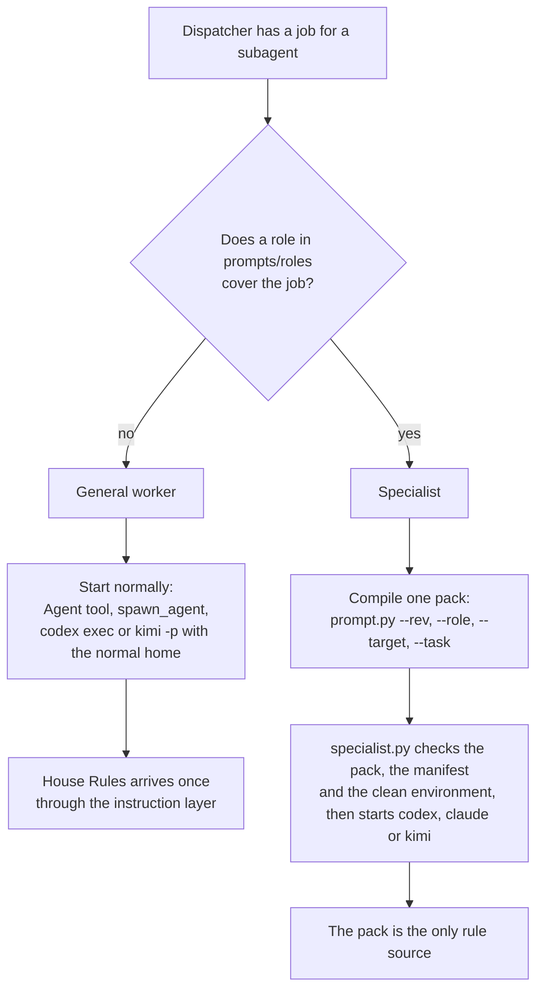

# Subagent profiles: general worker and specialist

Status: proposed (design only, awaiting operator approval)

Issue: [#75](https://github.com/jak-pan/house-rules/issues/75)

## 1. Result

Every subagent gets one of two profiles, and the dispatcher names the profile in the dispatch.
A **general worker** starts the normal way and gets House Rules once, through its tool's instruction layer, like an interactive session.
A **specialist** runs in a clean environment with no House Rules instructions, no project instruction files and no House Rules skills, and receives one compiled pack as its only rule source; a new launcher starts it for Codex, Claude Code and Kimi and refuses to start when the environment is not clean.
The pack is a role pack from [#74](https://github.com/jak-pan/house-rules/issues/74), built in one step by [#77](https://github.com/jak-pan/house-rules/issues/77)'s compiler.

## 2. Terms

- **Dispatcher:** the session or script that starts a subagent and writes its task.
- **Subagent:** any agent a dispatcher starts: a Claude Code Agent-tool subagent, a Codex `spawn_agent` child, or a separate CLI process (`codex exec`, `claude -p`, `kimi -p`).
- **In-process subagent:** a subagent that runs inside the dispatcher's tool session (Claude Code Agent tool, Codex `spawn_agent`).
- **General worker:** a subagent that receives House Rules the way an interactive session does.
- **Specialist:** a subagent whose only rule source is one compiled pack.
- **Specialist pack:** the text one specialist receives: a role pack compiled from House Rules at one commit with [#77](https://github.com/jak-pan/house-rules/issues/77)'s pack mode, plus the target repository's rules and the task. Section 4.3 lists its contents.
- **Manifest:** the JSON record [#77](https://github.com/jak-pan/house-rules/issues/77)'s compiler writes next to a pack: House Rules revision, every included file with its blob id, and the pack's SHA-256.
- **Specialist home:** a tool configuration home with no House Rules instructions, no project instruction loading and no House Rules skills. Codex uses `CODEX_HOME`, Kimi uses `KIMI_CODE_HOME`. Claude Code uses safe mode instead of a home (section 4.5).
- **Launcher:** the new script `skills/agent-lanes/scripts/specialist.py`, which checks the environment and starts a specialist.
- **Always-load set:** at 9e18159, `AGENTS.md` and the four rule files it lists under "Always load".
- **Foundation:** [#73](https://github.com/jak-pan/house-rules/issues/73)'s term for the House Rules text every session needs after its change: `rules/core.md` and `rules/writing.md`, delivered through the tool's instruction layer.

## 3. Current behavior

### 3.1 Every subagent restarts the whole chain

- `FACT` The global adapter tells every session to read the index at start: [INSTALL-AGENTS.md line 117](../../INSTALL-AGENTS.md) ("At session start and after every context compaction or reset, read `<HOUSE_RULES_ROOT>/AGENTS.md`").
- `FACT` In the 2026-10-07 load test, a Claude Code Agent-tool subagent (type general-purpose) was asked only to name the House Rules skills for a Rust review. Its first tool call read the index. It then read all four rule files and opened the bodies of pr-ready, rust-canon, rust-local-build and operator-writing, and the review-lenses reference; it also ran a size check and a grep on the reviewer role. Source: the subagent's tool log in the load test.
- `FACT` An Agent-tool subagent receives the user-level `CLAUDE.md` and the full skill list. The author of this design ran as a Claude Code 2.1.291 Agent-tool subagent, and its own context held the user `CLAUDE.md` House Rules block and every House Rules skill description.
- `ASSUMPTION` The Claude Code subagent documentation lists no agent-definition field that stops `CLAUDE.md` loading or hides the skill list (source: a documentation lookup by a helper agent in this session, not verified line by line).
- `FACT` In the same load test, a GPT subagent started with `codex exec` from a Claude session reported reading the index, the rule files and three skills. Its own command log was cut to the last 80 lines inside the parent's output, so this rests on its self-report.

### 3.2 Specialists exist only for lanes, outside House Rules

- `FACT` The reviewer and implementer roles tell the worker to stay off House Rules: [prompts/roles/reviewer.md line 1](../../prompts/roles/reviewer.md), [prompts/roles/implementer.md line 1](../../prompts/roles/implementer.md).
- `FACT` The local review panel starts Codex reviewers with the normal Codex home ([skills/pr-ready/scripts/review-panel.sh line 107](../../skills/pr-ready/scripts/review-panel.sh)) and Kimi reviewers from the checkout with the normal Kimi home (line 142). Neither command sets a home or turns off project instruction files.
- `ASSESSMENT` Both reviewers therefore receive the global House Rules block, the reviewed repository's `AGENTS.md` and every House Rules skill description, next to a prompt that says "do not load House Rules". A text instruction does not remove what the tool injects. The probe in the next points shows this for Codex; no Kimi probe was run.
- `FACT` The Grok branch of the same script already runs isolated: it starts Grok from an empty directory with every Claude and Cursor discovery switch off (lines 113–141).
- `FACT` The operator's lane launcher (outside this repository) gives lane workers their own Codex home. Its configuration sets `project_doc_max_bytes = 0` and disables each House Rules skill with a `[[skills.config]]` entry (`enabled = false`). Neither `agent-lanes` nor `INSTALL-AGENTS.md` describes such a home.
- `FACT` `codex debug prompt-input` (Codex CLI 0.159.1, no model call) shows the difference. A probe home with that lane configuration, run in a House Rules worktree, rendered no project `AGENTS.md` text and listed only the four Codex system skills (2,010 characters of skill list). A probe home with an empty configuration rendered the project `AGENTS.md` (3,567 characters) and a skill list of 10,691 characters including the House Rules skills.
- `FACT` `--ignore-user-config` alone does not isolate: `codex exec --help` says it skips only `$CODEX_HOME/config.toml`. In an isolation run on 2026-10-07 with that flag, the child still quoted the House Rules instruction and listed every House Rules skill (the child's own answer, read from its log).

### 3.3 No dispatch guidance

- `FACT` [skills/agent-lanes/SKILL.md](../../skills/agent-lanes/SKILL.md) (91 lines) covers ownership, worktrees, budgets and cleanup. It says nothing about what a subagent receives or how to start one.
- `FACT` No rule says that naming the applicable skills needs only their descriptions. [rules/core.md line 28](../../rules/core.md) says only "Load procedural skills on demand."
- `FACT` The prompt compiler already expands `@rule house-rules:<path>` lines from stdin text, so a list of whole files plus task text compiles into one prompt ([skills/pr-ready/scripts/prompt.py lines 16–21 and 55–68](../../skills/pr-ready/scripts/prompt.py)). Compiled role sizes at 9e18159: implementer 8,128 bytes, reviewer 10,572, triager 15,248, fixer 8,649, checker 13,499. The always-load set is 36,247 bytes.

## 4. Design

### 4.1 How the dispatcher chooses



`DECISION` The profile follows the job, not the model family. A job is a specialist job when a role under `prompts/roles/` covers it, because only those roles are built to be the only rule source ([#74](https://github.com/jak-pan/house-rules/issues/74)). Any other job, for example an implementer for a design-heavy feature that needs several skills, goes to a general worker.

`DECISION` In-process subagents are always general workers. `FACT` (section 3.1) They inherit the user instruction file and the skill list, and no documented setting removes them. A specialist therefore always runs as a separate process through the launcher, including a review that [#76](https://github.com/jak-pan/house-rules/issues/76)'s review skill hands off.

### 4.2 Text added to `skills/agent-lanes/SKILL.md`

A new section goes between "Resource budgets" and "Lane cleanup". Exact text:

````markdown
## Subagent profiles

Every subagent has one of two profiles. Name the profile in the dispatch.

- **General worker.** Start it the normal way: the Claude Agent tool, Codex
  `spawn_agent`, or `codex exec` / `kimi -p` with the normal home. House Rules reaches it
  through its tool's instructions, as in an interactive session. Do not paste, summarize
  or re-list House Rules files in its dispatch. Name the skills its task needs.
- **Specialist.** A reviewer, triager, checker, fixer, implementer or other agent whose
  job a role in `prompts/roles/` covers. Compile its pack in one call (below), then start
  it with `scripts/specialist.py`. It runs with no House Rules instructions, no project
  instruction files and no House Rules skills; the pack is its only rule source.
- In-process subagents (Claude Agent tool, Codex `spawn_agent`) are always general
  workers: they inherit the dispatcher's instructions and skill list. Hand a job that
  needs a clean environment to the launcher instead.
- To identify which skills apply, read skill descriptions, not skill bodies. The
  dispatcher already holds the descriptions: answer that question itself instead of
  starting a subagent.

General worker dispatch:

```text
Profile: general worker. House Rules is already in your instructions; do not read its rule files at start.
Skills this task needs: <names, or "none">. Load no others unless the task changes.
Task: <objective and acceptance>
Scope: <repositories, file set, worktree>
Authority: <read-only | commit on <branch> | push <branch>>; never push or merge main.
Output: <what the final message contains>
```

Specialist dispatch. Write the task file first: objective and acceptance, scope,
authority, output, and the work item's Decisions and Pre-flight sections. Then, from the
House Rules root:

```sh
rev=$(git rev-parse HEAD)   # a lane uses its pin instead
python3 skills/pr-ready/scripts/prompt.py --rev "$rev" --role <role> [--lens <lens>] \
  --target <checkout> --task <task-file> --out <pack> --manifest <manifest>
python3 skills/agent-lanes/scripts/specialist.py --tool codex|claude|kimi \
  --pack <pack> --manifest <manifest> --workdir <checkout> --mode ro|rw \
  --out <final-message-file>
```

The launcher refuses to start when the pack does not match its manifest, or when the
tool would load House Rules instructions, a project instruction file or a House Rules
skill. Specialist homes: [INSTALL-AGENTS.md §7](../../INSTALL-AGENTS.md). Run the
launcher as an attached background job (rules/core.md prime rule 15).
````

The description in the front matter gains the profiles. New description:

```text
Parallel multi-agent orchestration — subagent profiles (general worker or specialist with a compiled pack), lane ownership, non-colliding file sets, worktrees, build output inside worktrees, lane cleanup, GPU serialization, subagent git limits, cross-repo etiquette. Use when fanning out subagents, workflows, teammates, or background jobs.
```

### 4.3 What a specialist pack contains, and who compiles it

`DECISION` The dispatcher compiles the pack. The specialist never reads House Rules sources and never compiles anything.

`DECISION` This design adds no compiler code. The pack is exactly what [#77](https://github.com/jak-pan/house-rules/issues/77)'s pack mode builds, in #77's order:

1. The header line `House Rules revision: <40-hex commit id>`. It carries only the revision. The pack hash and the file list are in the manifest.
2. The role (`--role`), a role pack as [#74](https://github.com/jak-pan/house-rules/issues/74) defines it: the role text with #74's fragments (worker Git rules, writing baseline, cost-defect definition, and the stay-off line that states the pack is the only rule source).
3. The lens (`--lens`), when the job has one.
4. Extra files (`--include`): only fragments under `prompts/` that #74 writes for packs. A specialist pack never includes `rules/*.md` or a skill body; that House Rules text is #74's decision, and packs do not carry #73's foundation.
5. The repository rules part (`--target <checkout>`). #77's compiler reads the target's `.agents/rules.md`, or an `AGENTS.md` that is not a loader. The dispatcher copies no project rules by hand. #77 detects the STRUCTURE.md managed repository loader by exact match and never includes it; this design leaves that template unchanged.
6. The task (`--task`): objective and acceptance, scope, authority, output, and the work item's Decisions and Pre-flight sections. A dispatcher with no target repository passes `--no-target`.

`DECISION` The revision passed to `--rev`:

- A lane passes its lane pin.
- An interactive dispatcher passes `git rev-parse HEAD` of the House Rules root its instructions name, the same revision its own rules came from. #77's compiler stops when it differs from that commit's copy of itself, so a checkout with an uncommitted edit to the compiler cannot build a pack.

Example task file for a review of a docs-only branch, compiled with `--role reviewer --lens generalist-a --target <checkout> --task review.task.txt`:

```text
Task: review the diff of branch 75-subagent-profiles against main in this checkout (git diff origin/main...HEAD).
Scope: read-only. Report findings only.
Decisions: none recorded for this work item.
Output: the review report form in this prompt.
```

### 4.4 The launcher: `skills/agent-lanes/scripts/specialist.py`

Python 3.9 or later, standard library only, like `scripts/sync.py`.

```text
specialist.py --tool {codex,claude,kimi} --pack FILE --manifest FILE --workdir DIR
              --mode {ro,rw} --out FILE [--model NAME] [--effort LEVEL]
exit 0: the child ran and wrote --out
exit 1: the child failed (its exit status and log path on stderr)
exit 2: refused before start (one stderr line naming the failed check)
```

Checks before any model call, in order:

1. The pack's first line is `House Rules revision: <40-hex>`, and it equals the manifest's `house_rules_revision`.
2. The SHA-256 of the pack file equals the manifest's `pack.sha256`. The pack is then sent unchanged.
3. The specialist home for the tool is registered (section 4.6) and exists. Codex and Kimi homes must hold login state.
4. The home's instruction file (`AGENTS.md` or `AGENTS.override.md`) holds no House Rules, Forge or Groundwork block.
5. Codex only: `CODEX_HOME=<home> codex debug prompt-input -c project_doc_max_bytes=0` runs in `--workdir`. The rendered JSON must not contain the text `Shared operating foundation (House Rules)`, a block starting `# AGENTS.md instructions`, or any name from `skills/*/SKILL.md` in its skill list. This catches a House Rules skill added after the home was configured.

Commands it runs:

- **Codex:** `CODEX_HOME=<home> codex exec --skip-git-repo-check -c project_doc_max_bytes=0 -s <read-only|workspace-write> -C <workdir> -o <out> [-m model] [-c model_reasoning_effort=...] -` with the pack on stdin.
- **Claude Code:** `claude -p --safe-mode --output-format stream-json --verbose [--model model]` in `<workdir>`, with the pack on stdin. Mode `ro` adds `--disallowedTools Edit Write NotebookEdit` and `--permission-prompts none`. Mode `rw` adds `--permission-mode acceptEdits` and `--permission-prompts none`. `ASSUMPTION` With `--permission-prompts none`, a shell command that would ask for permission is denied, so mode `ro` runs only commands the permission settings already allow; canary run 2 (section 7) checks this, because Claude Code has no read-only sandbox flag like Codex `-s read-only`. The launcher writes the final result text to `--out`. `FACT` (`claude --help`, 2.1.291) `--safe-mode` disables `CLAUDE.md`, skills, installed plugins, hooks, MCP servers and custom agents, while login, model selection, built-in tools and permissions work normally; admin-managed policy still applies. After start, the launcher reads the stream's first `system`/`init` event. If its `skills` list holds a House Rules skill name, it stops the child and exits 2.
- **Kimi:** `KIMI_CODE_HOME=<home> kimi -p <pack> --skills-dir <empty-dir> [-m model]` in `<workdir>`, stdout to `--out`. `FACT` (`kimi --help`, 2.1.1) `--skills-dir` replaces the automatically discovered user and project skill folders. `FACT` (same help) Kimi has no read-only sandbox flag, so mode `ro` is enforced only by the pack's text. `ASSUMPTION` Whether Kimi loads a project `AGENTS.md` from the working directory is not documented in this repository. The qualification canary (section 7) decides; if it does load one, the Kimi branch starts in an empty directory and names the checkout by absolute path, as the review panel's Grok branch does.

`DECISION` The launcher retries nothing and holds no lane logic. Lane scripts keep their own retry, output folders and priority checks, and may call it. On a capacity retry, the caller compiles a new pack and manifest (#77) and calls the launcher again.

### 4.5 Why Claude uses safe mode, not a home

- `ASSUMPTION` A separate `CLAUDE_CONFIG_DIR` changes only user-level files; project `CLAUDE.md` and `AGENTS.md` in the working directory and its parents still load (documentation lookup, not verified here). `FACT` [INSTALL-AGENTS.md lines 135–137](../../INSTALL-AGENTS.md) records that Claude Code loads `AGENTS.md` and `CLAUDE.md` from parent folders.
- `FACT` (`claude --help`) `--bare` also skips `CLAUDE.md`, but accepts only an API key, never the subscription login.
- `DECISION` (question 1) Safe mode is the one documented switch that drops user and project instructions and skills while keeping the normal login.

### 4.6 Specialist homes: `INSTALL-AGENTS.md` and `scripts/sync.py`

A new section "## 7. Specialist homes" goes at the end of `INSTALL-AGENTS.md`. Exact text:

````markdown
## 7. Specialist homes

A specialist (skill `agent-lanes` §Subagent profiles) runs in a home that loads no House
Rules instructions, no project instruction files and no House Rules skills. Create one
Codex home and one Kimi home per machine when the operator uses specialists on those
products. Claude Code needs no home: the launcher uses its safe mode.

1. Create the home outside every House Rules and project checkout. It holds login state:
   run `CODEX_HOME=<home> codex login` or `KIMI_CODE_HOME=<home> kimi login`.
2. Codex `config.toml` sets `project_doc_max_bytes = 0` and one entry per House Rules
   Skill installed in `~/.agents/skills/`:

   ```toml
   [[skills.config]]
   path = "<HOME>/.agents/skills/<name>/SKILL.md"
   enabled = false
   ```

3. Never add a House Rules block to a specialist home's `AGENTS.md`, and never install
   Skills into its `skills/` folder.
4. Record each home in `custom/sync.env` as `SPECIALIST_CODEX_HOME="<home>"` or
   `SPECIALIST_KIMI_CODE_HOME="<home>"`. Never list it as `CODEX_HOME` or
   `KIMI_CODE_HOME`: §3 would install the interactive block there.
5. Verify with `CODEX_HOME=<home> codex debug prompt-input`: no House Rules heading and no
   House Rules Skill in the list.

The deny list covers every Skill under `skills/` at the installed revision, including
`change-review`. When a House Rules Skill is added, add its `skills.config` entry to every
specialist Codex home. `scripts/sync.py` and the launcher both report a missing entry.
````

`scripts/sync.py` changes:

- `homes()` accepts the two new keys from `custom/sync.env`. The same path under a specialist key and an interactive key is an error (exit 2).
- `verify()` checks each specialist home, reporting findings (exit 1) for: a House Rules, Forge or Groundwork block in its instruction file; `project_doc_max_bytes` other than 0 (Codex); a House Rules Skill from `skills/*/SKILL.md` without an `enabled = false` entry (Codex); a House Rules Skill entry in the home's own `skills/` folder.
- Specialist homes are excluded from the interactive block and Skill-link checks, so the scheduled drift report never asks an agent to "repair" them into interactive homes.

### 4.7 Follow-up: the local review panel

`FACT` The local review panel's Codex and Kimi reviewers start in the normal homes (section 3.2). `FACT` They get their prompt from `prepare.py review` ([review-panel.sh lines 91–92](../../skills/pr-ready/scripts/review-panel.sh)). [#77](https://github.com/jak-pan/house-rules/issues/77) leaves `prepare.py` unchanged, so that prompt has no revision header and no manifest, and the launcher would refuse it.

`DECISION` This design does not switch the panel. A follow-up issue switches the Codex and Kimi branches of `review-panel.sh` to the launcher, after `prepare.py review` emits #77's header and manifest. The team files that issue when this design is approved.

### 4.8 The skill-identification rule

The sentence "To identify which skills apply, read skill descriptions, not skill bodies." appears in the agent-lanes text above. `ASSUMPTION` [#73](https://github.com/jak-pan/house-rules/issues/73) puts the same sentence in its exact foundation text, so it also binds interactive sessions and general workers. #73 merges before this design (section 8), so this design does not edit `rules/core.md`.

## 5. Alternatives considered

- **Tell subagents in the dispatch text to skip House Rules.** Rejected: a task prompt cannot remove text the tool injects. The local panel's Codex reviewers receive the House Rules block and the skill list next to a prompt that says "do not load House Rules" (section 3.2), and the global instruction outranks the task prompt.
- **A small subagent index as the fallback for every child.** Rejected for specialists: it still leaves selection and link-following to the model, so the received text is not known in advance. General workers already get House Rules through [#73](https://github.com/jak-pan/house-rules/issues/73)'s foundation.
- **Clean in-process Claude subagents through an agent definition** (`tools` without the Skill tool, empty `skills`). Rejected: removing the Skill tool does not remove the user `CLAUDE.md`, which tells the subagent to read the index (section 3.1).
- **`claude --bare` for Claude specialists.** Rejected: it accepts only an API key, so specialists would bill a separate account.
- **A separate `CLAUDE_CONFIG_DIR` home for Claude specialists.** Rejected: project instruction files in the working directory and its parents still load (section 4.5).
- **Codex `--ignore-user-config` without a home.** Rejected: it skips only `config.toml`; the global `AGENTS.md` block and the shared skills still load (section 3.2).
- **Codex feature `skip_host_skill_discovery` instead of a deny list.** Rejected for now: `codex features list` (0.159.1) shows it "under development". In the 2026-10-07 isolation run with it enabled, the child still listed every House Rules skill (its own answer). Revisit when it is stable.
- **Specialists built from whole rule files or skill bodies (`--include rules/core.md`, a skill's `SKILL.md`).** Rejected: those files tell the reader to load more House Rules files and skills, which contradicts the stay-off line in the same pack, and their citations point outside the pack. What House Rules text a pack carries is [#74](https://github.com/jak-pan/house-rules/issues/74)'s decision.
- **Switch the review panel in this change and let the launcher accept a header-less prompt from `review-panel.sh`.** Rejected: the launcher's refusal would then depend on who calls it, and the panel's prompts would still have no manifest.

## 6. Size

`ESTIMATE` Files and lines touched:

- `skills/agent-lanes/SKILL.md`: about 50 lines added, 1 changed.
- `skills/agent-lanes/scripts/specialist.py`: new, about 180 lines.
- `skills/agent-lanes/scripts/test_specialist.py`: new, about 220 lines, with fake `codex`, `claude` and `kimi` executables on `PATH`.
- `INSTALL-AGENTS.md`: about 35 lines added.
- `scripts/sync.py`: about 45 lines added; `scripts/test_sync.py`: about 80 lines added.
- `.github/workflows/checks.yml`: 2 lines added (run the agent-lanes tests).

## 7. Verification

### 7.1 Canary run (acceptance)

Setup: a House Rules commit with canary codes, as in the 2026-10-07 load test. Each always-load file, each `prompts/` file and each Skill body ends with a unique `HRC-…` code; each Skill description carries an `HRD-…` code; the test user `CLAUDE.md` and the test Codex and Kimi global `AGENTS.md` each carry one more code. The target checkout has an `.agents/rules.md` with its own code.

Runs and pass conditions:

1. **Codex specialist:** a reviewer pack through `specialist.py --tool codex`. Pass: the `debug prompt-input` capture contains no `HRD-` code and no global or project instruction code; the `--json` event log shows no command that reads a House Rules file or the target's `AGENTS.md`; the only `HRC-` codes anywhere in the log belong to files in the manifest's `files` list, and the target's code appears once, from the repository rules part.
2. **Claude specialist:** the same pack through `--tool claude`. Pass: the `init` event lists no House Rules skill and no `CLAUDE.md` memory; the tool log reads no House Rules file; the transcript holds no code outside the manifest's `files` and the target's rules.
3. **Kimi specialist:** the same pack through `--tool kimi`. Pass: the session log reads no House Rules file, and its answer to "quote any instruction about House Rules other than this prompt" is empty. This run also settles the project `AGENTS.md` question in section 4.4.
4. **General worker, Claude:** an Agent-tool subagent asked to name the skills for a Rust review. Pass: each foundation code reaches it exactly once, through the instruction layer, with no tool read of a foundation file; it opens no Skill body.
5. **General worker, Codex:** `codex exec` with the normal home, same task. Pass: same as run 4.
6. **Refusals:** a specialist Codex home with the `change-review` entry removed, and a pack edited by one byte after compiling. Pass: the launcher exits 2 before any model call in both cases and names the Skill or the hash mismatch.

Evidence is the tool and event logs. A child's own report of what it loaded is not evidence: the load test showed agents listing codes for files they never received.

### 7.2 Text and unit tests

- `test_specialist.py`: refusal on a missing header, a header that differs from the manifest, a pack hash that differs from the manifest, a missing home, a House Rules block in the home, a House Rules Skill in a faked `prompt-input` output, and a House Rules skill in a faked Claude `init` event; correct command lines for each tool and mode; the pack bytes reach the fake child unchanged; `--out` written on success.
- `test_sync.py`: specialist keys parsed; a path under both kinds of key is an error; each specialist-home finding in section 4.6 reported; specialist homes absent from the interactive checks.
- A text test in `test_specialist.py` asserts that `skills/agent-lanes/SKILL.md` contains the skill-identification sentence and the "## Subagent profiles" heading.

## 8. Rollout and pins

The merge order for the five designs is [#74](https://github.com/jak-pan/house-rules/issues/74) → [#77](https://github.com/jak-pan/house-rules/issues/77) → [#73](https://github.com/jak-pan/house-rules/issues/73) → [#76](https://github.com/jak-pan/house-rules/issues/76) → [#75](https://github.com/jak-pan/house-rules/issues/75). This design merges last.

1. [#74](https://github.com/jak-pan/house-rules/issues/74) provides the role packs that state they are the only rule source.
2. [#77](https://github.com/jak-pan/house-rules/issues/77) provides pack mode, the header line and the manifest the launcher checks.
3. [#73](https://github.com/jak-pan/house-rules/issues/73) provides the foundation for general workers and carries the skill-identification sentence.
4. [#76](https://github.com/jak-pan/house-rules/issues/76) adds the `change-review` Skill, so specialist homes deny it from the start, and hands reviews to the launcher.
5. This change lands in one PR: agent-lanes text, launcher and tests, `INSTALL-AGENTS.md` §7 and `sync.py`.
6. Operator checkout: after the merge, the installation agent follows `INSTALL-AGENTS.md` §7 once per machine. A Codex home that already matches §7 (for example the lane workers' home, after its `change-review` entry is added) can be registered as `SPECIALIST_CODEX_HOME` without a new login.
7. The team files the review-panel follow-up (section 4.7).

- **Lane pin:** no effect. The lane pin moves once, after #77 merges, with the lane runner's switch to `--target`. Lane workers already run in their own Codex home; their launcher may later call `specialist.py`, which is optional.
- **Warden pin:** no effect. Warden stages only `prompts/` and `skills/pr-ready/`; staging `rules/` is a separate Warden change. The launcher lives in `skills/agent-lanes/`, which Warden does not stage.

## 9. Interfaces with the other designs

- **[#73](https://github.com/jak-pan/house-rules/issues/73) (foundation):** `ASSUMPTION` The foundation reaches Agent-tool subagents through the instruction layer, because they receive the user `CLAUDE.md` (`FACT`, section 3.1); this is what makes "once, without reads" true for general workers. `ASSUMPTION` The foundation's exact text carries the skill-identification sentence and states that a compiled prompt which says it is the only rule source overrides the foundation's loading and re-read rules for that run. `ASSUMPTION` `sync.py --write-blocks` skips homes listed under the `SPECIALIST_*` keys.
- **[#74](https://github.com/jak-pan/house-rules/issues/74) (role packs):** `ASSUMPTION` #74 decides what House Rules text a pack carries; its question 1 is the one operator question on that, and it also covers specialists. Every role states that it is the only rule source (`rule-source.md`, or the reviewer's own line) and compiles from `prompts/` and `skills/pr-ready/` alone. The specialist pack uses those roles unchanged.
- **[#76](https://github.com/jak-pan/house-rules/issues/76) (review entry skill):** `ASSUMPTION` When the review skill hands a review to a subagent, it starts a specialist through `specialist.py`, with the reviewer pack compiled with `--rev` and a manifest. It does not hand the review to an in-process subagent.
- **[#77](https://github.com/jak-pan/house-rules/issues/77) (assembly):** `ASSUMPTION` Pack mode, part order, the header line `House Rules revision: <40-hex>`, the manifest fields `house_rules_revision`, `files` and `pack.sha256`, and the repository rules part are as #77 defines them. Work-item Decisions and Pre-flight sections travel in the `--task` file; #77 adds no work-item part. `ASSUMPTION` `prepare.py` output carries no header; the review-panel switch waits for a follow-up (section 4.7).

## 10. Questions for the operator

### 1\. Run Claude specialists as a separate `claude -p --safe-mode` process?
`FACT` An Agent-tool subagent always receives the user `CLAUDE.md` and the skill list, so it cannot be clean. `FACT` Safe mode drops `CLAUDE.md`, skills, plugins, hooks and MCP servers, and keeps the normal login. `ASSESSMENT` Losing your own hooks and MCP servers is harmless for review-style work but would block a specialist that needs, for example, Mission Control.\
Codex and Kimi specialists are unaffected by this answer.

1. **Run every Claude specialist as a separate `claude -p --safe-mode` process through the launcher (recommended).** Each specialist is one more attached background process, and it runs without your hooks and MCP servers.
2. Allow an Agent-tool subagent with the pack as a "light specialist". It is cheaper to start, but it still receives the House Rules instruction block and every skill description next to the pack.
3. Run no Claude specialists. Specialists run only on Codex and Kimi, and Claude takes only general-worker jobs.

**Answer like so:**
```text
 1. 1
```
