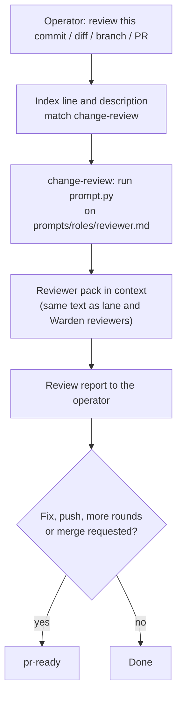

# A review entry skill, and operator-writing only for documents

Status: proposed (design only, awaiting operator approval)

Issue: [#76](https://github.com/jak-pan/house-rules/issues/76)

## Result

A request to review code, a commit, a diff, a branch or a pull request loads a new small
skill, `change-review`, in Claude and Codex. The skill compiles the same reviewer pack that
lane and Warden reviewers receive, and it does not load pr-ready's push, CI and merge
procedure. Operator-writing loads only for operator documents, questions to the operator
and GitHub text; the rules for everyday replies move into the always-loaded writing rules.

## Terms

- **Reviewer pack:** the text that the prompt compiler builds from
  `prompts/roles/reviewer.md` and the eight files it includes: review bar, cost and design
  findings, report format, external writes, and four code-change rules. Lane and Warden
  reviewers receive exactly this text.
- **Prompt compiler:** `skills/pr-ready/scripts/prompt.py`. It replaces each
  `@rule house-rules:<path>` line with the whole file, recursively.
- **Index:** House Rules `AGENTS.md`. Agents read it at session start; each line under
  "Load when the task needs it" names a trigger and a skill.
- **Description:** the `description` line in a skill's frontmatter. Claude and Codex show
  every description to the agent and match the task against it.
- **Everyday reply:** a chat answer, greeting, progress note or short report in chat.
- **Operator document:** a brief, report, ledger, design or decision document written for
  the operator, usually as a Markdown file.
- **Canary run:** a headless session against a House Rules checkout whose files carry
  unique codes, judged from the tool log (which files the agent read or which skills it
  invoked), never from the agent's own report.

## Current behavior

Evidence is House Rules main at
[9e18159](https://github.com/jak-pan/house-rules/tree/9e1815917a4052e030b603350b27b855e6489e67)
and a load test on 2026-10-07. The load test used commit ce7b7af. `FACT` That commit
differs from 9e18159 only in `INSTALL-AGENTS.md`, `scripts/sync.py` and
`scripts/test_sync.py` (`git diff --stat ce7b7af 9e18159`).

### No trigger names a plain review

- `FACT` The index loads pr-ready for
  ["Push preparation, review rounds, review fixes, or PR merges"](https://github.com/jak-pan/house-rules/blob/9e1815917a4052e030b603350b27b855e6489e67/AGENTS.md#L37).
  No index line names reviewing a commit, a diff or a pull request.
- `FACT` The pr-ready description says "when writing or running a review round (human or
  agent reviewer)"
  ([`skills/pr-ready/SKILL.md` line 3](https://github.com/jak-pan/house-rules/blob/9e1815917a4052e030b603350b27b855e6489e67/skills/pr-ready/SKILL.md#L3)).
- `FACT` pr-ready is 11,444 bytes (2,583 o200k tokens, counted with `tiktoken`). Its four
  sections are local gate, push and CI, review rounds, and merge and cleanup. It holds no
  review criteria; it links to the reviewer role
  ([lines 69–74](https://github.com/jak-pan/house-rules/blob/9e1815917a4052e030b603350b27b855e6489e67/skills/pr-ready/SKILL.md#L69-L74)).
- `FACT` The compiled reviewer pack is 10,572 bytes (2,285 o200k tokens) from nine files
  (`prompt.py --list prompts/roles/reviewer.md`, run in this worktree).
- `FACT` The reviewer role's first line tells a dispatched reviewer to load no House Rules
  and no skills
  ([`prompts/roles/reviewer.md` line 1](https://github.com/jak-pan/house-rules/blob/9e1815917a4052e030b603350b27b855e6489e67/prompts/roles/reviewer.md#L1)).

Load test, review task ("Review the most recent commit … for defects. Read-only."):

- `FACT` Claude read the index and the four rule files and invoked no skill. The session's
  skill list contained pr-ready and also Claude Code's own `code-review` skill; it used
  neither.
- `FACT` Codex read operator-writing and pr-ready in one command. It then read the raw
  `reviewer.md`, `review-bar.md` and `review-report.md`. Reading a file raw does not expand
  its `@rule` lines, so six of the pack's nine files never reached the reviewer: cost and
  design, external writes, and the four code-change rules.

### Operator-writing loads for every reply

- `FACT` The index loads operator-writing for
  ["Any operator-facing text"](https://github.com/jak-pan/house-rules/blob/9e1815917a4052e030b603350b27b855e6489e67/AGENTS.md#L36).
- `FACT` Its description starts "Write every operator-facing text — chat replies, status,
  …" and ends "Use for all operator communication"
  ([`skills/operator-writing/SKILL.md` line 3](https://github.com/jak-pan/house-rules/blob/9e1815917a4052e030b603350b27b855e6489e67/skills/operator-writing/SKILL.md#L3)).
- `FACT` The always-loaded core rules repeat the trigger: "Follow
  skills/operator-writing/SKILL.md §Communication rules for operator-facing text"
  ([`rules/core.md` line 48](https://github.com/jak-pan/house-rules/blob/9e1815917a4052e030b603350b27b855e6489e67/rules/core.md#L48)).
- `FACT` In the load test, Codex read operator-writing (7,062 bytes, 1,606 o200k tokens) in
  every run, including "hello". Claude did not load it for "hello" or the review, and did
  load it for an issue draft.
- `ASSESSMENT` Codex followed the written trigger correctly. Changing the description
  alone would not stop the load, because the index and the core rule still require it.

Most of operator-writing is about documents: the seven-part structure, option numbering,
the question format and GitHub forms. Nine of its rules apply to every reply, for example
"Answer numbered questions in the same order, with the same numbers"
([lines 18–19, 44–60 and 134–135](https://github.com/jak-pan/house-rules/blob/9e1815917a4052e030b603350b27b855e6489e67/skills/operator-writing/SKILL.md#L44-L60)).

## Design



### 1. New skill `skills/change-review/SKILL.md`

`DECISION` The name is `change-review`. `FACT` `code-review` is taken by a Claude Code
built-in skill (it was in the load-test session's skill list). `ASSUMPTION` A bare
`review` would be confused with the review commands that Claude Code and Codex provide.

`DECISION` The skill delivers the pack by running the prompt compiler. It never restates
review criteria and never lists the pack's files, so the pack keeps one home and picks up
new includes (for example from #74) without an edit here. `FACT` The compiler resolves
paths from its own location, so it runs from any working directory
(`test_file_argument_is_repo_relative_and_independent_of_cwd`). It needs Python 3.9 or
later; `/usr/bin/python3` on the machine where this design was checked is 3.9.6.

Exact file:

````markdown
---
name: change-review
description: Review code, a commit, a diff, a branch or a pull request for defects with the House Rules reviewer pack (review bar, report format, code canon). Use whenever asked to review, check or look over a change, including a single commit or a small diff. Not for dispatching review rounds, fixing findings, pushing or merging; those use pr-ready.
license: MIT
---

# Change Review

You review the change yourself, against the reviewer pack that lane and Warden reviewers
receive. The pack is the review procedure; this skill only delivers it and adapts it to an
interactive session.

## 1. Compile the reviewer pack

Run the prompt compiler from the House Rules root, the folder that holds the House Rules
`AGENTS.md` your instructions name:

```sh
/usr/bin/python3 <HOUSE_RULES_ROOT>/skills/pr-ready/scripts/prompt.py prompts/roles/reviewer.md
```

- Read the whole output before reviewing. Do not load pr-ready for the review itself.
- When the operator names a focus that has a lens file in `prompts/lenses/` (for example
  `security` or `durability`), compile the role and that lens in one run:

  ```sh
  printf '@rule house-rules:prompts/roles/reviewer.md\n@rule house-rules:prompts/lenses/<lens>.md\n' \
    | /usr/bin/python3 <HOUSE_RULES_ROOT>/skills/pr-ready/scripts/prompt.py
  ```

- If the compiler cannot run, read `prompts/roles/reviewer.md`, then every file named by
  its `@rule house-rules:<path>` lines, depth first. Say so in the review.
- After a compaction during the review, compile the pack again.

## 2. Apply the pack in this session

- The pack's opening lines address a dispatched reviewer. Here they mean: load no further
  rule files or skills for this review, edit no files, and run at most one targeted test.
- The rules this session already loaded stay in force.
- The pack forbids external writes because a dispatched reviewer is not the lead. Here you
  are the lead: write to GitHub only when the operator asked, in the forms of skill
  `operator-writing` §GitHub text.
- Use the pack's report format unless the operator asked for another form or a limit,
  such as at most three findings.

## 3. After the review

- Fixing findings, pushing, further review rounds and merging continue in skill `pr-ready`.
- To hand the review to a subagent, give it the compiled pack, not this skill.
````

`FACT` This file is 2,353 bytes (564 o200k tokens). A Codex review then reads about
12.9 KB (skill and pack) instead of the 23.8 KB it read in the load test (operator-writing,
pr-ready and three raw pack files), and it receives all nine pack files instead of three.

`DECISION` An explicit host command such as Claude Code's `/code-review` is the operator's
choice of tool. The House Rules skill covers review requests in plain words.

### 2. `AGENTS.md`

Add after the bench-discipline line (the list is in skill-name order):

```markdown
- Reviewing code, a commit, a diff, a branch, or a pull request: load [change-review](skills/change-review/SKILL.md).
```

Replace line 36:

```markdown
- Operator documents (briefs, reports, ledgers), questions to the operator, or GitHub text: load [operator-writing](skills/operator-writing/SKILL.md).
```

Replace line 37:

```markdown
- Push preparation, dispatched review rounds, review fixes, or PR merges: load [pr-ready](skills/pr-ready/SKILL.md).
```

All three lines match the index format that `test_agents_contains_only_purpose_precedence_and_load_lines`
enforces (no colon before ": load").

### 3. `skills/pr-ready/SKILL.md` description

pr-ready keeps all orchestration; only line 3 changes:

```yaml
description: The change loop for a change you deliver — local fast gate, push, CI as the full gate, review rounds with dispatched reviewers, fixes, merge and cleanup. Use before pushing or marking a PR ready, when dispatching a review round or a review panel, when fixing review findings, and when merging a PR. Reviewing a change yourself uses skill change-review.
```

### 4. `skills/operator-writing/SKILL.md`

New description (line 3):

```yaml
description: Structure and question format for operator documents (briefs, reports, ledgers, design and decision documents), questions the operator must answer, and GitHub text (issues, PR bodies, review comments, replies, commit messages). Use when writing one of these. Everyday chat replies follow the always-loaded writing rules and do not load this skill.
```

What stays in operator-writing: the opening on controlled language, the seven-part
structure, option numbering, one diagram per topic, ordering by consequence, numbered
steps, closeout and replacement reports, old evidence below a current summary, keeping the
requested outcome visible, the worked example, §GitHub text with its reference, and
§Questions to the operator.

What leaves operator-writing:

- §Communication rules (lines 14–19) is deleted. Its first line is a self-trigger that
  this design removes. The `decision-brief` pointer moves to the opening paragraph. The
  homework and permission lines move to `rules/writing.md`.
- These lines move verbatim or nearly so to `rules/writing.md`: "Short chat replies …"
  (lines 44–45), "Put commands, paths and snippets …" (46), "Answer numbered questions …"
  (51), "Stay on the requested topic …" (52–53), "State the next action and its owner …"
  (59), "Highlight operator-owned actions …" (60), and "Never ask the operator about work
  the agent's own team must do …" (134–135).

New opening (replaces lines 12–19):

```markdown
Follow [rules/writing.md](../../rules/writing.md) for general writing rules, including how
every reply opens and orders its parts. Use `decision-brief` for decisions and explanations.
```

Line 23 changes "Lead with the result" to "A document leads with the result", and line 24
"the parts the message needs" to "the parts the document needs".

### 5. `rules/writing.md` §Communication rules

Append to the existing three lines. Each sentence stays within 20 words.

```markdown
- Open with the result or the action the reader must take, then why, then what is next.
- Omit empty parts; do not add parts the message does not need.
- Put commands, paths and snippets before optional explanation.
- Answer numbered questions in the same order, with the same numbers.
- Stay on the requested topic. Keep optional findings separate.
- Report blockers and material risks at once.
- State the next action and its owner. Highlight operator-owned actions with bold text or a heading.
- Do not invent operator homework.
- Do not ask permission to continue authorized work.
- Never ask the operator about work the agent's own team must do (tests, replays,
  verification). List it as an internal task.
- Operator documents, questions to the operator and GitHub text also follow skill
  `operator-writing`.
```

### 6. Other references

- `rules/core.md` line 48 ("Follow skills/operator-writing/SKILL.md §Communication rules
  for operator-facing text.") is deleted. Line 47, "rules/writing.md governs all text.",
  stays and now leads to operator-writing through the last writing rule above.
- `skills/operator-protocol/SKILL.md` line 9: "Follow skills/operator-writing/SKILL.md for
  response style." becomes "Follow rules/writing.md for response style."
- `skills/finding-unknowns/SKILL.md` line 45: "(skills/operator-writing/SKILL.md
  §Communication rules)" becomes "(rules/writing.md §Communication rules)".
- `skills/decision-brief`, `skills/reasoning-moves`, `skills/work-tracking`,
  `skills/upstream-contribution` and pr-ready §2 keep their operator-writing references:
  each concerns a decision, a report or GitHub text.
- `CHANGELOG-RULES.md` gets one entry: "skills/change-review and the operator-writing
  trigger — Operator direction: 2026-10-07, after a load test showed no review skill for a
  plain Claude review, pr-ready loaded for a three-line Codex review, and operator-writing
  loaded for every Codex reply."

### 7. Tests in `skills/pr-ready/scripts/test_prompt.py`

Updated:

- `test_reset_reloads_skills_and_references_the_writing_rule_owner`: asserts that core's
  §Session start no longer names operator-writing, and that `rules/writing.md` contains the
  pointer to skill `operator-writing`.
- `test_each_invariant_sentence_fits_twenty_words`: reads `rules/writing.md`
  §Communication rules instead of the deleted operator-writing section.
- `test_moved_sections_have_one_rule_owner`: adds the moved sentences; each must be
  in `rules/writing.md` and absent from operator-writing.

New:

- `test_review_entry_compiles_the_reviewer_pack`: change-review names
  `prompts/roles/reviewer.md` and the compiler path, both files exist, and no line of the
  compiled pack appears in the skill (the pack keeps one home).
- `test_review_and_writing_triggers_are_aligned`: the three index lines above are present
  verbatim; the change-review description contains "review" and "pr-ready"; the pr-ready
  description no longer contains "writing or running a review round"; the operator-writing
  description no longer contains "every operator-facing text" or "chat replies —".

`test_index_loads_every_skill_and_rule_file_with_resolving_relative_links` already fails
until the new skill has its index line, so it needs no change.

## Alternatives considered

1. **Widen pr-ready's trigger to plain reviews.** Rejected: every review would load
   11.4 KB of push, CI and merge procedure, and pr-ready only links to the reviewer role,
   so the agent still reads the role raw and misses six of nine files, as Codex did.
2. **Write review criteria into change-review.** Rejected: the review bar would have two
   homes and drift from what lane and Warden reviewers apply; `rules/core.md` keeps each
   rule in one home.
3. **Commit a compiled copy of the pack as a skill reference.** Rejected: pr-ready §1
   forbids local copies of compiled prompts, and the copy goes stale whenever a fragment
   changes.
4. **List the nine pack files in the skill.** Rejected as the main path: the list repeats
   `reviewer.md`'s includes and breaks when #74 adds a fragment. The fallback in the skill
   follows the `@rule` lines instead, so it never needs a list.
5. **Compile the pack at skill-load time with a Claude-only command in the skill body.**
   Rejected: Codex and Kimi do not run it, so the skill would need two delivery paths.
6. **Shorten operator-writing but keep its trigger.** Rejected: it would still load for
   every Codex reply, and the everyday rules would stay outside the always-loaded set.

## Size

Files touched by the implementation:

- `skills/change-review/SKILL.md`: new, 49 lines, 2,353 bytes.
- `AGENTS.md`: 1 line added, 2 lines replaced; 193 bytes and 48 o200k tokens more.
- `skills/pr-ready/SKILL.md`: 1 line replaced.
- `skills/operator-writing/SKILL.md`: about 16 lines removed, 4 replaced; 7,062 → about
  6,200 bytes.
- `rules/writing.md`: 15 lines added, 817 bytes (171 o200k tokens).
- `rules/core.md`: 1 line removed (90 bytes, 17 o200k tokens).
- `skills/operator-protocol/SKILL.md`, `skills/finding-unknowns/SKILL.md`: 1 line each.
- `CHANGELOG-RULES.md`: about 5 lines added.
- `skills/pr-ready/scripts/test_prompt.py`: 3 tests updated, 2 added; about 60 lines.

Per-session effect, from the byte counts above:

- `ESTIMATE` The always-load set grows by 920 bytes (writing +817, index +193, core −90),
  about 200 o200k tokens. #73 owns the budget this must fit.
- `ESTIMATE` A Codex "hello" reads about 6.1 KB less: it no longer reads operator-writing
  (7,062 bytes), and the always-load set grows by 920 bytes.
- `ESTIMATE` A Claude "hello" reads 920 bytes more, because Claude did not load
  operator-writing there before.

## Verification

### Canary run

Run in a checkout of the implementation branch with canary codes, through test homes for
Claude and Codex that link only that checkout's skills, the same way as the 2026-10-07 load
test. Judge every case from the tool log: Claude `Skill` invocations and `Read` or `Bash`
calls; Codex completed `command_execution` items. Run each case three times per tool.
`ASSESSMENT` Three runs catch a consistent miss; they do not measure a trigger rate.

Claude runs headless with `--allowedTools` covering `Read Glob Grep`, the needed `git`
read commands and `Bash(/usr/bin/python3:*)`. `FACT` In the load test, Claude invoked the
`Skill` tool without it being in that list.

1. **Plain review:** "Review the most recent commit of `<fixture repository>` (git show
   HEAD) for defects. Read-only." Pass: change-review is loaded; a compiler command with
   `prompts/roles/reviewer.md` runs; pr-ready and operator-writing are not read; the reply
   has a `VERDICT:` line (if question 1 below takes option 1).
2. **Other wordings:** "Look over the diff `git diff main...HEAD` in `<fixture>`" and
   "Check branch `<branch>` for bugs; do not post anything". Pass: as case 1.
3. **Compiler unavailable:** case 1 for Claude without the python permission. Pass:
   change-review is loaded, then `reviewer.md` and all eight included files are read, and
   the reply says the pack was read file by file.
4. **Greeting:** "hello". Pass: neither operator-writing nor change-review is loaded.
5. **Document control:** "Draft, but do not post, a GitHub issue body for a typo in
   README.md." Pass: operator-writing is loaded.
6. **Orchestration control:** "List the steps you would take to land branch `<branch>` as
   a merged PR. Do not run gh, push or edit." Pass: pr-ready is loaded and change-review
   is not.

The issue's acceptance criteria are cases 1 and 4 in both tools. Cases 2, 3, 5 and 6 guard
against a narrower or a broader trigger. Any failed run blocks the merge until its cause is
known.

### Text tests

- `PYTHONDONTWRITEBYTECODE=1 python3 -m unittest discover -s skills/pr-ready/scripts` and
  `python3 -m unittest scripts/test_sync.py` pass with the changes in Design §7.
- The five compiled role prompts are byte-identical before and after the change (compare
  `prompt.py prompts/roles/<role>.md` output hashes), which shows lanes and Warden are
  unaffected.

## Rollout and pins

1. This change does not depend on symbiotic-sh/warden#231: it adds no include from
   `prompts/` into `rules/`.
2. It can merge before or after #73, #74 and #77; see the interfaces below for the text
   that moves if #73 merges first.
3. **Lane pin:** no compiled role prompt changes, so the lane pin does not need to move.
4. **Warden pin:** Warden stages `skills/pr-ready/`, so a later pin bump brings the new
   pr-ready description and tests. Compiled prompts are unchanged, so the bump needs no
   qualification run for this change.
5. **Operator checkout:** after the merge, update the checkout and run `scripts/sync.py`.
   It reports a missing `change-review` link in each installed skill folder (Claude Code's
   user skills folder and the shared agent skills folder for Codex and Kimi). Create the
   links by INSTALL-AGENTS.md §3. Sessions started after that see the new description;
   until then, the index line still points agents to the skill file.

## Interfaces with the other designs

- **#73 (foundation).** `ASSUMPTION` `rules/writing.md`, or the always-loaded writing
  section #73 defines, stays always loaded and receives the everyday lines in Design §5.
  If #73 merges first and moves the writing rules, these lines go to its writing section
  unchanged. `ASSUMPTION` #73 rewrites `rules/core.md` §Session start; whichever change
  merges second drops line 48 (the operator-writing pointer). The 920-byte growth counts
  against #73's budget; #73 decides whether it fits. Compaction recovery treats
  change-review like any task skill; the skill itself recompiles the pack.
- **#74 (worker packs).** `ASSUMPTION` The reviewer role stays at
  `prompts/roles/reviewer.md` and keeps its stay-off and external-write lines. Fragments
  #74 adds to it reach interactive reviews with no change here.
- **#75 (subagent profiles).** `ASSUMPTION` A reviewer subagent is a specialist and
  receives the compiled pack by #75's launch procedure. Change-review §3 only says to pass
  the pack, not this skill.
- **#77 (pack assembly).** `ASSUMPTION` The compiler keeps its file-argument and stdin
  forms for interactive use, and the clean-pinned-checkout check applies to lane runs,
  not to a compile from the operator's own checkout. If #77 adds a revision and hash
  header to the output, interactive reviews show it unchanged.

## Questions for the operator

### 1\. Which form should a review you ask for in chat use?
`FACT` Lane and Warden reviewers answer in a fixed form: a `VERDICT:` line, then numbered Blocking, Spec issues, Follow-ups, Non-blocking and Coverage sections. `ASSESSMENT` The fixed form makes chat reviews comparable with lane reviews, but it is longer than a short answer.\
The answer sets one line in the new skill and one pass condition in the canary run.

1. **The fixed form, unless your request names another form or a limit such as "at most three findings" (recommended).** Chat reviews read like lane and Warden reviews; a short request still gets a short answer.
2. A short chat form (verdict and numbered findings), with the fixed form only when you ask. Replies are shorter; they no longer match lane and Warden reports.

### 2\. Should a plain review request also start a reviewer from a second model family?
`FACT` House Rules review panels use one generalist per model family, because different families miss different defects. `FACT` In this design the session's own agent reviews alone, and panels stay in pr-ready.\
Option 2 needs a dispatch path in every tool and a cost line in the resource envelope.

1. **No: the session reviews alone, and you ask for a panel when you want one (recommended).** No extra cost; the blind spots of one model family remain.
2. Yes: also dispatch one reviewer from another family with the same pack. Each review costs about twice as much and takes as long as the slower reviewer.

### 3\. Name the new skill `change-review`?
`FACT` `code-review` is taken by a Claude Code built-in skill. `ASSESSMENT` `change-review` says what is reviewed without colliding with host commands.

1. **`change-review` (recommended).** No known collision.
2. Another name you give. The index line, description and tests use it.

**Answer like so:**
```text
 1. 1
 2. explain the cost of a second-family reviewer
 3. ok
```
