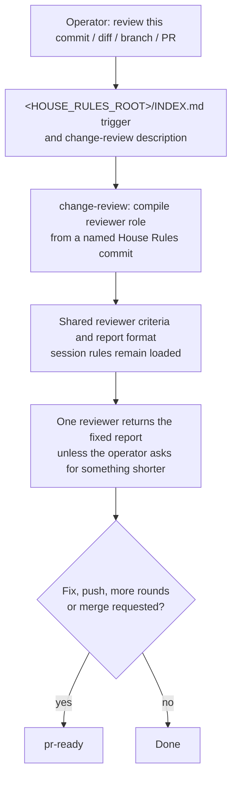

# A review entry skill, and operator-writing only for documents

Status: proposed implementation, incorporating the operator's decisions of 2026-10-07.

Issue: [review entry skill (#76)](https://github.com/symbiotic-sh/house-rules/issues/76).
Draft: [review entry design (#82)](https://github.com/symbiotic-sh/house-rules/pull/82).

## Result

A plain request to review code, a commit, a diff, a branch or a pull request loads the
new `change-review` skill in Claude and Codex. The session reviews the change itself.
A plain request gets one reviewer; a panel starts only when the operator asks for a panel.
The review uses the lane and Warden report format unless the operator asks for something shorter.
Review questions use the question format from the operator-writing skill.

The change-review skill delivers the shared reviewer criteria through the prompt compiler.
The change-review skill does not load the pr-ready push, CI or merge procedure for a plain review.
The operator-writing skill loads for operator documents, questions to the operator and GitHub text.
Everyday replies follow the always-loaded writing rules in [rules/writing.md](../../rules/writing.md).
The foundation design owns the always-loaded rules and the House Rules index rename
([foundation design (#73)](https://github.com/symbiotic-sh/house-rules/pull/79)).

## Terms

- **Reviewer pack:** the criteria and report format compiled from
  [prompts/roles/reviewer.md](../../prompts/roles/reviewer.md) and its recursive `@rule` includes.
  Interactive, lane and Warden reviewers apply the same criteria and report format.
  Normal House Rules sessions already load shared rules; Warden reviewers receive those rules through role includes.
- **Prompt compiler:** [skills/pr-ready/scripts/prompt.py](../../skills/pr-ready/scripts/prompt.py).
  The pack-assembly design requires the compiler to read Git objects from a named House Rules commit
  ([pack-assembly design (#77)](https://github.com/symbiotic-sh/house-rules/pull/83)).
- **Foundation:** the always-loaded session rules owned by the foundation design.
- **Index:** the proposed House Rules index at `<HOUSE_RULES_ROOT>/INDEX.md`.
  The foundation design makes `<HOUSE_RULES_ROOT>/AGENTS.md` a pointer to that index and
  `<HOUSE_RULES_ROOT>/.agents/rules.md`.
- **Description:** the frontmatter description that each host shows when matching a task to a skill.
- **Everyday reply:** every chat reply, including answers, greetings, progress notes and reports.
  Every chat reply is an everyday reply for skill loading, including review reports and short status reports.
  This includes review reports in the fixed report format.
  A chat reply that asks the operator questions still follows the operator-writing question format.
- **Operator document:** a Markdown file written for the operator (a brief, report, ledger, design or decision document),
  or GitHub text. Chat replies are everyday replies for skill loading.
- **Canary run:** a headless session whose tool log shows which files and skills the agent loaded.
  Canary evidence comes from the tool log, never from the agent's own report.

Paths below name complete repository-relative file paths unless a root placeholder identifies an installed file.
The placeholder `<HOUSE_RULES_ROOT>` means the House Rules clone named by the session's loader.
The placeholder `<HOUSE_RULES_COMMIT>` means the named commit selected for the review pack.

## Current behavior and prior evidence

`FACT` The current [House Rules index at <HOUSE_RULES_ROOT>/INDEX.md](../../INDEX.md)
loads pr-ready for “Push preparation, review rounds, review fixes, or PR merges.”
`FACT` The current [House Rules index at <HOUSE_RULES_ROOT>/INDEX.md](../../INDEX.md)
loads operator-writing for “Any operator-facing text.”
`FACT` The current [skills/pr-ready/scripts/prompt.py](../../skills/pr-ready/scripts/prompt.py)
reads include files from the checkout through `path.open`, rather than from Git objects.
`FACT` The current [prompts/roles/reviewer.md](../../prompts/roles/reviewer.md)
includes eight files through `@rule house-rules:` lines.
`FACT` The current [prompts/util/review-report.md](../../prompts/util/review-report.md)
requires a `VERDICT:` line followed by Blocking, Spec issues, Follow-ups, Non-blocking and Coverage sections.

`ASSUMPTION` The earlier version of this design reports a 2026-10-07 load test against
commit ce7b7af ([prior design](https://github.com/symbiotic-sh/house-rules/blob/5a7e3b9/docs/design/76-review-entry-skill.md)).
`ASSUMPTION` The prior design reports that Claude loaded no review skill for a plain review request.
`ASSUMPTION` The prior design reports that Codex loaded operator-writing and pr-ready, then read only three reviewer-pack files.
`ASSUMPTION` The prior design reports that Codex loaded operator-writing even for “hello.”
The revision does not treat those inherited load-test results as measurements verified in this run.
`ASSESSMENT` Narrowing a skill description alone leaves the current loader's broader trigger in force.
The implementation therefore changes the descriptions, index triggers and core writing pointer together.

## Design



### 1. New change-review skill

The implementation adds the change-review skill at the complete repository-relative path
`skills/change-review/SKILL.md`. The operator chose the name `change-review` on 2026-10-07.
The change-review skill compiles the reviewer role instead of restating criteria or listing includes.
New role includes therefore reach interactive reviews without a second rule owner.
An explicit host command, such as Claude Code's `/code-review`, remains the operator's choice of tool.
The change-review trigger covers review requests in plain words.

Proposed skill text:

````markdown
---
name: change-review
description: Review code, a commit, a diff, a branch or a pull request for defects with the House Rules reviewer pack (review bar, report format, code canon). Use whenever asked to review, check or look over a change, including a single commit or a small diff. A plain request gets one reviewer; a panel starts only when asked. Dispatching review rounds, fixing findings, pushing and merging use pr-ready.
license: MIT
---

# Change Review

Review the change yourself against the shared lane and Warden reviewer criteria.
This skill delivers the reviewer pack and adapts the pack to an interactive session.

## 1. Compile the reviewer pack

Find the House Rules root from the session's pointer to `<HOUSE_RULES_ROOT>/INDEX.md`.
Select a named House Rules commit for the review pack.
Use the dispatcher's commit when the dispatcher supplies one.
Otherwise, resolve the House Rules clone's HEAD to a commit ID before compilation.
Invoke `<HOUSE_RULES_ROOT>/skills/pr-ready/scripts/prompt.py` with `--rev <HOUSE_RULES_COMMIT>`
and entry file `prompts/roles/reviewer.md`.
Use the compiler's option for a session that already loads shared rules.
The pack-assembly design owns that option and its command syntax.

- Read the whole compiler output before reviewing.
- Do not load pr-ready for the review itself.
- Select any requested review lens from the same named commit.
  Compile the reviewer role and the selected `prompts/lenses/<lens>.md` together.
- If compilation fails, report the error and stop the review.
  Do not substitute live checkout files or an incomplete pack.
- After compaction, compile the pack again from the same named commit.

## 2. Apply the pack in this session

- The session's already-loaded rules stay in force.
- Perform a read-only review and run at most one targeted test to resolve a specific suspected finding.
- The reviewer role's dispatched-agent loading instructions do not replace the normal session's loading rules.
- External writes require the operator's authorization and the session's external-write rules.
  A review request alone does not authorize a GitHub post.
- Use the fixed report format unless the operator asks for something shorter.
- Questions to the operator use skill operator-writing's question format in every review.
  Load operator-writing when the review needs an operator question or GitHub text.
- A plain review request gets one reviewer.
  Start a panel only when the operator asks for a panel, through pr-ready.

## 3. After the review

Fixing findings, pushing, further dispatched review rounds and merging continue in skill pr-ready.
A requested specialist hand-off follows the specialist-subagent design and the agent-lanes skill.
The specialist receives a reviewer pack compiled from the same named commit.
````

`ASSESSMENT` Resolving the House Rules clone's HEAD once is the simplest default when no dispatcher supplies a commit.
The resolved commit remains fixed through compaction, so edits or branch changes cannot alter the review pack.
The skill adds no stored pack, pin file, cache or manifest of its own.
The pack-assembly design owns Git-object compilation and the session option
([pack-assembly design (#77)](https://github.com/symbiotic-sh/house-rules/pull/83)).
The specialist-subagent design owns specialist launching
([specialist-subagent design (#75)](https://github.com/symbiotic-sh/house-rules/pull/81)).
If the specialist launcher has not landed, omit the specialist hand-off paragraph from the implementation.
The specialist-subagent implementation then adds the hand-off paragraph when its launcher lands.

### 2. House Rules index at `<HOUSE_RULES_ROOT>/INDEX.md`

The foundation design owns the index rename and the common pointer shape for installed and repository loaders
([foundation design (#73)](https://github.com/symbiotic-sh/house-rules/pull/79)).
This implementation changes the following triggers in `<HOUSE_RULES_ROOT>/INDEX.md`.
The index keeps skill-name order.

Add the review trigger after bench-discipline:

```markdown
- Reviewing code, a commit, a diff, a branch, or a pull request: load [change-review](skills/change-review/SKILL.md).
```

Replace the operator-writing trigger:

```markdown
- Operator documents (Markdown files written for the operator or GitHub text), or questions to the operator: load [operator-writing](skills/operator-writing/SKILL.md).
```

Replace the pr-ready trigger:

```markdown
- Push preparation, dispatched review rounds, review fixes, or PR merges: load [pr-ready](skills/pr-ready/SKILL.md).
```

The proposed triggers retain the index's `: load` link format.
The implementation applies the trigger changes to the renamed index, not the pointer-only loader.

### 3. Pr-ready description

The implementation changes the description in [skills/pr-ready/SKILL.md](../../skills/pr-ready/SKILL.md).
The pr-ready skill keeps orchestration of gates, delivery, dispatched review rounds and fixes.

```yaml
description: The change loop for a change you deliver — local fast gate, push, CI as the full gate, review rounds with dispatched reviewers, fixes, merge and cleanup. Use before pushing or marking a PR ready, when dispatching a review round or a review panel, when fixing review findings, and when merging a PR. Reviewing a change yourself uses skill change-review.
```

### 4. Operator-writing description and document rules

The implementation changes the description in
[skills/operator-writing/SKILL.md](../../skills/operator-writing/SKILL.md):

```yaml
description: Structure and question format for operator documents (Markdown files written for the operator, such as briefs, reports, ledgers, design and decision documents; or GitHub text, such as issues, PR bodies, review comments, replies, commit messages), and questions the operator must answer. Use when writing one of these, including questions raised during a review. Every chat reply is an everyday reply for skill loading, including review reports in the fixed report format and short status reports. Chat replies follow the writing rules in the foundation and do not load this skill unless they need an operator question or GitHub text. A chat reply that asks the operator questions still follows this skill's question format.
```

The operator-writing skill keeps its document structure, option numbering, diagrams, numbered steps and worked example.
The operator-writing skill also keeps its operator-document rules for closeout reports, replacement reports and the requested-outcome guidance.
The operator-writing skill keeps its GitHub forms and question format.
Every review question uses that question format, including lane and Warden review questions.
The worker-pack design owns delivery of shared question instructions to role prompts
([worker-pack design (#74)](https://github.com/symbiotic-sh/house-rules/pull/80)).

The implementation deletes the operator-writing §Communication rules self-trigger.
The implementation moves the general reply rules into [rules/writing.md](../../rules/writing.md), as specified in Design §5.
The decision-brief pointer moves to the operator-writing opening paragraph.

Proposed replacement opening in the operator-writing skill:

```markdown
Follow [rules/writing.md](../../rules/writing.md) for general writing rules, including how
every reply opens and orders its parts. Use decision-brief for decisions and explanations.
```

The operator-writing document-structure section changes “Lead with the result” to “A document leads with the result.”
The operator-writing document-structure section changes “the parts the message needs” to “the parts the document needs.”

### 5. General communication rules

The implementation appends the following rules to [rules/writing.md](../../rules/writing.md) §Communication rules.
The existing writing introduction already gives the order: what happened, why it matters and what to do.
The implementation adds no second ordering rule.

```markdown
- Omit empty parts; do not add parts the message does not need.
- Put commands, paths and snippets before optional explanation.
- Answer numbered questions in the same order, with the same numbers.
- Stay on the requested topic. Keep optional findings separate.
- Report blockers and material risks at once.
- State the next action and its owner. Highlight operator-owned actions with bold text or a heading.
- Do not invent operator homework.
- Do not ask permission to continue authorized work.
- Never ask the operator about work the agent's own team must do (tests, replays,
  verification). List it as an internal task.
- Operator documents, questions to the operator and GitHub text also follow skill
  operator-writing.
```

The moved rules have one owner in [rules/writing.md](../../rules/writing.md).
The worker-pack design owns shared writing, Git and priority-label rule files under `rules/`
([worker-pack design (#74)](https://github.com/symbiotic-sh/house-rules/pull/80)).
This implementation adds no verbatim writing-rule copy under `prompts/util/`.

### 6. Other references

- The implementation deletes the operator-writing §Communication rules loading bullet from
  [rules/core.md](../../rules/core.md). The core keeps “rules/writing.md governs all text.”
- The implementation changes the response-style pointer in
  [skills/operator-protocol/SKILL.md](../../skills/operator-protocol/SKILL.md) to the writing-rule owner.
- The implementation changes the communication-rules pointer in
  [skills/finding-unknowns/SKILL.md](../../skills/finding-unknowns/SKILL.md) to the writing-rule owner.
- Document, question and GitHub references to operator-writing remain in
  [skills/decision-brief/SKILL.md](../../skills/decision-brief/SKILL.md),
  [skills/reasoning-moves/SKILL.md](../../skills/reasoning-moves/SKILL.md),
  [skills/work-tracking/SKILL.md](../../skills/work-tracking/SKILL.md),
  [skills/upstream-contribution/SKILL.md](../../skills/upstream-contribution/SKILL.md)
  and [skills/pr-ready/SKILL.md](../../skills/pr-ready/SKILL.md) §2.
- The implementation adds one provenance entry to [CHANGELOG-RULES.md](../../CHANGELOG-RULES.md).
  The provenance entry cites the operator's 2026-10-07 choice of the change-review skill and narrowed writing trigger.

### 7. Implementation tests

The implementation updates [skills/pr-ready/scripts/test_prompt.py](../../skills/pr-ready/scripts/test_prompt.py).
The following test changes are proposals for the implementation, not results of this design-only revision.

Updated tests:

- Rename `test_reset_reloads_skills_and_references_the_writing_rule_owner` to
  `test_reset_reloads_skills_and_writing_rules_name_operator_writing` after the foundation change lands.
  The renamed test checks the core writing pointer and the writing-rule pointer to operator-writing.
- Change `test_each_invariant_sentence_fits_twenty_words` to read the writing-rule §Communication rules.
- Extend `test_moved_sections_have_one_rule_owner` to require each moved sentence only in the writing-rule owner.

New tests:

- `test_review_entry_compiles_the_reviewer_pack` checks the role entry path, compiler path and named-commit requirement.
  The test rejects copied review criteria and a live-checkout fallback in the change-review skill.
- `test_review_and_writing_triggers_are_aligned` checks the three index triggers and their matching skill descriptions.
  The test reads `<HOUSE_RULES_ROOT>/INDEX.md` after the foundation rename.
  The test checks that the definitions, operator-writing trigger and description classify every chat reply
  as an everyday reply for skill loading, including review reports and short status reports.
  Markdown files written for the operator, operator questions and GitHub text still load operator-writing.
- `test_plain_review_uses_one_reviewer_and_fixed_format` checks the one-reviewer default and shorter-report exception.
  The test also checks that review questions use the operator-writing question format.

The index link-resolution test must cover the new skill and the renamed index.
The pack-assembly and worker-pack designs own tests for Git-object reads and shared-rule include selection.

## Rejected alternatives

- §4 (operator-writing narrowing) withdrawn by the operator on 2026-10-07; retain today's loading and skill text.
- §5 (general communication-rule moves) withdrawn by the operator on 2026-10-07; retain today's rule owners and loading.
- Widen the pr-ready trigger to plain reviews: rejected because a plain review does not need delivery orchestration.
- Copy review criteria or a compiled reviewer pack into the skill: rejected because shared criteria need one owner.
- List reviewer include files in the skill: rejected because a list duplicates the role's `@rule` declarations.
- Use a Claude-only skill-load command: rejected because the review entry must also work in Codex.
- Shorten operator-writing while keeping its broad trigger: rejected because everyday replies would still load document procedure.
- Default to a short chat review: rejected by the operator on 2026-10-07; the fixed format is the default.
- Start a second-model reviewer for every plain request: rejected by the operator on 2026-10-07; panels require a request.
- Leave the skill name open: rejected by the operator on 2026-10-07; the name is `change-review`.

## Size and persistent state

`ESTIMATE` The change-review skill and complete reviewer pack replace the broader procedure reads reported by the prior design.
Exact byte and token counts depend on the shared-rule and prompt-compiler changes that land first.
The implementation measures skill size, emitted pack size and foundation size after those dependencies land.
The implementation reports those counts with the compiler revision and counting command.

The implementation adds one skill source at `skills/change-review/SKILL.md`, as required by the review-entry result.
The implementation adds no stored state, index, projection, cache, queue, mirror, compiled pack or separate pin checkout.
The foundation design owns the index rename; this implementation only edits its skill triggers.
The implementation removes duplicate general communication sentences from the operator-writing skill.
The implementation keeps the canonical communication sentences in the writing-rule owner.

## Verification

### Canary run

The implementation runs canaries in test homes for Claude and Codex linked to the implementation checkout's skills.
The canary runner compiles packs from a named implementation commit.
Canary evidence comes from Claude tool calls and Codex completed command-execution records.
The implementation runs each case three times per tool.
`ASSESSMENT` Three repetitions can expose a consistent miss but do not measure a trigger rate.

1. **Plain review:** “Review the most recent commit of `<fixture repository>` for defects. Read-only.”
   Pass: change-review loads, the compiler reads the reviewer role from a named commit, and one reviewer answers.
   Pass also requires a `VERDICT:` line and the fixed report sections.
   Neither pr-ready nor operator-writing loads unless the review needs an operator question or GitHub text.
2. **Other wordings:** “Look over the diff `git diff main...HEAD` in `<fixture repository>`” and
   “Check branch `<branch>` for bugs; do not post anything.”
   Each wording has the same pass conditions as the plain-review case.
3. **Compiler unavailable:** deny the compiler invocation for the plain-review case.
   Pass: the agent reports the compiler failure and stops without substituting checkout files or an incomplete pack.
4. **Greeting:** “hello.”
   Pass: neither operator-writing nor change-review loads.
5. **Document control:** “Draft, but do not post, a GitHub issue body for a typo in `<fixture repository>/README.md`.”
   Pass: operator-writing loads.
6. **Orchestration control:** “List the steps to land branch `<branch>` as a merged pull request. Do not push or edit.”
   Pass: pr-ready loads and change-review does not.
7. **Short review and questions:** request a shorter review, then use a fixture requiring an operator question.
   Pass: the report honors the shorter request, and the question uses the operator-writing question format.

The acceptance criteria are the plain-review and greeting cases in both tools.
The other cases guard the trigger, failure path and settled report behavior.
Any failed canary blocks implementation merge until the failure is understood and resolved.

### Text tests

The implementation runs targeted changed tests in
[skills/pr-ready/scripts/test_prompt.py](../../skills/pr-ready/scripts/test_prompt.py)
and `python3 scripts/test_sync.py`.
Continuous integration owns the complete suite on push.
The implementation compares packs built from the implementation base and candidate commits.
The comparison uses both normal-session and Warden compilation modes supplied by the earlier designs.
The comparison records both commit IDs and separates revision headers from review criteria.
The implementation must not introduce a new difference in shared review criteria or report format.
Different shared-rule delivery modes do not require byte-identical prompt text.

## Rollout and interfaces with the other designs

1. **Worker packs:** the worker-pack design owns shared files in `rules/`, role includes and normal-session lane workers
   ([worker-pack design (#74)](https://github.com/symbiotic-sh/house-rules/pull/80)).
   Lane workers load live session rules; only their role prompt comes from the named commit.
   Warden reviewers stay read-only, without builds or tests and without network access except the model provider.
   Continuous integration runs builds and tests; Warden posts reviews, and Mac lane scripts start local fixers.
2. **Pack assembly:** the pack-assembly design owns named-commit Git-object compilation and the session shared-rule option
   ([pack-assembly design (#77)](https://github.com/symbiotic-sh/house-rules/pull/83)).
   This implementation uses the same compiler contract as lane review panels and Warden role compilation.
   This implementation does not require a separate pinned checkout or compile from uncommitted files.
3. **Foundation:** the foundation design owns the smaller always-loaded core and `<HOUSE_RULES_ROOT>/INDEX.md`
   ([foundation design (#73)](https://github.com/symbiotic-sh/house-rules/pull/79)).
   This implementation changes the index's skill triggers and the core's operator-writing pointer after the foundation lands.
4. **Specialists:** the specialist-subagent design owns specialist hand-offs and safe-mode skill delivery
   ([specialist-subagent design (#75)](https://github.com/symbiotic-sh/house-rules/pull/81)).
   This implementation adds no specialist launcher, isolated lane-worker home or new specialist policy.
5. **Installation and pins:** update the operator checkout after merge and run
   [scripts/sync.py](../../scripts/sync.py).
   Install the new skill links according to [INSTALL-AGENTS.md](../../INSTALL-AGENTS.md) §3.
   Qualify lane and Warden prompt revisions through the pack-assembly rollout; this design grants no qualification waiver.

The intended merge order remains worker packs, pack assembly, foundation, review entry, then specialist subagents.
Dependency implementation must preserve the review-entry acceptance criteria before the review-entry change merges.

## Decisions

1. **2026-10-07 — Chat review format.** The operator chose the lane and Warden fixed report format for chat reviews.
   The operator allows a shorter report when the operator asks for one.
2. **2026-10-07 — Review questions.** The operator chose the operator-writing question format everywhere, including review questions.
3. **2026-10-07 — Reviewer count.** The operator chose one reviewer for a plain request outside lanes and Warden.
   A review panel starts only when the operator asks for a panel.
4. **2026-10-07 — Skill name.** The operator named the skill `change-review`.
5. **2026-10-07 — Shared rules.** The operator chose one shared home in `rules/`, without verbatim prompt copies.
   The worker-pack design owns shared-rule files and role inclusion
   ([worker-pack design (#74)](https://github.com/symbiotic-sh/house-rules/pull/80)).
6. **2026-10-07 — Lane sessions.** The operator chose normal House Rules sessions for lane workers.
   The worker-pack and pack-assembly designs own role compilation for those sessions
   ([worker-pack design (#74)](https://github.com/symbiotic-sh/house-rules/pull/80),
   [pack-assembly design (#77)](https://github.com/symbiotic-sh/house-rules/pull/83)).
7. **2026-10-07 — Prompt source.** The operator chose Git objects from a named House Rules commit for every prompt.
   The pack-assembly design owns that compiler contract
   ([pack-assembly design (#77)](https://github.com/symbiotic-sh/house-rules/pull/83)).
8. **2026-10-07 — Index name.** The operator chose `<HOUSE_RULES_ROOT>/INDEX.md` as the House Rules index.
   The foundation design owns the rename and pointer-only loaders
   ([foundation design (#73)](https://github.com/symbiotic-sh/house-rules/pull/79)).
9. **2026-10-07 — Drop load optimizations.** The operator said "I agree to drop it" for the load optimizations.
   Implement only §1's change-review skill, §2's added change-review index line, and §3's pr-ready
   description cross-reference if needed for discovery. Every existing rule and skill keeps loading
   as today. Sections §4 and §5 are withdrawn; related load-reduction changes in §6 and their
   tests and canary load exclusions are outside this implementation. Review reports retain the fixed
   format (shorter only when asked); review questions use
   [rules/session-writing.md §Questions to the operator](../../rules/session-writing.md#questions-to-the-operator).
   A plain request gets one reviewer; a panel starts only when asked. The name remains `change-review`.
   No size targets apply.

## Open points

No operator question remains open in this design.
The implementation needs the pack-assembly compiler's final syntax for the already-loaded shared-rule option.
The pack-assembly implementation closes that integration point by publishing its compiler interface and passing its tests.
The review-entry implementation then uses that interface and runs the canaries and targeted text tests above.
