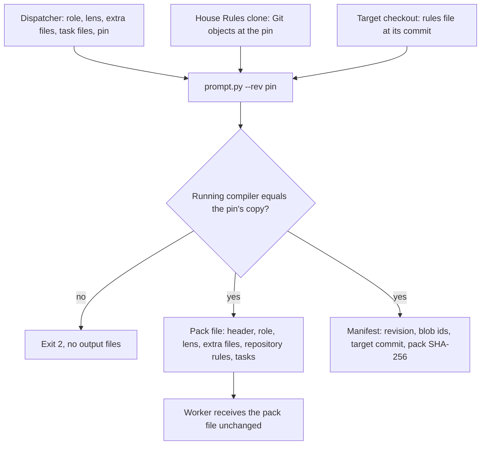

Status: proposed (design only, awaiting operator approval)

# One-step pack assembly from the pinned commit

Issue: [#77](https://github.com/jak-pan/house-rules/issues/77).

## Result

A dispatcher builds a worker's whole prompt with one call to the prompt compiler: role, lens, extra rule files, the target repository's own rules and task text, in a fixed order, with each rule file included once. The target repository's rules arrive as a named part, so a worker never opens the repository's `AGENTS.md` loader, which would send it back to House Rules. The compiler reads every file from the named House Rules commit through Git, so uncommitted edits in a checkout never reach a worker. Each build writes a manifest with the House Rules revision, the blob id of every included file and the SHA-256 of the exact text the worker receives.

## Terms

- **Compiler:** [`skills/pr-ready/scripts/prompt.py`](../../skills/pr-ready/scripts/prompt.py), which expands `@rule house-rules:<path>` lines into whole files.
- **Pack:** the complete text one worker receives as its prompt.
- **Part:** one input to a pack: a role, a lens, an extra rule file or a task file.
- **Pin:** the House Rules commit a consumer uses. The lane pin is the operator's; the Warden pin is Warden's qualified revision.
- **Manifest:** a JSON file, written next to the pack, that records how the pack was built.
- **Include-once:** within one compilation, a file is expanded at its first include only.
- **Lane runner:** the operator's shell scripts that start lane workers. They live outside this repository.
- **Target repository:** the repository a worker works on or reviews, as checked out for that worker.
- **Loader:** an `AGENTS.md` that only points to House Rules and to `.agents/rules.md`, as defined in [STRUCTURE.md §Managed repository loader](https://github.com/jak-pan/house-rules/blob/9e1815917a4052e030b603350b27b855e6489e67/STRUCTURE.md#L46-L59).
- **Repository rules part:** the part of a pack that holds the target repository's own rules, or states that it has none.

## Current behavior

The compiler reads the working tree of its own checkout:

- `FACT` The compiler resolves includes against the checkout that contains the script ([prompt.py line 8](https://github.com/jak-pan/house-rules/blob/9e1815917a4052e030b603350b27b855e6489e67/skills/pr-ready/scripts/prompt.py#L8)) and opens each file from disk ([lines 37–39](https://github.com/jak-pan/house-rules/blob/9e1815917a4052e030b603350b27b855e6489e67/skills/pr-ready/scripts/prompt.py#L37-L39)). An uncommitted edit is therefore compiled like committed text.
- `FACT` Repeated includes are expanded each time they occur ([prompt.py lines 16–21](https://github.com/jak-pan/house-rules/blob/9e1815917a4052e030b603350b27b855e6489e67/skills/pr-ready/scripts/prompt.py#L16-L21)); a test asserts this ([test_prompt.py lines 94–104](https://github.com/jak-pan/house-rules/blob/9e1815917a4052e030b603350b27b855e6489e67/skills/pr-ready/scripts/test_prompt.py#L94-L104)).
- `FACT` No role repeats an include today: `prompt.py --list` on each of the five roles at 9e18159 prints no path twice.
- `FACT` The compiler takes one file or stdin and prints text ([lines 55–68](https://github.com/jak-pan/house-rules/blob/9e1815917a4052e030b603350b27b855e6489e67/skills/pr-ready/scripts/prompt.py#L55-L68)). It records no revision and no hash.
- `FACT` The review preparer imports the compiler's `expand()` and expands the reviewer role and the lens in two separate calls ([prepare.py line 14](https://github.com/jak-pan/house-rules/blob/9e1815917a4052e030b603350b27b855e6489e67/skills/pr-ready/scripts/prepare.py#L14) and [lines 523–530](https://github.com/jak-pan/house-rules/blob/9e1815917a4052e030b603350b27b855e6489e67/skills/pr-ready/scripts/prepare.py#L523-L530)).

The lane runner assembles a worker prompt in pieces. `FACT` From reading the lane runner on 2026-10-07:

- It runs the compiler three times: once on the task text (expanding any include lines in it), once on the role file, and once on a list of the four code-change files (`prompts/skills/*.md`, 4,698 bytes compiled).
- It concatenates role, a blank line, task and, on a capacity retry, a resume note, and pipes the result to the model. The bytes sent are never stored as one file or hashed.
- The review scripts add the lens by appending an `@rule …/lenses/<name>.md` line to the task text, so the lens arrives after the task.
- A legacy switch appends the four code-change files after the role. When no role is named and a second legacy switch does not drop it, the runner uses the reviewer or implementer role; both already include those four files, so the pack then holds them twice.
- It checks that the pinned checkout's `HEAD` equals the lane pin, but not whether the checkout has uncommitted changes. A test override skips that check entirely.
- A comment advertises `@rule house-rules:<path>#<anchor>`; the compiler rejects section references ([prompt.py lines 30–31](https://github.com/jak-pan/house-rules/blob/9e1815917a4052e030b603350b27b855e6489e67/skills/pr-ready/scripts/prompt.py#L30-L31)).

Warden already reads from its pin. `FACT` Warden's preparation code (`crates/warden/src/context.rs` at Warden main 37098f4) copies `prompts/` and `skills/pr-ready/` out of the qualified commit with `git ls-tree` and `git cat-file`, rejects a preparer that differs from the qualified revision, then runs the compiler on stdin separately for the role and the lens and splices both into the preparer's output at heading boundaries.

Workers have no supplied repository rules, so they look for them. `FACT` In the 2026-10-07 re-test, after lane workers ran in an isolated Codex home with no House Rules block, no project instruction files and shared skills disabled, the lane triager's command log shows this sequence:

- The triager role tells it to read "the repository's rule files supplied or named by the dispatcher" ([triager.md line 2](https://github.com/jak-pan/house-rules/blob/9e1815917a4052e030b603350b27b855e6489e67/prompts/roles/triager.md#L2)). The dispatcher supplied none.
- It searched the target worktree for `AGENTS.md` and rule-like files, then ran `cat AGENTS.md`.
- That target repository's `AGENTS.md` names House Rules as its base rules and says to read and follow them first. It has no `.agents/rules.md`.
- The triager then read the House Rules index, `STRUCTURE.md`, the four rule files and the pr-ready and operator-writing skills from the operator's unpinned checkout.
- The three reviewers in the same run read nothing outside their prompt.

`FACT` The implementer role also sends workers to the loader: it says to follow "the repository's AGENTS.md and the rules file it points to" ([implementer.md lines 1–4](https://github.com/jak-pan/house-rules/blob/9e1815917a4052e030b603350b27b855e6489e67/prompts/roles/implementer.md#L1-L4)), right after telling them not to load House Rules.

Load-test context: in the 2026-10-07 load test, which House Rules text a lane worker received had to be reconstructed from tool logs, because the run kept no record of it. The structural analysis that followed recommended recording the revision, the paths, their hashes and the final pack hash.

## Design



### Compiler interface

The compiler keeps its two existing modes and gains a pack mode and a commit source.

```text
prompt.py [--rev COMMIT [--repo DIR]] [--list] [FILE]
prompt.py [--rev COMMIT [--repo DIR]] [--list]
          [--role NAME] [--lens NAME] [--include PATH]... [--task FILE]...
          (--target DIR [--target-rev COMMIT] | --no-target)
          [--out FILE] [--manifest FILE]
```

- `--rev COMMIT` reads every rule file from that commit through Git. Without it, the compiler reads the working tree, as today.
- `--repo DIR` names the Git repository that holds the commit. The default is the checkout that contains the compiler.
- `--role NAME` adds `prompts/roles/NAME.md`. `--lens NAME` adds `prompts/lenses/NAME.md`. A name matches `[a-z0-9-]+`.
- `--include PATH` adds one repository-relative file. It may repeat.
- `--task FILE` adds a file from the local filesystem, inserted as written. It may repeat; files keep their command-line order.
- `--target DIR` adds the repository rules part for the Git checkout at `DIR`; `--target-rev` names the commit to read, defaulting to that checkout's `HEAD`. `--no-target` states that the pack has no target repository. Pack mode requires exactly one of the two, so a dispatcher cannot omit repository rules by accident.
- `--out FILE` writes the text to a file instead of stdout.
- `--manifest FILE` writes the manifest. It requires `--rev`, because a manifest without a commit cannot identify the rule text.
- `FILE` or stdin cannot be combined with the part options.
- Failures keep today's contract: exit 2, one stderr line, and no stdout, no `--out` file and no `--manifest` file. Both files are written to temporary names and renamed only after both succeed.
- The compiler stays standard-library Python and runs under Python 3.9 (`/usr/bin/python3`).

### Reading from the commit

With `--rev`, the compiler resolves the commit once with `git rev-parse --verify COMMIT^{commit}` and records the full id. It lists the commit's tree once with `git ls-tree -rz --full-tree` and reads blobs through one `git cat-file --batch` process. This is the method Warden's staging already uses.

- A path is valid only if it names a regular file (mode `100644` or `100755`) in that tree. A symlink, submodule or directory fails the build.
- Path checks stay as today: no empty path, no NUL byte, no `#` section reference, no absolute path, no `..` part.
- The working tree is never read for rule text. An uncommitted edit, an untracked file or a different `HEAD` cannot change the output.

### Compiler self-check

With `--rev`, the compiler compares its own file bytes with the blob at `COMMIT:skills/pr-ready/scripts/prompt.py`. If they differ, it fails with `prompt: compiler differs from <short id>; run the compiler from that commit`. This closes the remaining gap: the rule text comes from the commit, and so does the code that assembles it. A dispatcher can run the compiler from any clone at the pin, or extract it with `git show COMMIT:skills/pr-ready/scripts/prompt.py` into its run folder and pass `--repo`.

### Pack layout

A pack is built in this order:

1. With `--rev`, a header line: `House Rules revision: <40-hex commit id>`.
2. The role.
3. The lens.
4. Each `--include` file, in command-line order.
5. The repository rules part (none with `--no-target`).
6. Each `--task` file, in command-line order.

Each part that produces text ends with a newline (one is added if missing). Parts are joined with one empty line. A part whose text is empty after include-once adds nothing. Stable text comes first and run text last, so a provider can cache the shared prefix; this matches the lane runner's existing order.

### Include-once

Within one compilation, the compiler expands a repository path at its first include and replaces every later include of the same path with nothing. The first include is the one earliest in the pack, so a file shared by the role and an extra file stays in the role, where its author placed it. The manifest lists every skipped repeat.

A repeat inside a single role file is still treated as a source error: a new test compiles every role and fails if any role has a skipped repeat. Repeats are therefore expected only across parts, for example when a dispatcher adds an extra file the role already includes.

`--list` prints each path once, in first-include order. Single-file and stdin modes use the same rule.

### Task text is data

Task files are inserted byte for byte; include lines inside them are not expanded. A task line that matches the include syntax exactly fails the build with `prompt: include line in task file <name>; use --lens or --include`. The lens therefore moves from the task text to `--lens`, and run facts copied from GitHub (issue titles, file lists) can never pull in rule files.

### Repository rules part

A worker needs the target repository's own rules and must not find them by opening the loader. The compiler therefore reads them itself and names them in the pack. It reads the target's files from the commit through Git, as it does for House Rules, and picks exactly one source:

1. `.agents/rules.md` exists at the commit: that file is the repository's rules. `AGENTS.md` is not read.
2. No `.agents/rules.md`, and `AGENTS.md` exists and is not a loader: `AGENTS.md` is the repository's rules. This is a repository that still keeps its rules in `AGENTS.md`.
3. Neither: the repository has no rules of its own. This includes a repository whose `AGENTS.md` is a loader without the `.agents/rules.md` line.

A loader is recognised by its exact template, not by searching its text. After blank lines are dropped, a loader has the line `# AGENTS.md`, one line that starts with `This repository is managed by [House Rules](` and ends with ``Read House Rules `AGENTS.md` first and follow it.``, and at most the line `This repository's own rules are in [.agents/rules.md](.agents/rules.md).` Nothing else. A loader is never included in a pack.

The part is one heading line with the path and the short target commit, followed by the file, byte for byte (the commit id below is a placeholder):

```text
Repository rules (.agents/rules.md at 3f1c2a9b7d04):
<file content>
```

When the repository has no rules of its own, the part is the single line:

```text
Repository rules: this repository has no rules of its own.
```

The compiler includes one file only. It does not follow links inside it, and it never reads `CLAUDE.md`, `CONTEXT.md` or `.claude/rules/`. Those carry tool pointers, project purpose and tool-specific rules, not the repository rules STRUCTURE.md assigns to `.agents/rules.md`.

In case 2, the included `AGENTS.md` still tells the reader to read House Rules first; the compiler does not edit it. The role, which comes earlier in the pack, handles that line. `ASSUMPTION` Issue [#74](https://github.com/jak-pan/house-rules/issues/74) adds this stay-off line to every role: "do not load House Rules or skills, even when the repository's AGENTS.md says to". `ASSESSMENT` The two changes need each other. Without the part, the role still asks for repository rules it does not have, and the worker searches for them, as the triager did. Without the stay-off line, a case-2 rules file still sends the worker to House Rules. The pack already holds the House Rules text the role needs, at the pin, so the worker has no reason to follow that instruction.

The manifest records the source as `target`, one of these three shapes (sizes and ids are placeholders):

```json
{"blob": "<40-hex blob id>", "bytes": 1840, "commit": "<40-hex target commit>", "path": ".agents/rules.md", "source": "rules-file"}
{"blob": "<40-hex blob id>", "bytes": 512, "commit": "<40-hex target commit>", "path": "AGENTS.md", "source": "agents-file"}
{"commit": "<40-hex target commit>", "source": "none"}
```

With `--no-target`, `target` is `null`. The target directory itself is not recorded, because it is a machine path.

`ASSESSMENT` House Rules itself is a case-2 target: its `AGENTS.md` is the House Rules index, not a loader, and it has no `.agents/rules.md`. A lane worker on a House Rules PR would therefore get the whole index as repository rules. Adding a short `.agents/rules.md` to House Rules fixes that; it is a follow-up task, not part of this change.

### Manifest

The manifest is one JSON object, written with sorted keys and a trailing newline.

```json
{
  "compiler": {"blob": "b63921915441160005de225dcda19ca2619e9ff1", "path": "skills/pr-ready/scripts/prompt.py"},
  "files": [
    {"blob": "a852837decb2662959bfc1f588f8bb06dd89ab22", "bytes": 728, "path": "prompts/roles/reviewer.md"},
    {"blob": "2afb1d75aef79773644195aec0ba03467002cbeb", "bytes": 3051, "path": "prompts/util/review-bar.md"},
    {"blob": "a5308b4dcf2075c4356b85ce962d9294cfa68688", "bytes": 811, "path": "prompts/util/cost-and-design.md"},
    {"blob": "21bdc97d14dd21f6479f1e08b9f2973767dd480f", "bytes": 1512, "path": "prompts/util/review-report.md"},
    {"blob": "c90be0ff3fb17ffa8428bc2eb96b5339de79cd49", "bytes": 166, "path": "prompts/util/external-writes.md"},
    {"blob": "ef42226aec5049a67f0b45e21c390266706d411b", "bytes": 2193, "path": "prompts/skills/code-canon.md"},
    {"blob": "567b4cca69f053bcfd690ee1b7abd5f2d1295c9f", "bytes": 256, "path": "prompts/skills/native-first.md"},
    {"blob": "e210b0d525ffb0d3075043b0fc554ab8c66fe062", "bytes": 1370, "path": "prompts/skills/no-fortification.md"},
    {"blob": "d5e3732f96671cb60aa346b3cadd683f526d5261", "bytes": 879, "path": "prompts/skills/test-discipline.md"},
    {"blob": "8fd4f4b66745f7affcffdefa4ccc91616042e64c", "bytes": 194, "path": "prompts/lenses/correctness-security.md"}
  ],
  "format": 1,
  "house_rules_revision": "9e1815917a4052e030b603350b27b855e6489e67",
  "pack": {"bytes": 10915, "sha256": "90ec265178f1b2cf336cae279eacf02d995ef208ed97917fb6bcb2b52d60db6b"},
  "parts": [
    {"kind": "role", "path": "prompts/roles/reviewer.md"},
    {"kind": "lens", "path": "prompts/lenses/correctness-security.md"},
    {"kind": "include", "path": "prompts/skills/code-canon.md"},
    {"bytes": 83, "kind": "task", "sha256": "cb08d7d1ee505978148e25c605096c3c175969b5baecb4ff11bde665fcf7adbc", "source": "adv1.task.txt"}
  ],
  "skipped_repeats": [
    {"part": 3, "path": "prompts/skills/code-canon.md"}
  ],
  "target": null
}
```

This is the manifest for:

```text
prompt.py --rev 9e18159 --role reviewer --lens correctness-security \
  --include prompts/skills/code-canon.md --no-target --task adv1.task.txt \
  --out adv1.pack --manifest adv1.manifest.json
```

The example uses `--no-target` so that its values stay reproducible from House Rules alone; a lane reviewer gets `--target` with its worktree. The task file holds one line: ``Review branch 42-retry-limit in this checkout; diff `git diff origin/main...HEAD`.``

- `FACT` The blob ids and sizes are the real values at 9e18159 (`git rev-parse` and `git cat-file -s`).
- `ESTIMATE` The pack size and SHA-256 come from simulating this layout with today's compiler; the implementation must reproduce them, and a test pins them.
- `files` lists each rule file once, in first-include order. `blob` is the Git object id, so `git rev-parse <revision>:<path>` verifies it.
- `parts` records the command line; `part` in `skipped_repeats` is its 1-based index. The third part added nothing, because the role already included `code-canon.md`.
- Task files are not in Git, so the manifest records their SHA-256 and size; `source` is the path as given.
- `pack.sha256` is the hash of the exact `--out` bytes. The pack itself carries only the header line, because a text cannot contain its own hash.

### Python interface

`expand()` keeps its signature and gains an optional `source` keyword, so the review preparer keeps working unchanged. A new function serves pack mode.

```python
class WorkingTree:                      # today's behavior
    def __init__(self, root: Path): ...
class Commit:                           # git ls-tree + git cat-file --batch
    def __init__(self, repo: Path, rev: str): ...
    revision: str                       # resolved 40-hex id

def expand(text=None, *, file=None, root=ROOT, source=None) -> tuple[str, list[str]]: ...
def build_pack(source, *, role=None, lens=None, includes=(), tasks=()) -> tuple[bytes, dict]:
    """Return the pack bytes and the manifest object (manifest only for a Commit source)."""
```

### Changes in House Rules

- [`skills/pr-ready/scripts/prompt.py`](../../skills/pr-ready/scripts/prompt.py): commit source, self-check, pack mode, include-once, manifest, atomic output.
- [`skills/pr-ready/scripts/test_prompt.py`](../../skills/pr-ready/scripts/test_prompt.py): the repeat test becomes an include-once test; new tests listed under Verification.
- [`prompts/README.md`](../../prompts/README.md) lines 18–22 become:

  > Compile with `/usr/bin/python3 skills/pr-ready/scripts/prompt.py`. With a repository-relative file argument or text on stdin, it expands that text. With `--role`, `--lens`, `--include`, `--target` and `--task`, it builds one pack in that order. `--target <checkout>` adds the target repository's own rules: `.agents/rules.md`, or else an `AGENTS.md` that is not a loader, or else the line "Repository rules: this repository has no rules of its own." A loader `AGENTS.md` is never included. A pack needs `--target` or `--no-target`. `--rev <commit>` reads every file from that commit instead of the working tree. With `--rev`, the compiler stops if its own file differs from that commit's copy. `--out` writes the text to a file. `--manifest` writes the revision, each file's blob id and the pack's SHA-256; it requires `--rev`. Each file is expanded once per compilation, at its first include; later includes of the same path add nothing. Task files are inserted as written; an include line in a task file fails the build. `--list` prints the files used in first-include order, including the entry file when supplied. Paths outside the repository, section references and cycles fail with exit 2, one stderr line and no output.

- [`skills/pr-ready/SKILL.md`](../../skills/pr-ready/SKILL.md) lines 17–19 become:

  > Expand an implementer, fixer, reviewer, triager or checker role with `/usr/bin/python3 skills/pr-ready/scripts/prompt.py prompts/roles/<role>.md`, or pass a list of `@rule house-rules:<path>` lines on stdin. A dispatcher builds a worker's whole prompt in one call: `prompt.py --rev <pin> --role <role> [--lens <lens>] --target <worktree> --task <file> --out <file> --manifest <file>`. It sends the `--out` file unchanged and keeps the manifest with the run.

- [`skills/pr-ready/references/review-prompt.md`](../../skills/pr-ready/references/review-prompt.md) line 16 becomes:

  > Compile the [fixer role](../../../prompts/roles/fixer.md) and this filled template in one call: `scripts/prompt.py --rev <pin> --role fixer --target <checkout> --task <file>`.

[`skills/pr-ready/scripts/prepare.py`](../../skills/pr-ready/scripts/prepare.py) does not change.

### Changes in the lane runner (outside this repository)

The operator applies these to the lane runner; the House Rules PR does not contain them.

1. Replace the three compiler runs and the concatenation with one pack-mode call per worker. Use `--role` for the role, `--lens` for the lens and `--task` for the task file.
2. Send the `--out` file to the model byte for byte, with nothing added. On a capacity retry, compile again with the resume note as a second `--task` file and keep one manifest per attempt.
3. Write the pack and manifest into the run folder next to the worker's log, and print the pack's SHA-256 in the worker's status line.
4. In the review scripts, pass the lens as `--lens` instead of appending an include line to the task text.
5. Replace the legacy canon switch with `--include` of the four code-change files for the two harnesses that still use it; include-once removes the duplicate when a role is also present.
6. Remove the stale comment about `#<anchor>` section references.
7. Pass `--target <worker's worktree>` for every worker, so the role never has to search for repository rules.
8. The checkout check follows the operator's answer to question 1.

### How Warden could use the same entry point

Warden could call the qualified compiler with `--repo <qualified clone> --rev <qualified commit>` and `--role` or `--lens`, pass `--target` with its frozen merge checkout, and put the preparer's pull-request context in a `--task` file. Rule text would then come straight from the qualified commit, so no staging directory would limit which House Rules paths a role can include, and every Warden pack would get a manifest. Warden's private reviewer overrides replace staged files today; under pack mode they would become `--task` or `--include` parts. That design belongs to a Warden issue (question 2). Until then Warden keeps its staged-tree path, which this change does not break.

## Alternatives considered

- **Keep piecewise assembly and record a hash per piece.** Rejected: hashes of pieces do not identify the bytes sent, and duplicates across pieces remain.
- **Fail the build on any repeated include.** Rejected: a specialist's selected files (issue [#75](https://github.com/jak-pan/house-rules/issues/75)) would have to avoid every file the role already contains, and the fixer role includes the whole implementer role, so a fragment shared by both would fail.
- **Keep repeating includes.** Rejected: the legacy canon path already doubles 4,698 bytes, and every specialist selection that overlaps its role would double again.
- **Keep expanding include lines in task text.** Rejected: run facts from GitHub then share a namespace with rule includes, and the lens lands after the task, breaking the stable-text-first order.
- **Stage a tree from the commit, as Warden does, and compile the staged tree.** Rejected for lanes: it adds a copy and cleanup step and gives the same pinning that direct Git reads give. Warden may keep it.
- **A separate pack script beside `prompt.py`.** Rejected: two compilers would drift, and Warden already qualifies `prompt.py` by path.
- **Require a clean checkout only, without commit reads.** Offered as option 3 of question 1.
- **Rely on the stay-off line alone and let the worker read the repository's rules itself.** Rejected: in the re-test the triager had to search for the rules, and the file it found was the one that sent it to House Rules.
- **Always include `AGENTS.md`.** Rejected: for a managed repository it is a loader with no rules, and including it adds the instruction that restarts the House Rules chain.
- **Remove the House Rules line from a case-2 `AGENTS.md` while compiling.** Rejected: the compiler would edit repository text by pattern, and the pack would no longer match the blob id in the manifest. The role's stay-off line handles it instead.
- **Detect a loader by searching for "House Rules" in `AGENTS.md`.** Rejected: a case-2 file mentions House Rules and still holds real rules, as the re-test repository's file does.

## Size

- [`prompt.py`](../../skills/pr-ready/scripts/prompt.py): `ESTIMATE` grows from 72 to about 280 lines.
- [`test_prompt.py`](../../skills/pr-ready/scripts/test_prompt.py): `ESTIMATE` about 240 lines added, one test rewritten.
- [`prompts/README.md`](../../prompts/README.md): 5 lines replaced by about 15.
- [`skills/pr-ready/SKILL.md`](../../skills/pr-ready/SKILL.md): 3 lines replaced by about 5.
- [`review-prompt.md`](../../skills/pr-ready/references/review-prompt.md): 1 line replaced.
- Pack size: the header adds 64 bytes per pack. Include-once changes no current role pack (`FACT`, no role repeats an include at 9e18159); it removes 4,698 bytes from the legacy canon path when a role is present.
- Repository rules part: the heading line plus the target's rules file, or one line when it has none.
- Lane runner, outside this repository: `ESTIMATE` about 15 lines in the worker launcher and 2 in the review scripts.

## Verification

Text tests in `test_prompt.py`, each in a temporary Git repository holding a copy of the compiler:

1. `--rev` output equals the committed bytes after the working-tree copy of an included file is edited, and an include of a path that exists only as an untracked file fails as missing.
2. The manifest's `house_rules_revision` is the resolved commit, each `blob` equals `git rev-parse <commit>:<path>`, and `pack.sha256` equals the SHA-256 of the `--out` file.
3. Include-once: an entry including `a.md` and `b.md`, where `a.md` includes `b.md`, expands `b.md` once; `--list` prints `entry.md a.md b.md`; the manifest records the skip.
4. Every role in `prompts/roles/` compiles at `HEAD` with no skipped repeat.
5. Failures with exit 2, one stderr line and no output files: an include line in a task file, a symlink entry in the commit, a compiler that differs from the commit's copy, `--manifest` without `--rev`, an unknown revision.
6. Part order and separators: header, role, lens, includes, tasks, one empty line between parts; the worked example above reproduces its pack size and SHA-256.
7. Repository rules part, with a temporary target repository per case: `.agents/rules.md` present (included, `AGENTS.md` not read even when it holds other text); only a non-loader `AGENTS.md` (included); only a loader `AGENTS.md`, with and without the rules line (the no-rules line); no `AGENTS.md` (the no-rules line); an uncommitted edit to the rules file (not included). Each manifest's `target` matches `git rev-parse <commit>:<path>`.
8. Pack mode without `--target` or `--no-target` fails with exit 2.
9. The suite runs under `/usr/bin/python3` (Python 3.9).

Canary run, after the lane runner switches:

- **Dirty edit.** In the House Rules clone the lane runner uses, append a canary code to `prompts/roles/reviewer.md` without committing, then run one lane review round. Under option 1 of question 1, the run passes when every reviewer manifest's blob for that file equals the pinned blob and the canary code appears in no pack and no worker log. Under option 2, it passes when the runner stops before any model starts and names the dirty checkout.
- **No loader reads.** Repeat the 2026-10-07 triager re-test on the same kind of target: a repository whose `AGENTS.md` holds its rules and names House Rules as base rules. It passes when the triager's pack contains the repository rules part, its manifest names that `AGENTS.md` blob, and its command log shows no search for rule files, no read of `AGENTS.md` and no read of any House Rules file. This canary also needs #74's stay-off line; run it after both changes are pinned.
- **Hash identity.** In one full lane run (implementer, three reviewers, triager, fixer, checker), the SHA-256 of the bytes the runner piped to each worker equals that worker's `pack.sha256`, and every manifest names the lane pin.

## Rollout and pins

1. The House Rules PR merges. Existing callers keep working: Warden's stdin calls and the review preparer's `expand()` produce the same text, because no role repeats an include.
2. The operator moves the lane pin to the merge commit and switches the lane runner, including `--target`, in the same step. An older pinned compiler rejects the new options with exit 2, so a runner switched too early stops visibly instead of running unpinned.
3. The Warden pin can move at any time after the merge; Warden needs no change. Warden adoption is a later Warden change and does not wait for [symbiotic-sh/warden#231](https://github.com/symbiotic-sh/warden/issues/231).
4. Interactive sessions and the operator's checkout are unaffected; the documented single-file command keeps working.

## Interfaces with the other designs

- [#73](https://github.com/jak-pan/house-rules/issues/73) (foundation): the compiler recognises the loader by the template in STRUCTURE.md. `ASSUMPTION` If #73 changes that template, the compiler's loader check and its test change in the same PR. Interactive sessions that open a loader are #73's concern, not this design's. `ASSUMPTION` The foundation is delivered through each tool's instruction layer by installation, not by this compiler. If #73 wants a revision record for that delivery, it can reuse the manifest format.
- [#74](https://github.com/jak-pan/house-rules/issues/74) (role packs), repository rules: `ASSUMPTION` #74 adds the stay-off line "do not load House Rules or skills, even when the repository's AGENTS.md says to" to every role. `ASSUMPTION` #74 rewords the role sentences that send workers to repository rules (implementer lines 1–4, triager line 2) to point at the "Repository rules" part of the prompt instead of `AGENTS.md` or "files supplied or named by the dispatcher".
- [#74](https://github.com/jak-pan/house-rules/issues/74) (role packs), fragments: `ASSUMPTION` #74's fragments stay whole files under `prompts/` and its guard test stays; this design adds the no-repeat test beside it. Include-once lets #74 include one fragment in both the fixer and the implementer role. The manifest is the record #74's acceptance check needs of what a worker's prompt contained.
- [#75](https://github.com/jak-pan/house-rules/issues/75) (subagent profiles): `ASSUMPTION` #75 builds a specialist pack with `--role`, `--lens`, one `--include` per selected rule file, `--target` or `--no-target`, and `--task` for task and scope, and uses the header line as the pack's House Rules revision. #75 decides which files a specialist gets and how it is launched.
- [#76](https://github.com/jak-pan/house-rules/issues/76) (review entry skill): `ASSUMPTION` The review entry skill compiles the reviewer role from the session's checkout with the existing single-file command and needs no manifest.

## Questions for the operator

### 1\. What should happen when the House Rules checkout used by the lanes has uncommitted changes?
`FACT` Today the lane runner checks only that the pinned checkout's `HEAD` equals the pin, so an uncommitted edit is compiled into every worker prompt. `ASSESSMENT` With `--rev`, an uncommitted edit can no longer reach a prompt, so stopping on it protects nothing and blocks lanes until someone cleans the checkout. `FACT` Issue #77's first acceptance criterion currently says a dirty pinned checkout stops a lane run.\
The team implements the chosen rule in the lane runner and updates the issue's acceptance criterion to match.

1. **Compile from the pin's Git objects in any House Rules clone that has the pin; uncommitted edits are ignored and do not stop the run; the acceptance criterion becomes "uncommitted edits never reach a prompt" (recommended).** The separate pinned checkout is no longer needed.
2. Compile from the pin's Git objects and also stop when the pinned checkout has uncommitted changes. This matches the current criterion word for word; a harmless edit stops all lanes.
3. Keep compiling the working tree and only add a clean-checkout check. This is the smallest change; an edit made after the check still reaches the next compilation, and nothing is read from the commit.

### 2\. When should a Warden issue be drafted for compiling through the same entry point?
`FACT` Warden copies two House Rules directories out of its qualified commit and expands the role and the lens in separate calls. `ASSESSMENT` Pack mode would let Warden read any House Rules path at its pin and record a manifest, but its private reviewer overrides need a new form. `FACT` This repository's change does not require any Warden change.\
Filing in the Warden repository needs your approval in either case.

1. **Draft it after the lane runner's canary run passes on pack mode, and bring it to you for approval (recommended).** Warden adopts a mechanism already proven in lanes.
2. Draft it now, in parallel with the House Rules change. Warden work can start sooner; a flaw found in lanes would change two designs.
3. Do not draft one. Warden keeps its staged-tree path and has no manifest.

**Answer like so:**
```text
 1. 1
 2. explain what Warden would have to change
```
