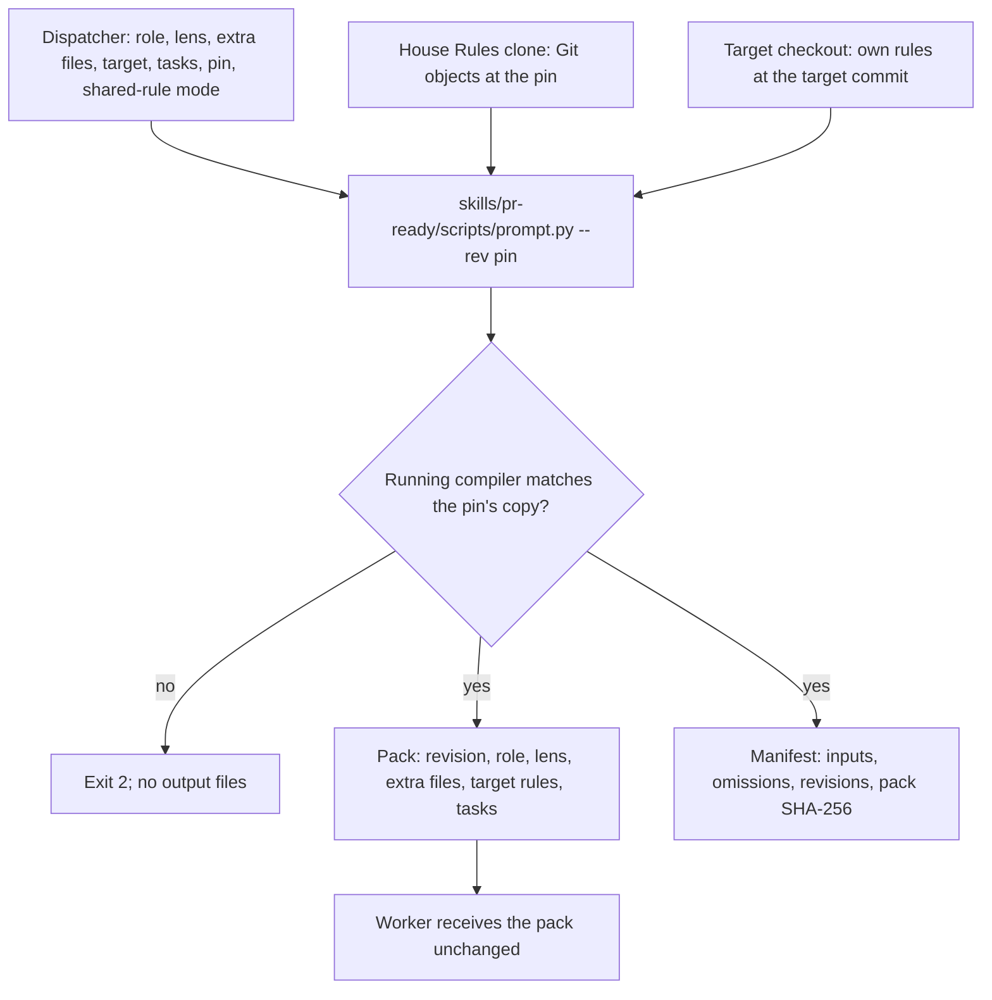

Status: design only; operator choices recorded on 2026-10-07; implementation pending.

# One-step pack assembly from a named commit

Issue: [#77](https://github.com/symbiotic-sh/house-rules/issues/77).

## Result

A dispatcher builds each worker's prompt with one compiler call. The pack contains the role, lens, extra rule files, target repository rules and task text, in that order. Each rule file is included once. The compiler reads House Rules text from a named commit through Git objects. Uncommitted edits and other branches on disk cannot reach the pack. The acceptance criterion is "uncommitted edits never reach a prompt".

Lane workers run as normal Codex sessions in the operator's Codex home. Lane sessions load the live House Rules foundation through their installed pointer. Their role prompts come from the named commit. The compiler omits shared-rule includes for lane sessions that already load House Rules. Warden reviewers receive those includes in their prompts. A manifest records the role prompt's revision and the hash of the exact pack bytes. The manifest does not claim that a lane session's live foundation came from that revision.

## Terms and paths

- **Compiler:** [skills/pr-ready/scripts/prompt.py](../../skills/pr-ready/scripts/prompt.py), which expands whole-file `@rule house-rules:<path>` includes.
- **Pack:** the complete prompt text the dispatcher sends to a worker.
- **Part:** one input to a pack: a role, lens, extra rule file, target repository rules or task file.
- **Pin:** the named House Rules commit used to build a role prompt.
- **Manifest:** a JSON file beside the pack that records the pack's inputs and SHA-256 hash.
- **Include-once:** expansion of a repository path only at its first include within a compilation.
- **Lane runner:** the operator's scripts outside House Rules that launch local workers.
- **Target:** the repository checkout on which a worker works or performs a review.
- **Loader:** the target's pointer file, which directs a session to the House Rules index and the target's own rules.

House Rules file paths in this document are complete repository-relative paths. A target file has the `<target>/` prefix. The House Rules pointer is `house-rules/AGENTS.md`; the renamed House Rules index is `house-rules/INDEX.md`. Installed pointers use `<codex-home>/AGENTS.md` or `<repository>/AGENTS.md`. The pointer format and index rename belong to the [smaller-core design, issue #73](https://github.com/symbiotic-sh/house-rules/issues/73).

## Pre-flight

The dispatcher supplies the work item's Decisions and Pre-flight sections in the task file. Implementation reads those sections before changing code. Implementation also reads the target repository rules supplied in the pack.

The [role-pack design, issue #74](https://github.com/symbiotic-sh/house-rules/issues/74), owns shared-rule placement and worker instructions. The smaller-core design owns the loader template and index rename. Implementation must use the loader template selected by those designs. This design must not freeze the old loader text from [STRUCTURE.md](../../STRUCTURE.md).

## Current behavior and evidence

- `FACT` The compiler at commit `9e1815917a4052e030b603350b27b855e6489e67` reads included files from disk, as verified in this run with `git show 9e18159:skills/pr-ready/scripts/prompt.py` ([skills/pr-ready/scripts/prompt.py, lines 37–39](https://github.com/symbiotic-sh/house-rules/blob/9e1815917a4052e030b603350b27b855e6489e67/skills/pr-ready/scripts/prompt.py#L37-L39)).
- `FACT` The compiler at commit `9e1815917a4052e030b603350b27b855e6489e67` expands repeated includes, as verified in this run by its `visit()` implementation ([skills/pr-ready/scripts/prompt.py, lines 16–39](https://github.com/symbiotic-sh/house-rules/blob/9e1815917a4052e030b603350b27b855e6489e67/skills/pr-ready/scripts/prompt.py#L16-L39)).
- `FACT` The compiler at commit `9e1815917a4052e030b603350b27b855e6489e67` accepts a file or standard input and writes expanded text, as verified in this run by its `main()` implementation ([skills/pr-ready/scripts/prompt.py, lines 55–68](https://github.com/symbiotic-sh/house-rules/blob/9e1815917a4052e030b603350b27b855e6489e67/skills/pr-ready/scripts/prompt.py#L55-L68)).

`ASSUMPTION` The [docs/design/77-one-step-pack-assembly.md at commit 38f7eba761ee31f4e73da20d2a42f185321b4567](https://github.com/symbiotic-sh/house-rules/blob/38f7eba761ee31f4e73da20d2a42f185321b4567/docs/design/77-one-step-pack-assembly.md#current-behavior) reports that the lane runner assembled prompts through separate compiler calls and concatenation. That account was not reverified against lane scripts in this run. The design replaces piecewise assembly with one recorded pack.

`DECISION` The operator's 2026-10-07 record says that lane workers use normal sessions instead of an isolated worker home. The role-pack design owns that session setup. The earlier isolated-home test is not the acceptance model for this design.

`ASSUMPTION` The operator's 2026-10-07 record reports that Warden added staging for `rules/` in commit `9f1568b` for [Warden issue #238](https://github.com/symbiotic-sh/warden/issues/238). Warden deployment was not checked in this run. This design does not assume that Warden stages only `prompts/` and `skills/pr-ready/`.

## Design



### Compiler interface

The compiler keeps single-file and standard-input expansion. The compiler gains a pack mode that requires a named commit.

```text
skills/pr-ready/scripts/prompt.py [--rev COMMIT [--repo DIR]] [--list] [FILE]
skills/pr-ready/scripts/prompt.py --rev COMMIT [--repo DIR] [--list]
    [--role NAME] [--lens NAME] [--include PATH]... [--task FILE]...
    (--target DIR [--target-rev COMMIT] | --no-target)
    [--omit-shared-rules] [--out FILE] [--manifest FILE]
```

- `--rev COMMIT` reads House Rules files from that commit. Legacy single-file and standard-input expansion can still read the working tree without this option. Dispatchers use `--rev` for every worker prompt, including lane review panels.
- `--repo DIR` names a clone holding the commit. The default is the clone containing the compiler. A separate pinned checkout is unnecessary.
- `--role NAME` selects `prompts/roles/NAME.md`. `--lens NAME` selects `prompts/lenses/NAME.md`. Each name must match `[a-z0-9-]+`.
- `--include PATH` adds a House Rules repository-relative file. Repeated options retain command-line order.
- `--task FILE` adds local task text without expanding it. Repeated options retain command-line order.
- `--target DIR` selects a target Git checkout. `--target-rev COMMIT` selects its rules revision, defaulting to its `HEAD`. `--no-target` declares that the pack has no target. Pack mode requires exactly one target choice.
- `--omit-shared-rules` omits includes whose House Rules repository-relative paths are under `rules/`. The dispatcher uses this option only for workers whose normal sessions already load the shared rules. The manifest records each omitted path. Warden and specialists without the foundation receive shared-rule includes by default.
- `--out FILE` writes pack bytes instead of standard output. `--manifest FILE` writes the manifest and requires `--rev`.
- An entry file or standard-input text cannot be combined with pack part options. `--omit-shared-rules` is a pack-mode option.
- A failure returns exit 2 and one standard-error line. A failure writes no standard output, pack file or manifest file. Output files use temporary names and become final only after successful compilation and writing.
- The compiler uses only the Python standard library. The compiler supports Python 3.9 through `/usr/bin/python3`.

The shared-rule option is the proposed way for one role file to serve normal lane sessions and Warden reviewers. The [role-pack design, issue #74](https://github.com/symbiotic-sh/house-rules/issues/74), owns which shared rules belong under `rules/`. That design keeps session-only instructions separate from role includes. This compiler omits only explicit shared-rule paths; the compiler does not infer rule meaning from prose.

### Reading from the commit

With `--rev`, the compiler resolves `COMMIT^{commit}` once through `git rev-parse --verify`. The compiler records the resolved full commit id. The compiler lists the tree once with `git ls-tree -rz --full-tree`. The compiler reads blobs through one `git cat-file --batch` process.

A valid path names a regular file with mode `100644` or `100755`. A symlink, submodule or directory fails compilation. Empty paths, NUL bytes, section references, absolute paths and `..` components fail compilation. An omitted shared-rule include must still name a valid file at the selected commit. A missing shared rule must not disappear silently.

The compiler never reads the working tree for rule text in commit mode. Uncommitted edits, untracked files and a different checked-out branch cannot change the pack. A missing commit fails visibly. The lane runner does not require a clean checkout or require the clone's `HEAD` to equal the pin.

### Compiler self-check

The compiler compares its running file bytes with `COMMIT:skills/pr-ready/scripts/prompt.py`. A mismatch fails with `prompt: compiler differs from <short id>; run the compiler from that commit`. This check pins the assembly code as well as the rule text.

A dispatcher can run a matching compiler in any clone containing the pin. A dispatcher can also extract `COMMIT:skills/pr-ready/scripts/prompt.py` into the durable run folder and pass `--repo`. Compiler extraction does not require a separate pinned checkout. The extracted compiler must still pass the self-check.

### Pack layout and include-once

The pack order is:

1. `House Rules revision: <40-hex commit id>`.
2. Role text.
3. Lens text.
4. Extra files in command-line order.
5. Target repository rules, unless `--no-target` is selected.
6. Task files in command-line order.

Only pack mode writes the revision header. Legacy single-file and standard-input expansion remains plain text. The review preparer's existing use of `expand()` remains supported.

Each nonempty part ends with a newline. The compiler adds a newline when the source lacks one. The compiler joins parts with one empty line. An empty part adds no separator. Stable rule text precedes run-specific task text.

A repository path expands only at its first include in one compilation. Later includes of the same path produce no text. The manifest records the skipped repeats. The first occurrence determines the file's position. Cycle detection occurs before repeat suppression, so include-once cannot hide a cycle.

A role that repeats an include remains a source error caught by the role test. Expected repeats occur across parts, such as an extra file already included by a role. `--list` prints included paths once in first-include order. Omitted shared rules do not appear as included files.

### Task text is data

Task text is inserted without expansion or editing, apart from the part-ending newline rule. A task line matching include syntax fails with `prompt: include line in task file <name>; use --lens or --include`. The dispatcher supplies lenses and extra rules through compiler options. Task text copied from a work item cannot pull in rule files.

The dispatcher writes the work item's Decisions and Pre-flight sections into the task file. The compiler adds no separate work-item part. A capacity retry supplies the resume note as a second task file. Each attempt gets its own pack and manifest.

### Target repository rules

The compiler reads the target's rules from its selected commit through Git. The compiler picks exactly one source:

1. If `<target>/.agents/rules.md` exists, include that file. Do not read `<target>/AGENTS.md`.
2. Otherwise, if `<target>/AGENTS.md` exists and is not a loader, include that file unchanged.
3. Otherwise, emit `Repository rules: this repository has no rules of its own.`

The compiler recognizes a loader by the pointer template owned by the smaller-core design. The pointer's install paths may vary. The compiler must not classify a file as a loader merely because the file mentions House Rules. The compiler never includes a loader as target rules. A change to the canonical pointer template must update the detection test in the same change.

The smaller-core design renames the House Rules index to `house-rules/INDEX.md`. The House Rules pointer at `house-rules/AGENTS.md` points to that index and `house-rules/.agents/rules.md`. Global and managed-repository pointer files use the same shape with installation paths adjusted. This design must test the renamed-index shape rather than preserve the former index in `house-rules/AGENTS.md`.

The target rules part has a heading and the unchanged file content. This example uses a placeholder target commit:

```text
Repository rules (<target>/.agents/rules.md at 3f1c2a9b7d04):
<file content>
```

The compiler includes one target file only. The compiler does not follow links inside that file. The compiler does not read `<target>/CLAUDE.md`, `<target>/CONTEXT.md` or files under `<target>/.claude/rules/` to assemble this part.

The [role-pack design, issue #74](https://github.com/symbiotic-sh/house-rules/issues/74), owns instructions for consuming the supplied target rules. Normal lane sessions keep their House Rules loading behavior. Warden reviewers use the supplied prompt and read-only target copy. The earlier instruction forbidding every lane worker from loading House Rules is rejected.

### Manifest

The manifest is one JSON object with sorted keys and a trailing newline. Object ids, byte counts and hashes in this example are placeholders. Paths inside the manifest are repository-relative to their named source; they are not machine paths.

```json
{
  "compiler": {
    "blob": "<compiler blob id>",
    "path": "skills/pr-ready/scripts/prompt.py"
  },
  "files": [
    {"blob": "<role blob id>", "bytes": 728, "path": "prompts/roles/reviewer.md"},
    {"blob": "<lens blob id>", "bytes": 194, "path": "prompts/lenses/correctness-security.md"}
  ],
  "format": 1,
  "house_rules_revision": "<resolved House Rules commit id>",
  "omitted_shared_rules": ["rules/writing.md"],
  "pack": {"bytes": 1024, "sha256": "<hash of exact pack bytes>"},
  "parts": [
    {"kind": "role", "path": "prompts/roles/reviewer.md"},
    {"kind": "lens", "path": "prompts/lenses/correctness-security.md"},
    {"bytes": 83, "kind": "task", "sha256": "<task hash>", "source": "<run>/task.txt"}
  ],
  "skipped_repeats": [],
  "target": null
}
```

`files` records included House Rules files in first-include order. Each file entry records its blob id and byte count. `parts` records the requested part order. A skipped repeat records its path and the 1-based part number. `omitted_shared_rules` lists distinct omitted paths in first-encounter order. An empty omission list means all shared-rule includes were expanded.

Task files are local inputs rather than Git blobs. Each task entry records its supplied path, byte count and SHA-256 hash. `pack.sha256` hashes the exact output bytes. The pack header contains only the revision because the pack cannot contain its own hash.

The target record uses a file-source shape or a no-rules shape. Values are placeholders. The file-source path is relative to the target commit; the source identifies either the target rules file or the target instruction file:

```json
{"blob": "<blob id>", "bytes": 1840, "commit": "<target commit id>", "path": "<target-relative rule path>", "source": "<rules-file or agents-file>"}
{"commit": "<target commit id>", "source": "none"}
```

A `rules-file` source names `<target>/.agents/rules.md`. An `agents-file` source names `<target>/AGENTS.md`. The target record's `path` is relative to the target repository. With `--no-target`, `target` is `null`. The manifest excludes the target's machine directory. The manifest records compiled inputs only; the manifest does not record or pin the live session foundation.

### Python interface

`expand()` keeps its existing arguments and gains an optional `source` keyword. Pack assembly uses a separate function in the same compiler module.

```python
class WorkingTree:
    def __init__(self, root: Path): ...

class Commit:
    def __init__(self, repo: Path, rev: str): ...
    revision: str

def expand(text=None, *, file=None, root=ROOT, source=None) -> tuple[str, list[str]]: ...
def build_pack(source, *, role=None, lens=None, includes=(), tasks=(),
               target=None, omit_shared_rules=False) -> tuple[bytes, dict]: ...
```

### Changes in House Rules

- [skills/pr-ready/scripts/prompt.py](../../skills/pr-ready/scripts/prompt.py): add commit reads, compiler self-check, pack mode, include-once, shared-rule omission, target rules, manifest output and atomic output handling.
- [skills/pr-ready/scripts/test_prompt.py](../../skills/pr-ready/scripts/test_prompt.py): replace repeat-expansion expectations with include-once checks; add the tests below.
- [prompts/README.md](../../prompts/README.md): document pack mode, required commit and target choices, shared-rule mode, manifests and failure behavior.
- [skills/pr-ready/SKILL.md](../../skills/pr-ready/SKILL.md): document one compiler call per dispatched worker and task files containing Decisions and Pre-flight sections.
- [skills/pr-ready/references/review-prompt.md](../../skills/pr-ready/references/review-prompt.md): document compiling the fixer role and filled task together from the pin.

[skills/pr-ready/scripts/prepare.py](../../skills/pr-ready/scripts/prepare.py) keeps its existing interface. The existing `expand()` caller remains supported. Shared-rule ownership changes belong to the role-pack design rather than a second set of copies here.

### Changes in the lane runner

The lane runner changes are outside this House Rules change:

1. Build each worker prompt in one pack-mode call using the pin. Replace compiler calls followed by concatenation.
2. Use `--omit-shared-rules` for normal lane sessions. Keep the operator's Codex home, skills and guardian escalation path.
3. Pass the role, lens, extra files, target worktree and task files through their compiler options.
4. Send the output pack unchanged. Retain each pack and manifest beside its worker log. Print the pack hash in worker status output.
5. Replace clean-checkout or checked-out-branch requirements with commit availability and the compiler self-check. Retire the separate pinned checkout requirement.
6. Build lane review panels from the same named commit. Replace the live-checkout execution of `<lanes>/main/finalize.sh`'s review-panel entry point with the matching `skills/pr-ready/scripts/review-panel.sh` from the pin. Compile every panel prompt with `--rev`.
7. Replace the legacy canon switch with explicit extra-file includes. Include-once removes overlap with the role. Remove the obsolete comment advertising section references.
8. Supply Decisions and Pre-flight in the task file. Supply a resume note as an additional task file on a capacity retry. Preserve a manifest for each attempt.

Lane sessions still load session rules from the live House Rules checkout through the installed block. Only the role prompt is commit-built. Pinning a role prompt does not isolate a normal session from the live foundation.

### Warden adoption

Warden can use the same compiler entry point with its named House Rules commit. Warden builds reviewer packs without `--omit-shared-rules`. Warden can then retain manifests for its prompt inputs. Shared rules remain in `rules/`; this design adds no verbatim copies under `prompts/util/`.

The role-pack design owns Warden staging of `rules/` and the corresponding guard update. The matching Warden compiler change is drafted after the lane runner's test run passes on the new assembly. The draft goes to the operator for approval before external writes.

Warden reviewers remain read-only. Warden supplies a read-only PR copy. Reviewers have no network except the model provider and run no builds or tests. Continuous integration runs builds and tests. Warden posts the review on GitHub. Mac lane scripts read the review and start the fixer locally. Pack assembly changes none of those boundaries.

## Rejected alternatives

- **Keep piecewise assembly.** Rejected because piece hashes do not identify the final prompt bytes and do not remove overlap across parts.
- **Fail on every repeated include.** Rejected because an extra rule may already occur in a role; include-once preserves the role's placement.
- **Expand includes in task text.** Rejected because work-item text would share the rule namespace and could place a lens after the task.
- **Copy a commit tree into a separate pinned checkout.** Rejected because Git object reads provide the required pin without another checkout.
- **Compile the working tree after a clean-checkout check.** Rejected because an edit after the check can reach a prompt.
- **Read Git objects but reject dirty checkouts too.** Rejected because harmless working-tree edits cannot affect commit-built prompts.
- **Use a second pack compiler.** Rejected because the existing compiler already owns include expansion.
- **Isolate lane workers and forbid House Rules loading.** Rejected by the operator's choice of normal sessions with the live foundation.
- **Always include `<target>/AGENTS.md`.** Rejected because a managed target pointer is not the target's rules.
- **Rewrite `<target>/AGENTS.md` or detect loaders by mentions of House Rules.** Rejected because supplied rules must remain unchanged and a mention alone does not identify a pointer.
- **Draft the Warden change immediately or never draft it.** Rejected because the operator chose drafting after the lane runner's successful test run, with approval.

## Size

`ESTIMATE` Commit reads, pack assembly and manifests grow [skills/pr-ready/scripts/prompt.py](../../skills/pr-ready/scripts/prompt.py) from the original small compiler to a few hundred lines. Target rules and shared-rule omission add tests to [skills/pr-ready/scripts/test_prompt.py](../../skills/pr-ready/scripts/test_prompt.py). Exact implementation size is not measured in this design revision.

Pack size depends on the selected role, extra files, target rules and task text. Shared-rule omission reduces normal lane role prompts by the omitted files' bytes. The live session still loads those rules. Include-once removes repeated included text across parts. No numerical token saving is claimed without a measured pack comparison.

## Verification

Implementation tests belong in [skills/pr-ready/scripts/test_prompt.py](../../skills/pr-ready/scripts/test_prompt.py). Each test uses a small local Git fixture with a compiler copy. Each subprocess has a fixed short timeout.

1. Commit-built output stays identical after an included working-tree file changes or the clone checks out another branch. A file present only as an untracked file fails as missing at the pin.
2. The manifest records the resolved House Rules commit. Each included blob matches `git rev-parse <commit>:<path>`. The pack hash matches the output bytes.
3. Include-once preserves first-include order across role, lens and extra-file parts. The manifest records repeats. Include cycles still fail.
4. Every role compiles with no repeated includes in both shared-rule modes. Normal-session mode omits `rules/` includes and records the omissions. Default mode includes the shared rules once. An invalid omitted-rule path still fails.
5. An include line in task text, a symlink entry, a mismatched compiler, a missing commit, a manifest without `--rev`, or pack mode without `--rev` returns exit 2 with one error line and no outputs.
6. Pack parts and separators match the declared order. Legacy single-file and standard-input output has no revision header. Task bytes and manifest hashes agree with the part-ending newline rule.
7. Target fixtures cover `<target>/.agents/rules.md`, a non-loader `<target>/AGENTS.md`, a canonical renamed-index loader with and without a target-rule pointer, no target instruction file, and an uncommitted target-rule edit. The target manifest records the selected commit and blob. House Rules' own pointer selects `house-rules/.agents/rules.md`, not `house-rules/INDEX.md`.
8. Pack mode without exactly one target choice fails with exit 2. The compiler tests run under `/usr/bin/python3` with Python 3.9.

The lane runner's canary test runs after switching assembly:

- **Dirty edit and branch independence:** edit [prompts/roles/reviewer.md](../../prompts/roles/reviewer.md) without committing in the clone used by the runner. Run a lane review round from the named commit. Every reviewer manifest must name the pinned role blob. The canary text must appear in no pack or worker log. Repeat from another checked-out branch with a matching extracted compiler.
- **Normal session and supplied target rules:** run a worker with the operator's normal Codex home. Confirm that shared-rule paths are omitted from the role prompt. Confirm that the target rules part and target blob are recorded. Confirm that the worker retains the live foundation, skills and guardian path. A read of the live House Rules index is expected session behavior rather than a failure.
- **Hash identity and panels:** record the exact bytes sent to each implementer, reviewer, triager, fixer and checker. Compare each hash with its manifest. Every role prompt, including panels launched by `<lanes>/main/finalize.sh`, must name the lane pin. No role prompt may come from the live working tree.

The smaller-core design's separate canary remains separate. This design's canary tests pack assembly and its interface with normal lane sessions. The role-pack design owns shared-rule placement checks.

## Rollout and pins

1. Coordinate the canonical pointer and `house-rules/.agents/rules.md` with the smaller-core design. The House Rules target must supply its own rules rather than its universal index. Update loader detection and its tests with the selected template.
2. Land the role-pack shared-rule changes before switching lane prompt assembly. Default compilation must support the canonical files under `rules/`.
3. Land this compiler change and switch the lane runner to one-call assembly at the matching pin. Include target rules and shared-rule omission in that switch. An old compiler rejecting the new options must stop the runner before a worker starts.
4. Run this design's lane canary tests. Retire the separate pinned checkout requirement after the runner uses Git objects and matching compiler code.
5. After the lane runner's test run passes, draft the matching Warden compiler change for operator approval. Warden's existing staging path remains usable while that change is pending.

Legacy single-file expansion remains available to existing callers. Normal sessions continue to use their installed foundation pointers. This design does not prescribe a merge order for unrelated review-skill or specialist work.

## Interfaces with the other designs

- [Smaller core, issue #73](https://github.com/symbiotic-sh/house-rules/issues/73): owns `house-rules/INDEX.md`, global and repository pointers, and its separate canary. This compiler detects that design's canonical pointer shape.
- [Role packs, issue #74](https://github.com/symbiotic-sh/house-rules/issues/74): owns shared rules under `rules/`, role instructions for normal sessions and Warden, and the Warden staging guard. This design provides shared-rule omission and a manifest of compiled inputs. The dispatcher puts Decisions and Pre-flight in task text.
- [Specialists, issue #75](https://github.com/symbiotic-sh/house-rules/issues/75): owns specialist selection, separate Claude safe-mode processes, supplied skill text and the Model Context Protocol (MCP) test and fallback. Specialist packs use the named commit and include shared rules when the specialist does not load the foundation.
- [Review skill, issue #76](https://github.com/symbiotic-sh/house-rules/issues/76): owns `change-review`, the shared review format, and one reviewer for a plain chat request unless a panel is requested. Dispatched reviewer prompts use the named-commit compiler interface.

## Decisions

- **2026-10-07 — Prompt source:** `DECISION` The operator chose building every prompt from a named House Rules commit through Git objects in any clone containing that commit. Uncommitted edits and other branches on disk cannot reach a prompt. The separate pinned checkout is unnecessary. The choice covers lane review panels.
- **2026-10-07 — Warden timing:** `DECISION` The operator chose drafting the matching Warden change after the lane runner's test run passes on the new assembly. The draft requires operator approval before external writes.
- **2026-10-07 — Lane sessions:** `DECISION` The operator chose normal lane sessions in the operator's Codex home, with House Rules, skills and guardian escalation. The live session foundation remains distinct from the commit-built role prompt. The role-pack design owns session setup.
- **2026-10-07 — Shared-rule delivery:** `DECISION` The operator chose one canonical home under `rules/` for writing, Git and priority-label instructions. One role file must serve normal sessions without repeating their shared rules and Warden reviewers with shared-rule includes. The role-pack design owns file placement; this design supplies the compiler option.
- **2026-10-07 — Index and pointers:** `DECISION` The operator chose renaming the House Rules index to `house-rules/INDEX.md`. Global, managed-repository and House Rules pointer files use the same shape with installation paths adjusted. The smaller-core design owns the rename and pointer text; this design updates loader detection.

- **2026-10-07 — Warden review boundary:** `DECISION` The operator kept Warden reviewers read-only, with no builds or tests and no network except the model provider. Continuous integration owns builds and tests. Warden posts reviews; Mac lane scripts start local fixers. The role-pack design owns the reviewer setup.

## Open points

No operator choice remains open for this design.

- **Loader integration:** close when the smaller-core design's canonical pointer template is available and this compiler's loader tests use that template.
- **Runtime verification:** close when the compiler implementation and the declared compiler and lane tests pass. Pack assembly remains undeployed until that evidence exists.
- **Warden adoption:** close when the lane runner's successful test evidence is available, the operator approves the matching Warden change, and Warden adopts that change.
