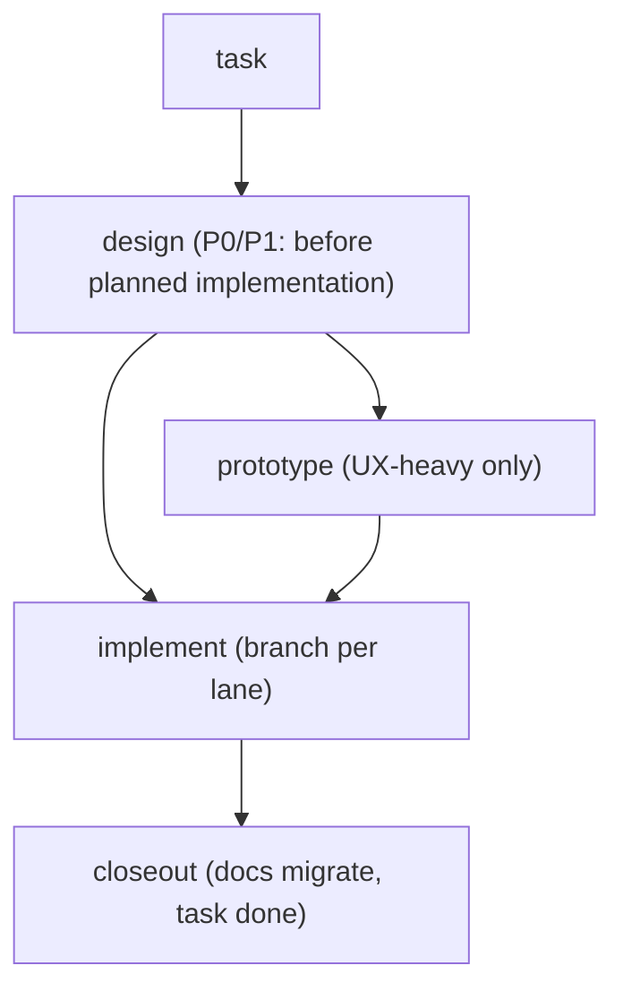

# Design Flow

The lifecycle every non-trivial feature moves through. Paths and naming: `STRUCTURE.md` in the installed House Rules root.
Principles behind the gates: skill `design-canon`. `task …` operations below refer to the
workspace's tracker — the file-based default uses `house-rules task` (skill `task-protocol`); on any
other tracker, map the operations (create/claim/close-gate/handoff) 1:1 onto its primitives.

## 1. Task first

Every feature starts as a task (`task new`). The task owns the feature's artifacts: its id
prefixes the design doc and prototype dir, its `task.md` frontmatter links them
(`design: docs/design/NNN-….md`). No orphan design docs.

## 2. Design / spec (P0/P1: mandatory before planned implementation; urgent P0 containment comes first)

Open with a **blindspot pass + reverse interview** (skill `finding-unknowns`) — surface
the unknowns before writing the spec, not after implementing the wrong one. Then
`docs/design/NNN-feature-name.md`, frontmatter `status: draft`:

- exact type/trait signatures (real code, not prose), module/crate layout
- integration plan: what existing code changes; config schema if any
- **Key decisions with rejected alternatives** (why) — this section is what survives migration
- end-state first (skill `design-canon` §Decisions)

Gate: apply AGENTS.md §Autonomy and its recorded collaboration mode. In autonomous mode,
a design entirely inside the approved outcome and decision boundaries may be marked
`approved` at the base confidence threshold, with evidence recorded and the operator
informed. Otherwise keep `draft` and ask about the consequential unresolved choice.
Record whether approval came from the operator or delegated authority; do not imply
operator review when it did not happen. Priorities follow the base definitions.
P2/P3 may skip the doc but still need a plan note in `task.md`.

## 3. Prototype (UX-heavy features only)

Use this sequence for work that needs both prototype stages:

1. **System map + micro-specs**: mermaid + md per screen/flow in the design doc
2. **Lofi**: `prototypes/NNN-feature/lofi/` — flows, wireframes, single-file html sketches
3. **Hifi**: `prototypes/NNN-feature/hifi/` — the project UI stack (default:
   `PREFERENCES.md`) + mock data; component library before screens (shared sizes/tokens,
   no per-screen one-offs)
4. Operator picks/tweaks on the prototype → decisions recorded back into the design doc

Prototypes exist so decisions happen **before** the engine is wired to a frontend. They are
never the implementation; hifi code may be quarried, not merged wholesale.

## 4. Spikes (technical unknowns)

One question → `prototypes/spikes/YYYY-MM-DD-question/` with `SPIKE.md` (question, method,
verdict). Throwaway by contract: code never lands in `src/`, deps never land in the
product tree. Kill-or-promote: verdict feeds the design doc, then the spike is deletable.
After 30 days without a verdict, review whether the spike is still useful; cleanup follows
AGENTS.md §Security.

## 5. Implement

Branch `task/NNN-slug/<agent>`; test-first red→green; design doc is the spec — implement it
literally, and when reality forces a deviation, update the design doc in the same commit
(the doc never silently diverges from what's being built).

## 6. Closeout — `task done NNN`

A feature is done when the code shipped AND the paper trail moved. Run `task done NNN` as
the last commit on the task branch, before merge. The `task done` gate enforces what's
mechanically checkable; the rest is the agent's checklist (the gate prints only a one-line
reminder):

**Enforced (refuses otherwise, `--force` to override with justification in the handoff):**
- the latest Markdown handoff has content in all five standard sections (structural
  validation only; the owner remains responsible for its evidence)
- the linked design doc is `implemented` or `superseded` (never `draft`/`approved`)

**Checklist (agent's judgment):**
- pre-merge quiz passed on significant work (skill `finding-unknowns`)
- shipped sections migrated: design doc → `docs/architecture/feature.md` (or the repo's
  `docs/specs/{subsystem}/`); design doc shrunk to a pointer or deleted (`design:` field:
  `STRUCTURE.md` §Frontmatter statuses)
- PR open; `pr:` recorded in task.md frontmatter
- durable decisions promoted from task.md → the bible
- prototypes: keep hifi if it's the living reference, else delete; spikes killed
- regression tests required by AGENTS.md §Verification exist and are green

Automation hook (owned repos, via your PR bot/CI): a PR from branch `task/NNN-*` runs
`task done NNN --check` (read-only) and comments the result on the PR; merge after it
reports closeable, then delete the branch. CI never writes `task.md` — single writer holds.

## Experimentation is a first-class lane

Diagnostic experiments follow `bench-discipline` and live in `runs/` (neutral names) with
findings filed into the owning task; a campaign (multi-day target push) gets its own task +
ledger. Experiments never bypass the lifecycle by mutating `src/` directly "just to test" —
levers go behind flags, spikes go to `prototypes/spikes/`, and anything that survives gets
a design doc like everything else.
