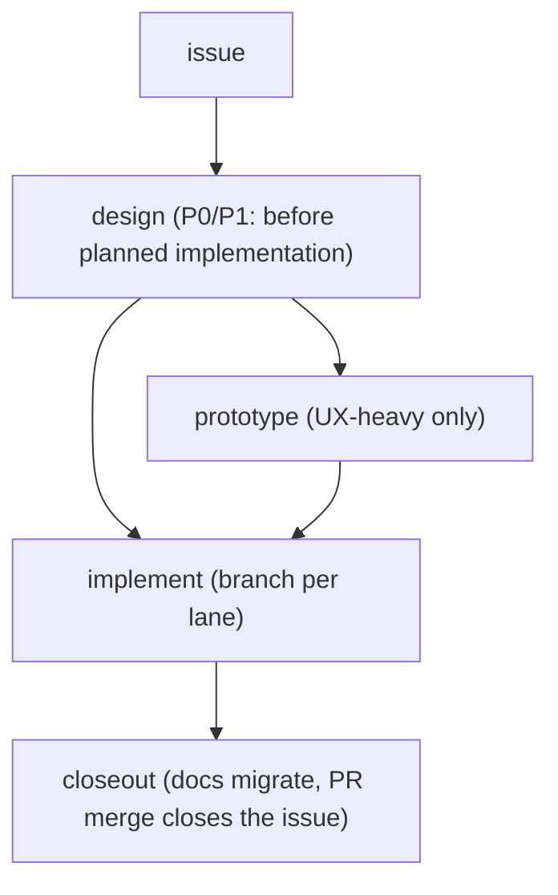

# Design Flow

The lifecycle every non-trivial feature moves through. Paths and naming: `STRUCTURE.md` in
the installed House Rules root. Principles behind the gates: skill `design-canon`. Issues,
branches, and PRs: skill `work-tracking`.

## 1. Issue first

Every feature starts as an issue. The issue owns the feature's artifacts: its number
prefixes the design doc and prototype dir, and its body links the design doc. No orphan
design docs.

## 2. Design / spec (P0/P1: mandatory before planned implementation; urgent P0 containment comes first)

Open with a **blindspot pass + reverse interview** (skill `finding-unknowns`) — surface
the unknowns before writing the spec, not after implementing the wrong one. Then
`docs/design/<issue>-feature-name.md`, frontmatter `status: draft`:

- exact type/trait signatures (real code, not prose), module/crate layout
- integration plan: what existing code changes; config schema if any
- **Key decisions with rejected alternatives** (why) — this section is what survives migration
- end-state first (skill `design-canon` §Decisions)

Gate: apply AGENTS.md §Autonomy and its recorded collaboration mode. In autonomous mode,
a design entirely inside the approved outcome and decision boundaries may be marked
`approved` at the base confidence threshold, with evidence recorded and the operator
informed. Otherwise keep `draft` and ask about the consequential unresolved choice.
Record whether approval came from the operator or delegated authority; do not imply
operator review when it did not happen. Priorities follow the base definitions.
P2/P3 may skip the doc but still need a plan note in the issue body.

## 3. Prototype (UX-heavy features only)

Use this sequence for work that needs both prototype stages:

1. **System map + micro-specs**: mermaid + md per screen/flow in the design doc
2. **Lofi**: `prototypes/<issue>-feature/lofi/` — flows, wireframes, single-file html sketches
3. **Hifi**: `prototypes/<issue>-feature/hifi/` — the project UI stack (default:
   `PREFERENCES.md`) + mock data; component library before screens (shared sizes/tokens,
   no per-screen one-offs)
4. Operator picks/tweaks on the prototype → decisions recorded back into the design doc

Prototypes exist so decisions happen **before** the engine is wired to a frontend. They are
never the implementation; hifi code may be quarried, not merged wholesale.

## 4. Spikes (technical unknowns)

One question → `prototypes/spikes/YYYY-MM-DD-question/` with `SPIKE.md` (question, method,
verdict). Throwaway by contract: code never lands in `src/`, deps never land in the
product tree. Kill-or-promote: verdict feeds the design doc, then the spike is deletable.
After 30 days without a verdict, review whether the spike is still useful; cleanup follows
AGENTS.md §Security.

## 5. Implement

One branch per issue (`STRUCTURE.md`); test-first red→green; design doc is the spec — implement it
literally, and when reality forces a deviation, update the design doc in the same commit
(the doc never silently diverges from what's being built).

## 6. Closeout — the PR merge closes the issue

A feature is done when the code shipped AND the paper trail moved. The PR closes the issue
on merge (skill `work-tracking` §Branches and PRs) and carries this checklist:

- pre-merge quiz passed on significant work (skill `finding-unknowns`)
- design doc `implemented` or `superseded` (never `draft`/`approved`); shipped sections
  migrated to `docs/architecture/feature.md` (or the repo's `docs/specs/{subsystem}/`);
  design doc shrunk to a pointer or deleted (issue link: `STRUCTURE.md` §Frontmatter
  statuses)
- durable decisions promoted from the issue → the bible
- prototypes: keep hifi if it's the living reference, else delete; spikes killed
- regression tests required by AGENTS.md §Verification exist and are green
- final handoff comment on the issue (skill `handoff-continuity`)

Merge only when the checklist holds, then delete the branch.

## Experimentation is a first-class lane

Diagnostic experiments follow `bench-discipline` and live in `runs/` (neutral names) with
findings filed into the owning issue; a campaign (multi-day target push) gets its own
issue + ledger. Experiments never bypass the lifecycle by mutating `src/` directly "just to
test" — levers go behind flags, spikes go to `prototypes/spikes/`, and anything that
survives gets a design doc like everything else.
